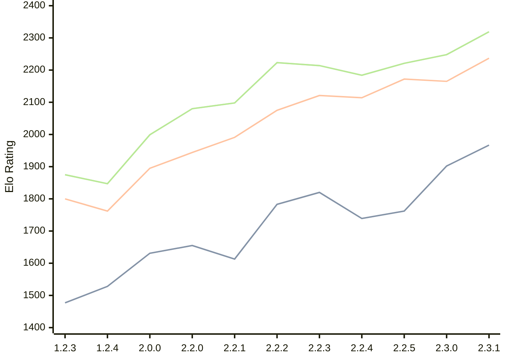

# Engine: Kreveta

Author: Daniel Michna

Home: https://github.com/ZlomenyMesic/Kreveta

## Elo Ratings

| Version | Published | STC 8.0+0.08s  | LTC 60.0+0.60s | VLTC 2m24s+1.12s | Comment |
| --- | --- | --- | --- | --- | --- |
| 2.3.1 | 2026-05-12 | 1967(+65) | 2237(+72) | 2319(+71) |  |
| 2.3.0 | 2026-04-20 | 1902(+140) | 2165(-7) | 2248(+27) |  |
| 2.2.5 | 2026-03-15 | 1762(+23) | 2172(+58) | 2221(+37) |  |
| 2.2.4 | 2026-03-05 | 1739(-81) | 2114(-7) | 2184(-30) |  |
| 2.2.3 | 2026-02-05 | 1820(+37) | 2121(+46) | 2214(-9) |  |
| 2.2.2 | 2026-01-13 | 1783(+170) | 2075(+84) | 2223(+125) |  |
| 2.2.1 | 2025-12-25 | 1613(-42) | 1991(+47) | 2098(+18) |  |
| 2.2.0 | 2025-12-23 | 1655(+24) | 1944(+49) | 2080(+81) |  |
| 2.0.0 | 2025-12-01 | 1631(+103) | 1895(+133) | 1999(+152) |  |
| 1.2.4 | 2025-11-17 | 1528(+51) | 1762(-38) | 1847(-28) |  |
| 1.2.3 | 2025-10-31 | 1477(+new) | 1800(+new) | 1875(+new) |  |
| 1.1.3 | 2025-10-26 |  |  |  |  |
| 1.0 | 2025-09-10 |  |  |  |  |
 | | | cElo (∆ prev) | cElo (∆ prev) | cElo (∆ prev) | 

<a href="https://github.com/computer-chess-index/cci/issues/new?template=submit-version.yml&title=[VERSION]+Kreveta+<version>&body=###%20Engine%20name%0AKreveta%0A%0A###%20Version%0A2.3.1" target="_blank">Submit new version</a>

 Test Conditions:

GUI/CLI: <a href=https://github.com/cutechess/cutechess target="_blank">Cute-Chess</a> 
Elo Calculation: <a href=https://www.remi-coulom.fr/Bayesian-Elo/ target="_blank">Bayesian-Elo</a> 
CPU: Intel(R) Core(TM) i5-7500T 2.70GHz 
Opening book: 8_moves_v3 
\* STC: 8.0+0.08s, LTC: 60.0+0.60s, VLTC: 2m24s+1.12s

 Lists:
Ratings: <a href=https://github.com/computer-chess-index/cci/blob/main/lists/CCIRatings.csv target="_blank">Complete list</a>

Generated: 2026-10-09 04:39:38

## Ratings Verlauf

```mermaid
%%{init: {"theme":"base","themeVariables":{"seriesColors:['#a3a3a3','#222221','#faa371']}}}%%
xychart-beta
  x-axis ["1.2.3", "1.2.4", "2.0.0", "2.2.0", "2.2.1", "2.2.2", "2.2.3", "2.2.4", "2.2.5", "2.3.0", "2.3.1"]
  y-axis "Elo Rating" 1400 --> 2400
  line "" [1477, 1528, 1631, 1655, 1613, 1783, 1820, 1739, 1762, 1902, 1967]
  line "STC (8.0+0.08s)" [1477, 1528, 1631, 1655, 1613, 1783, 1820, 1739, 1762, 1902, 1967]
  line "LTC (60.0+0.60s)" [1800, 1762, 1895, 1944, 1991, 2075, 2121, 2114, 2172, 2165, 2237]
  line "" [1875, 1847, 1999, 2080, 2098, 2223, 2214, 2184, 2221, 2248, 2319]
  line "VLTC (2m24s+1.12s)" [1875, 1847, 1999, 2080, 2098, 2223, 2214, 2184, 2221, 2248, 2319]
```

## Detailed Evaluation Results

| Version | Time Control | Elo  | Range +/- | Matches | Score | Average Opponent Elo | Draws |
| --- | --- | --- | --- | --- | --- | --- | --- |
| 2.3.1 | VLTC (2m24s+1.12s) | 2319 | 29 | 404 | 51% | 2300 | 28% |
| 2.3.1 | LTC (60.0+0.60s) | 2237 | 29 | 416 | 49% | 2249 | 26% |
| 2.3.1 | STC (8.0+0.08s) | 1967 | 27 | 494 | 49% | 1974 | 23% |
| --- | --- | --- | --- | --- | --- | --- | --- |
| 2.3.0 | VLTC (2m24s+1.12s) | 2248 | 35 | 272 | 51% | 2236 | 28% |
| 2.3.0 | LTC (60.0+0.60s) | 2165 | 37 | 254 | 48% | 2182 | 23% |
| 2.3.0 | STC (8.0+0.08s) | 1902 | 33 | 328 | 49% | 1901 | 22% |
| --- | --- | --- | --- | --- | --- | --- | --- |
| 2.2.5 | VLTC (2m24s+1.12s) | 2221 | 32 | 346 | 50% | 2223 | 18% |
| 2.2.5 | LTC (60.0+0.60s) | 2172 | 32 | 340 | 48% | 2186 | 25% |
| 2.2.5 | STC (8.0+0.08s) | 1762 | 32 | 352 | 52% | 1728 | 21% |
| --- | --- | --- | --- | --- | --- | --- | --- |
| 2.2.4 | VLTC (2m24s+1.12s) | 2184 | 38 | 230 | 49% | 2195 | 29% |
| 2.2.4 | LTC (60.0+0.60s) | 2114 | 37 | 248 | 54% | 2074 | 25% |
| 2.2.4 | STC (8.0+0.08s) | 1739 | 42 | 204 | 51% | 1733 | 22% |
| --- | --- | --- | --- | --- | --- | --- | --- |
| 2.2.3 | VLTC (2m24s+1.12s) | 2214 | 35 | 288 | 48% | 2233 | 26% |
| 2.2.3 | LTC (60.0+0.60s) | 2121 | 36 | 260 | 48% | 2142 | 24% |
| 2.2.3 | STC (8.0+0.08s) | 1820 | 37 | 252 | 48% | 1837 | 22% |
| --- | --- | --- | --- | --- | --- | --- | --- |
| 2.2.2 | VLTC (2m24s+1.12s) | 2223 | 37 | 256 | 52% | 2202 | 25% |
| 2.2.2 | LTC (60.0+0.60s) | 2075 | 40 | 216 | 49% | 2084 | 21% |
| 2.2.2 | STC (8.0+0.08s) | 1783 | 41 | 212 | 54% | 1751 | 19% |
| --- | --- | --- | --- | --- | --- | --- | --- |
| 2.2.1 | VLTC (2m24s+1.12s) | 2098 | 48 | 148 | 50% | 2093 | 22% |
| 2.2.1 | LTC (60.0+0.60s) | 1991 | 44 | 180 | 49% | 2003 | 21% |
| 2.2.1 | STC (8.0+0.08s) | 1613 | 56 | 110 | 52% | 1596 | 22% |
| --- | --- | --- | --- | --- | --- | --- | --- |
| 2.2.0 | VLTC (2m24s+1.12s) | 2080 | 52 | 124 | 52% | 2066 | 26% |
| 2.2.0 | LTC (60.0+0.60s) | 1944 | 64 | 84 | 55% | 1898 | 21% |
| 2.2.0 | STC (8.0+0.08s) | 1655 | 50 | 148 | 55% | 1605 | 18% |
| --- | --- | --- | --- | --- | --- | --- | --- |
| 2.0.0 | VLTC (2m24s+1.12s) | 1999 | 51 | 136 | 52% | 1980 | 24% |
| 2.0.0 | LTC (60.0+0.60s) | 1895 | 52 | 132 | 52% | 1878 | 17% |
| 2.0.0 | STC (8.0+0.08s) | 1631 | 46 | 172 | 48% | 1654 | 16% |
| --- | --- | --- | --- | --- | --- | --- | --- |
| 1.2.4 | VLTC (2m24s+1.12s) | 1847 | 52 | 158 | 42% | 1987 | 9% |
| 1.2.4 | LTC (60.0+0.60s) | 1762 | 60 | 110 | 48% | 1794 | 12% |
| 1.2.4 | STC (8.0+0.08s) | 1528 | 61 | 108 | 48% | 1557 | 9% |
| --- | --- | --- | --- | --- | --- | --- | --- |
| 1.2.3 | VLTC (2m24s+1.12s) | 1875 | 34 | 324 | 52% | 1860 | 19% |
| 1.2.3 | LTC (60.0+0.60s) | 1800 | 34 | 316 | 52% | 1786 | 19% |
| 1.2.3 | STC (8.0+0.08s) | 1477 | 34 | 316 | 50% | 1467 | 22% |
| --- | --- | --- | --- | --- | --- | --- | --- |