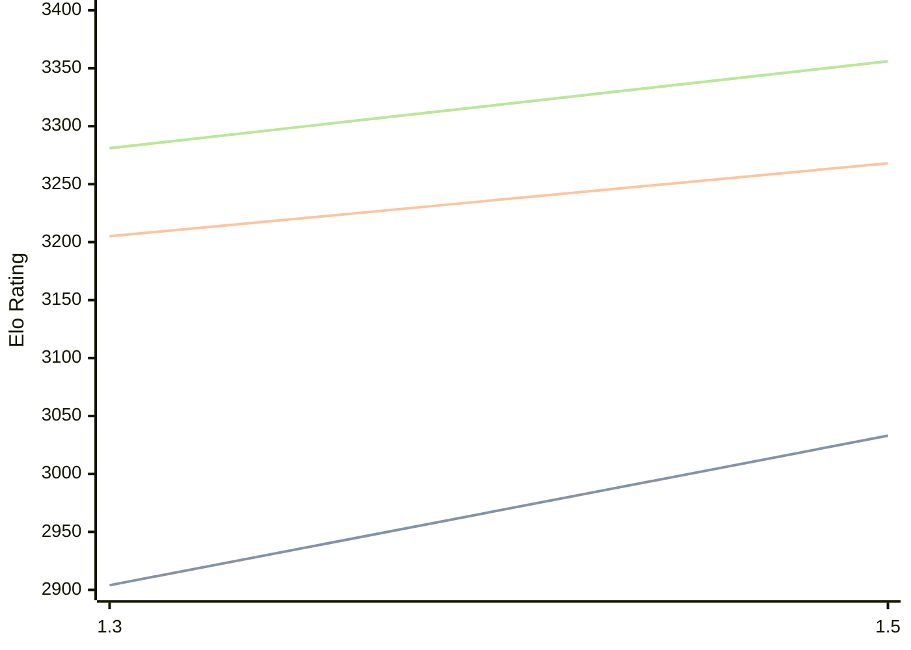

# Engine: Lambergar

Author: Jabolcni Strudelj

Home: https://github.com/jabolcni/Lambergar

## Elo Ratings

| Version | Published | STC 8.0+0.08s  | LTC 60.0+0.60s | VLTC 2m24s+1.12s | Comment |
| --- | --- | --- | --- | --- | --- |
| 1.5 | 2026-05-28 | 3033(+129) | 3268(+63) | 3356(+75) |  |
| 1.3 | 2025-09-19 | 2904 | 3205 | 3281 |  |
 | | | cElo (∆ prev) | cElo (∆ prev) | cElo (∆ prev) | 

<a href="https://github.com/computer-chess-index/cci/issues/new?template=submit-version.yml&title=[VERSION]+Lambergar+<version>&body=###%20Engine%20name%0ALambergar%0A%0A###%20Version%0A1.5" target="_blank">Submit new version</a>

 Test Conditions:

GUI/CLI: <a href=https://github.com/cutechess/cutechess target="_blank">Cute-Chess</a> 
Elo Calculation: <a href=https://www.remi-coulom.fr/Bayesian-Elo/ target="_blank">Bayesian-Elo</a> 
CPU: Intel(R) Core(TM) i5-7500T 2.70GHz 
Opening book: 8_moves_v3 
\* STC: 8.0+0.08s, LTC: 60.0+0.60s, VLTC: 2m24s+1.12s

 Lists:
Ratings: <a href=https://github.com/computer-chess-index/cci/blob/main/lists/CCIRatings.csv target="_blank">Complete list</a>

Generated: 2026-08-19 06:26:21

## Ratings Verlauf

⬛ STC (8.0+0.08s) &nbsp;&nbsp; 🟧 LTC (60.0+0.60s) &nbsp;&nbsp; 🟩 VLTC (2m24s+1.12s)

dark mode: 🟩STC (8.0+0.08s) 🟧LTC (60.0+0.60s) ⬜VLTC (2m24s+1.12s)

## Detailed Evaluation Results

| Version | Time Control | Elo  | Range +/- | Matches | Score | Average Opponent Elo | Draws |
| --- | --- | --- | --- | --- | --- | --- | --- |
| 1.5 | VLTC (2m24s+1.12s) | 3356 | 31 | 258 | 51% | 3347 | 72% |
| 1.5 | LTC (60.0+0.60s) | 3268 | 27 | 376 | 53% | 3244 | 61% |
| 1.5 | STC (8.0+0.08s) | 3033 | 31 | 300 | 50% | 3036 | 48% |
| --- | --- | --- | --- | --- | --- | --- | --- |
| 1.3 | VLTC (2m24s+1.12s) | 3281 | 24 | 462 | 52% | 3267 | 66% |
| 1.3 | LTC (60.0+0.60s) | 3205 | 26 | 398 | 51% | 3195 | 63% |
| 1.3 | STC (8.0+0.08s) | 2904 | 22 | 640 | 53% | 2863 | 42% |
| --- | --- | --- | --- | --- | --- | --- | --- |