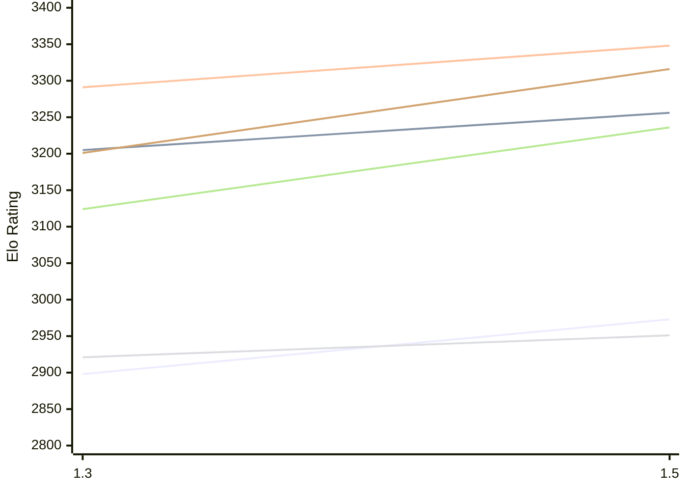
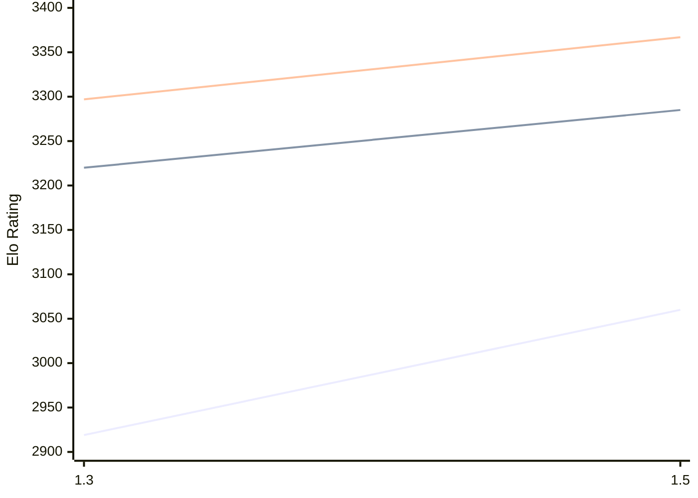

# Engine: Lambergar

Author: Jabolcni Strudelj

Home: https://github.com/jabolcni/Lambergar

## Elo Ratings E1 (Ultra 7 265T (1.50 GHz) - E-Core)

| Version | Published | STC 8.0+0.08s  | LTC 60.0+0.60s | VLTC 2m24s+1.12s | Comment |
| --- | --- | --- | --- | --- | --- |
| 1.5 | 2026-05-28 | 2973(+75) | 3256(+51) | 3348(+57) |  |
| 1.3 | 2025-09-19 | 2898 | 3205 | 3291 |  |
 | | | cElo (∆ prev) | cElo (∆ prev) | cElo (∆ prev) | 

## Elo Ratings P1 (Ultra 7 265T (1.50 GHz) - P-Core)

| Version | Published | STC 8.0+0.08s  | LTC 60.0+0.60s | VLTC 2m24s+1.12s | Comment |
| --- | --- | --- | --- | --- | --- |
| 1.5 | 2026-05-28 | 2951(+30) | 3236(+112) | 3316(+115) |  |
| 1.3 | 2025-09-19 | 2921 | 3124 | 3201 |  |
 | | | cElo (∆ prev) | cElo (∆ prev) | cElo (∆ prev) | 

## Elo Ratings T1 (i5-7500T 2.70GHz)

| Version | Published | STC 8.0+0.08s  | LTC 60.0+0.60s | VLTC 2m24s+1.12s | Comment |
| --- | --- | --- | --- | --- | --- |
| 1.5 | 2026-05-28 | 3060(+141) | 3285(+65) | 3367(+70) |  |
| 1.3 | 2025-09-19 | 2919 | 3220 | 3297 |  |
 | | | cElo (∆ prev) | cElo (∆ prev) | cElo (∆ prev) | 

<a href="https://github.com/computer-chess-index/cci/issues/new?template=submit-version.yml&title=[VERSION]+Lambergar+<version>&body=###%20Engine%20name%0ALambergar%0A%0A###%20Version%0A1.5" target="_blank">Submit new version</a>

 Test Conditions:

GUI/CLI: <a href=https://github.com/cutechess/cutechess target="_blank">Cute-Chess</a> 
Elo Calculation: <a href=https://www.remi-coulom.fr/Bayesian-Elo/ target="_blank">Bayesian-Elo</a> 
CPU for P1: Intel(R) Core(TM) Ultra 7 265T (1.50 GHz) - P-Core 
CPU for E1: Intel(R) Core(TM) Ultra 7 265T (1.50 GHz) - E-Core 
CPU for T1: Intel(R) Core(TM) i5-7500T 2.70GHz 
Opening book: 8_moves_v3 
\* STC: 8.0+0.08s, LTC: 60.0+0.60s, VLTC: 2m24s+1.12s

 Lists:
Ratings: <a href=https://github.com/computer-chess-index/cci/blob/main/lists/CCIRatings.csv target="_blank">Complete list</a>

Generated: 2026-11-14 05:39:18

## Ratings Verlauf E1 / P1

```mermaid
%%{init: {"theme":"base","themeVariables":{"seriesColors:['#a3a3a3','#222221','#faa371']}}}%%
xychart-beta
  x-axis ["1.3", "1.5"]
  y-axis "Elo Rating" 2800 --> 3400
  line "E1: STC (8.0+0.08s)" [2898, 2973]
  line "E1: LTC (60.0+0.60s)" [3205, 3256]
  line "E1: VLTC (2m24s+1.12s)" [3291, 3348]
  line "P1: STC (8.0+0.08s)" [2921, 2951]
  line "P1: LTC (60.0+0.60s)" [3124, 3236]
  line "P1: VLTC (2m24s+1.12s)" [3201, 3316]
```

## Ratings Verlauf T1

```mermaid
%%{init: {"theme":"base","themeVariables":{"seriesColors:['#a3a3a3','#222221','#faa371']}}}%%
xychart-beta
  x-axis ["1.3", "1.5"]
  y-axis "Elo Rating" 2900 --> 3400
  line "T1: STC (8.0+0.08s)" [2919, 3060]
  line "T1: LTC (60.0+0.60s)" [3220, 3285]
  line "T1: VLTC (2m24s+1.12s)" [3297, 3367]
```

## Detailed Evaluation Results

| Version | Time Control | Variant | Elo  | Range +/- | Matches | Score | Average Opponent Elo | Draws |
| --- | --- |--- | --- | --- | --- | --- | --- | --- |
| 1.5 | VLTC (2m24s+1.12s) | T1 | 3367 | 29 | 298 | 50% | 3364 | 72% |
|  |  | P1 | 3316 | 33 | 236 | 57% | 3252 | 72% |
|  |  | E1 | 3348 | 27 | 364 | 55% | 3302 | 68% |
|  | LTC (60.0+0.60s) | T1 | 3285 | 26 | 404 | 53% | 3262 | 61% |
|  |  | P1 | 3236 | 36 | 208 | 52% | 3185 | 64% |
|  |  | E1 | 3256 | 26 | 410 | 55% | 3189 | 62% |
|  | STC (8.0+0.08s) | T1 | 3060 | 27 | 392 | 50% | 3058 | 51% |
|  |  | P1 | 2951 | 36 | 220 | 50% | 2954 | 53% |
|  |  | E1 | 2973 | 28 | 358 | 47% | 3002 | 49% |
| --- | --- |--- | --- | --- | --- | --- | --- | --- |
| 1.3 | VLTC (2m24s+1.12s) | P1 | 3201 | 119 | 36 | 83% | 2556 | 28% |
|  |  | E1 | 3291 | 82 | 48 | 70% | 3062 | 52% |
|  |  | T1 | 3297 | 24 | 462 | 52% | 3283 | 66% |
|  | LTC (60.0+0.60s) | P1 | 3124 | 120 | 24 | 58% | 2984 | 33% |
|  |  | E1 | 3205 | 88 | 36 | 60% | 3109 | 58% |
|  |  | T1 | 3220 | 26 | 398 | 51% | 3210 | 63% |
|  | STC (8.0+0.08s) | P1 | 2921 | 115 | 28 | 43% | 3000 | 36% |
|  |  | E1 | 2898 | 90 | 44 | 59% | 2822 | 32% |
|  |  | T1 | 2919 | 22 | 640 | 53% | 2877 | 42% |