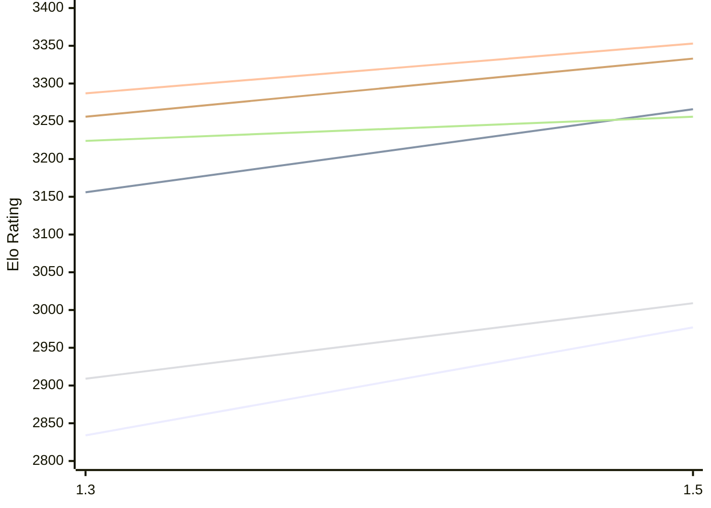
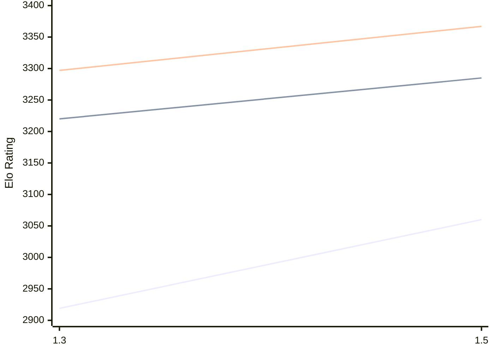

# Engine: Lambergar

Author: Jabolcni Strudelj

Home: https://github.com/jabolcni/Lambergar

## Elo Ratings E1 (Ultra 7 265T (1.50 GHz) - E-Core)

| Version | Published | STC 8.0+0.08s  | LTC 60.0+0.60s | VLTC 2m24s+1.12s | Comment |
| --- | --- | --- | --- | --- | --- |
| 1.5 | 2026-05-28 | 2977(+143) | 3266(+110) | 3353(+66) |  |
| 1.3 | 2025-09-19 | 2834 | 3156 | 3287 |  |
 | | | cElo (∆ prev) | cElo (∆ prev) | cElo (∆ prev) | 

## Elo Ratings P1 (Ultra 7 265T (1.50 GHz) - P-Core)

| Version | Published | STC 8.0+0.08s  | LTC 60.0+0.60s | VLTC 2m24s+1.12s | Comment |
| --- | --- | --- | --- | --- | --- |
| 1.5 | 2026-05-28 | 3009(+100) | 3256(+32) | 3333(+77) |  |
| 1.3 | 2025-09-19 | 2909 | 3224 | 3256 |  |
 | | | cElo (∆ prev) | cElo (∆ prev) | cElo (∆ prev) | 

## Elo Ratings T1 (i5-7500T 2.70GHz)

| Version | Published | STC 8.0+0.08s  | LTC 60.0+0.60s | VLTC 2m24s+1.12s | Comment |
| --- | --- | --- | --- | --- | --- |
| 1.5 | 2026-05-28 | 3060(+141) | 3285(+65) | 3367(+70) |  |
| 1.3 | 2025-09-19 | 2919 | 3220 | 3297 |  |
 | | | cElo (∆ prev) | cElo (∆ prev) | cElo (∆ prev) | 

<a href="https://github.com/computer-chess-index/cci/issues/new?template=submit-version.yml&title=[VERSION]+Lambergar+<version>&body=###%20Engine%20name%0ALambergar%0A%0A###%20Version%0A1.5" target="_blank">Submit new version</a>

 Test Conditions:

GUI/CLI: <a href=https://github.com/cutechess/cutechess target="_blank">Cute-Chess</a> 
Elo Calculation: <a href=https://www.remi-coulom.fr/Bayesian-Elo/ target="_blank">Bayesian-Elo</a> 
CPU for P1: Intel(R) Core(TM) Ultra 7 265T (1.50 GHz) - P-Core 
CPU for E1: Intel(R) Core(TM) Ultra 7 265T (1.50 GHz) - E-Core 
CPU for T1: Intel(R) Core(TM) i5-7500T 2.70GHz 
Opening book: 8_moves_v3 
\* STC: 8.0+0.08s, LTC: 60.0+0.60s, VLTC: 2m24s+1.12s

 Lists:
Ratings: <a href=https://github.com/computer-chess-index/cci/blob/main/lists/CCIRatings.csv target="_blank">Complete list</a>

Generated: 2026-11-28 05:39:48

## Ratings Verlauf E1 / P1

```mermaid
%%{init: {"theme":"base","themeVariables":{"seriesColors:['#a3a3a3','#222221','#faa371']}}}%%
xychart-beta
  x-axis ["1.3", "1.5"]
  y-axis "Elo Rating" 2800 --> 3400
  line "E1: STC (8.0+0.08s)" [2834, 2977]
  line "E1: LTC (60.0+0.60s)" [3156, 3266]
  line "E1: VLTC (2m24s+1.12s)" [3287, 3353]
  line "P1: STC (8.0+0.08s)" [2909, 3009]
  line "P1: LTC (60.0+0.60s)" [3224, 3256]
  line "P1: VLTC (2m24s+1.12s)" [3256, 3333]
```

## Ratings Verlauf T1

```mermaid
%%{init: {"theme":"base","themeVariables":{"seriesColors:['#a3a3a3','#222221','#faa371']}}}%%
xychart-beta
  x-axis ["1.3", "1.5"]
  y-axis "Elo Rating" 2900 --> 3400
  line "T1: STC (8.0+0.08s)" [2919, 3060]
  line "T1: LTC (60.0+0.60s)" [3220, 3285]
  line "T1: VLTC (2m24s+1.12s)" [3297, 3367]
```

## Detailed Evaluation Results

| Version | Time Control | Variant | Elo  | Range +/- | Matches | Score | Average Opponent Elo | Draws |
| --- | --- |--- | --- | --- | --- | --- | --- | --- |
| 1.5 | VLTC (2m24s+1.12s) | T1 | 3367 | 29 | 298 | 50% | 3364 | 72% |
|  |  | P1 | 3333 | 31 | 264 | 56% | 3279 | 73% |
|  |  | E1 | 3353 | 26 | 392 | 55% | 3310 | 68% |
|  | LTC (60.0+0.60s) | T1 | 3285 | 26 | 404 | 53% | 3262 | 61% |
|  |  | P1 | 3256 | 34 | 228 | 52% | 3214 | 66% |
|  |  | E1 | 3266 | 24 | 458 | 55% | 3202 | 63% |
|  | STC (8.0+0.08s) | T1 | 3060 | 27 | 392 | 50% | 3058 | 51% |
|  |  | P1 | 3009 | 33 | 258 | 51% | 3004 | 53% |
|  |  | E1 | 2977 | 27 | 412 | 47% | 3001 | 47% |
| --- | --- |--- | --- | --- | --- | --- | --- | --- |
| 1.3 | VLTC (2m24s+1.12s) | T1 | 3297 | 24 | 462 | 52% | 3283 | 66% |
|  |  | P1 | 3256 | 56 | 100 | 63% | 3008 | 50% |
|  |  | E1 | 3287 | 45 | 140 | 55% | 3220 | 57% |
|  | LTC (60.0+0.60s) | T1 | 3220 | 26 | 398 | 51% | 3210 | 63% |
|  |  | P1 | 3224 | 58 | 88 | 53% | 3178 | 51% |
|  |  | E1 | 3156 | 38 | 188 | 47% | 3178 | 57% |
|  | STC (8.0+0.08s) | T1 | 2919 | 22 | 640 | 53% | 2877 | 42% |
|  |  | P1 | 2909 | 55 | 108 | 44% | 2973 | 36% |
|  |  | E1 | 2834 | 43 | 162 | 49% | 2847 | 44% |