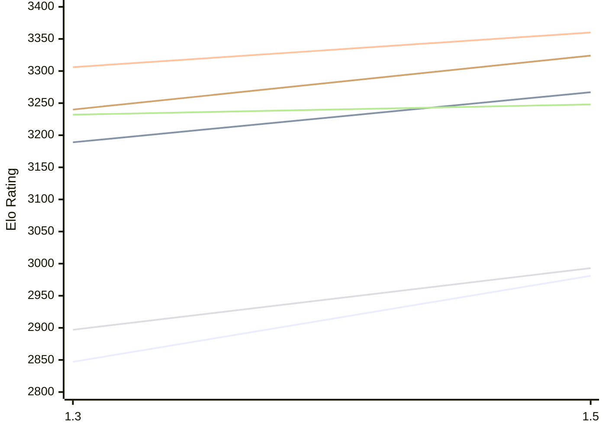
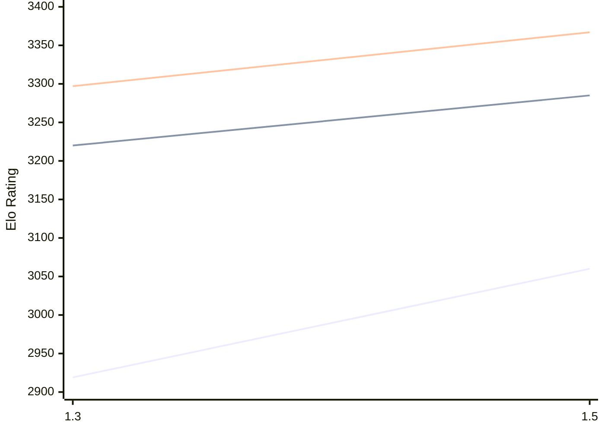

# Engine: Lambergar

Author: Jabolcni Strudelj

Home: https://github.com/jabolcni/Lambergar

## Elo Ratings E1 (Ultra 7 265T (1.50 GHz) - E-Core)

| Version | Published | STC 8.0+0.08s  | LTC 60.0+0.60s | VLTC 2m24s+1.12s | Comment |
| --- | --- | --- | --- | --- | --- |
| 1.5 | 2026-05-28 | 2981(+134) | 3267(+78) | 3360(+54) |  |
| 1.3 | 2025-09-19 | 2847 | 3189 | 3306 |  |
 | | | cElo (∆ prev) | cElo (∆ prev) | cElo (∆ prev) | 

## Elo Ratings P1 (Ultra 7 265T (1.50 GHz) - P-Core)

| Version | Published | STC 8.0+0.08s  | LTC 60.0+0.60s | VLTC 2m24s+1.12s | Comment |
| --- | --- | --- | --- | --- | --- |
| 1.5 | 2026-05-28 | 2993(+96) | 3248(+16) | 3324(+84) |  |
| 1.3 | 2025-09-19 | 2897 | 3232 | 3240 |  |
 | | | cElo (∆ prev) | cElo (∆ prev) | cElo (∆ prev) | 

## Elo Ratings T1 (i5-7500T 2.70GHz)

| Version | Published | STC 8.0+0.08s  | LTC 60.0+0.60s | VLTC 2m24s+1.12s | Comment |
| --- | --- | --- | --- | --- | --- |
| 1.5 | 2026-05-28 | 3060(+141) | 3285(+65) | 3367(+70) |  |
| 1.3 | 2025-09-19 | 2919 | 3220 | 3297 |  |
 | | | cElo (∆ prev) | cElo (∆ prev) | cElo (∆ prev) | 

<a href="https://github.com/computer-chess-index/cci/issues/new?template=submit-version.yml&title=[VERSION]+Lambergar+<version>&body=###%20Engine%20name%0ALambergar%0A%0A###%20Version%0A1.5" target="_blank">Submit new version</a>

 Test Conditions:

GUI/CLI: <a href=https://github.com/cutechess/cutechess target="_blank">Cute-Chess</a> 
Elo Calculation: <a href=https://www.remi-coulom.fr/Bayesian-Elo/ target="_blank">Bayesian-Elo</a> 
CPU for P1: Intel(R) Core(TM) Ultra 7 265T (1.50 GHz) - P-Core 
CPU for E1: Intel(R) Core(TM) Ultra 7 265T (1.50 GHz) - E-Core 
CPU for T1: Intel(R) Core(TM) i5-7500T 2.70GHz 
Opening book: 8_moves_v3 
\* STC: 8.0+0.08s, LTC: 60.0+0.60s, VLTC: 2m24s+1.12s

 Lists:
Ratings: <a href=https://github.com/computer-chess-index/cci/blob/main/lists/CCIRatings.csv target="_blank">Complete list</a>

Generated: 2026-11-24 05:39:40

## Ratings Verlauf E1 / P1

```mermaid
%%{init: {"theme":"base","themeVariables":{"seriesColors:['#a3a3a3','#222221','#faa371']}}}%%
xychart-beta
  x-axis ["1.3", "1.5"]
  y-axis "Elo Rating" 2800 --> 3400
  line "E1: STC (8.0+0.08s)" [2847, 2981]
  line "E1: LTC (60.0+0.60s)" [3189, 3267]
  line "E1: VLTC (2m24s+1.12s)" [3306, 3360]
  line "P1: STC (8.0+0.08s)" [2897, 2993]
  line "P1: LTC (60.0+0.60s)" [3232, 3248]
  line "P1: VLTC (2m24s+1.12s)" [3240, 3324]
```

## Ratings Verlauf T1

```mermaid
%%{init: {"theme":"base","themeVariables":{"seriesColors:['#a3a3a3','#222221','#faa371']}}}%%
xychart-beta
  x-axis ["1.3", "1.5"]
  y-axis "Elo Rating" 2900 --> 3400
  line "T1: STC (8.0+0.08s)" [2919, 3060]
  line "T1: LTC (60.0+0.60s)" [3220, 3285]
  line "T1: VLTC (2m24s+1.12s)" [3297, 3367]
```

## Detailed Evaluation Results

| Version | Time Control | Variant | Elo  | Range +/- | Matches | Score | Average Opponent Elo | Draws |
| --- | --- |--- | --- | --- | --- | --- | --- | --- |
| 1.5 | VLTC (2m24s+1.12s) | T1 | 3367 | 29 | 298 | 50% | 3364 | 72% |
|  |  | P1 | 3324 | 32 | 248 | 56% | 3266 | 72% |
|  |  | E1 | 3360 | 26 | 388 | 55% | 3314 | 69% |
|  | LTC (60.0+0.60s) | T1 | 3285 | 26 | 404 | 53% | 3262 | 61% |
|  |  | P1 | 3248 | 35 | 222 | 52% | 3204 | 66% |
|  |  | E1 | 3267 | 25 | 434 | 55% | 3201 | 63% |
|  | STC (8.0+0.08s) | T1 | 3060 | 27 | 392 | 50% | 3058 | 51% |
|  |  | P1 | 2993 | 34 | 240 | 50% | 2992 | 52% |
|  |  | E1 | 2981 | 27 | 388 | 47% | 3005 | 48% |
| --- | --- |--- | --- | --- | --- | --- | --- | --- |
| 1.3 | VLTC (2m24s+1.12s) | T1 | 3297 | 24 | 462 | 52% | 3283 | 66% |
|  |  | P1 | 3240 | 66 | 76 | 66% | 2920 | 49% |
|  |  | E1 | 3306 | 53 | 104 | 59% | 3198 | 59% |
|  | LTC (60.0+0.60s) | T1 | 3220 | 26 | 398 | 51% | 3210 | 63% |
|  |  | P1 | 3232 | 65 | 72 | 56% | 3152 | 49% |
|  |  | E1 | 3189 | 52 | 100 | 49% | 3186 | 58% |
|  | STC (8.0+0.08s) | P1 | 2897 | 63 | 84 | 42% | 2979 | 37% |
|  |  | E1 | 2847 | 57 | 96 | 49% | 2857 | 41% |
|  |  | T1 | 2919 | 22 | 640 | 53% | 2877 | 42% |