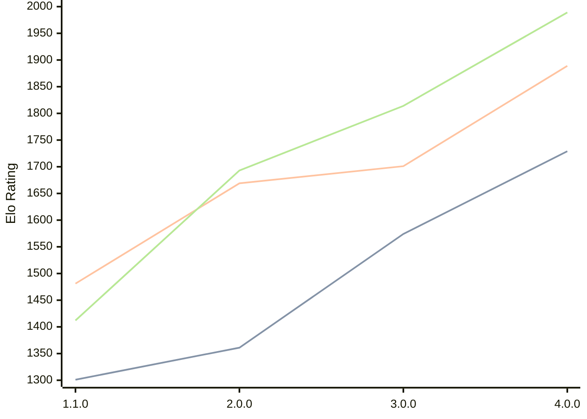

# Engine: Laura

Author: Hans Tibberio

Home: https://github.com/HansTibberio/Laura

## Elo Ratings

| Version | Published | STC 8.0+0.08s  | LTC 60.0+0.60s | VLTC 2m24s+1.12s | Comment |
| --- | --- | --- | --- | --- | --- |
| 4.0.0 | 2026-05-09 | 1729(+155) | 1889(+188) | 1989(+175) |  |
| 3.0.0 | 2026-04-29 | 1574(+213) | 1701(+32) | 1814(+121) |  |
| 2.0.0 | 2026-04-23 | 1361(+60) | 1669(+188) | 1693(+281) |  |
| 1.1.0 | 2026-01-26 | 1301 | 1481 | 1412 |  |
 | | | cElo (∆ prev) | cElo (∆ prev) | cElo (∆ prev) | 

<a href="https://github.com/computer-chess-index/cci/issues/new?template=submit-version.yml&title=[VERSION]+Laura+<version>&body=###%20Engine%20name%0ALaura%0A%0A###%20Version%0A4.0.0" target="_blank">Submit new version</a>

 Test Conditions:

GUI/CLI: <a href=https://github.com/cutechess/cutechess target="_blank">Cute-Chess</a> 
Elo Calculation: <a href=https://www.remi-coulom.fr/Bayesian-Elo/ target="_blank">Bayesian-Elo</a> 
CPU: Intel(R) Core(TM) i5-7500T 2.70GHz 
Opening book: 8_moves_v3 
\* STC: 8.0+0.08s, LTC: 60.0+0.60s, VLTC: 2m24s+1.12s

 Lists:
Ratings: <a href=https://github.com/computer-chess-index/cci/blob/main/lists/CCIRatings.csv target="_blank">Complete list</a>

Generated: 2026-09-25 04:39:44

## Ratings Verlauf

## Detailed Evaluation Results

| Version | Time Control | Elo  | Range +/- | Matches | Score | Average Opponent Elo | Draws |
| --- | --- | --- | --- | --- | --- | --- | --- |
| 4.0.0 | VLTC (2m24s+1.12s) | 1989 | 39 | 238 | 50% | 1994 | 19% |
| 4.0.0 | LTC (60.0+0.60s) | 1889 | 38 | 268 | 48% | 1909 | 13% |
| 4.0.0 | STC (8.0+0.08s) | 1729 | 37 | 280 | 51% | 1724 | 14% |
| --- | --- | --- | --- | --- | --- | --- | --- |
| 3.0.0 | VLTC (2m24s+1.12s) | 1814 | 51 | 152 | 50% | 1796 | 13% |
| 3.0.0 | LTC (60.0+0.60s) | 1701 | 53 | 136 | 50% | 1709 | 15% |
| 3.0.0 | STC (8.0+0.08s) | 1574 | 54 | 126 | 49% | 1582 | 21% |
| --- | --- | --- | --- | --- | --- | --- | --- |
| 2.0.0 | VLTC (2m24s+1.12s) | 1693 | 56 | 98 | 53% | 1674 | 45% |
| 2.0.0 | LTC (60.0+0.60s) | 1669 | 55 | 104 | 48% | 1696 | 39% |
| 2.0.0 | STC (8.0+0.08s) | 1361 | 56 | 108 | 55% | 1292 | 37% |
| --- | --- | --- | --- | --- | --- | --- | --- |
| 1.1.0 | VLTC (2m24s+1.12s) | 1412 | 52 | 132 | 43% | 1588 | 37% |
| 1.1.0 | LTC (60.0+0.60s) | 1481 | 51 | 134 | 43% | 1609 | 34% |
| 1.1.0 | STC (8.0+0.08s) | 1301 | 62 | 134 | 47% | 1346 | 25% |
| --- | --- | --- | --- | --- | --- | --- | --- |