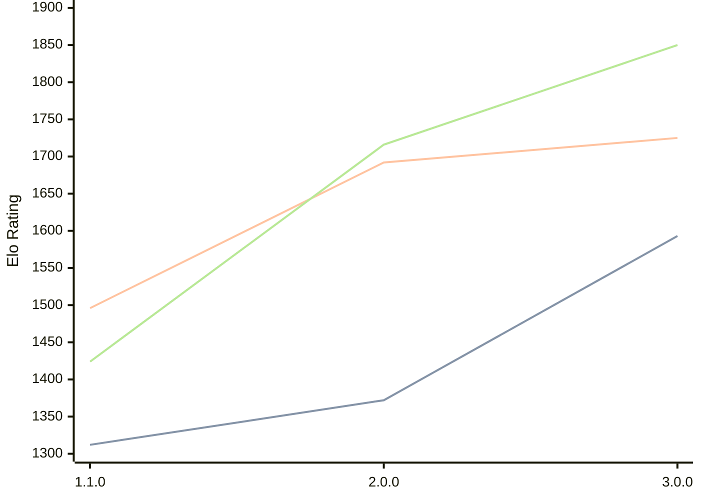

# Engine: Laura

Author: Hans Tibberio

Home: https://github.com/HansTibberio/Laura

## Elo Ratings

| Version | Published | STC 8.0+0.08s  | LTC 60.0+0.60s | VLTC 2m24s+1.12s | Comment |
| --- | --- | --- | --- | --- | --- |
| 3.0.0 | 2026-04-29 | 1593(+221) | 1725(+33) | 1850(+134) |  |
| 2.0.0 | 2026-04-23 | 1372(+60) | 1692(+196) | 1716(+292) |  |
| 1.1.0 | 2026-01-26 | 1312(+new) | 1496(+new) | 1424(+new) |  |
| 1.0.0 | 2025-05-30 |  |  |  |  |
 | | | cElo (∆ prev) | cElo (∆ prev) | cElo (∆ prev) | 

<a href="https://github.com/computer-chess-index/cci/issues/new?template=submit-version.yml&title=[VERSION]+Laura+<version>&body=###%20Engine%20name%0ALaura%0A%0A###%20Version%0A3.0.0" target="_blank">Submit new version</a>

 Test Conditions:

GUI/CLI: <a href=https://github.com/cutechess/cutechess target="_blank">Cute-Chess</a> 
Elo Calculation: <a href=https://www.remi-coulom.fr/Bayesian-Elo/ target="_blank">Bayesian-Elo</a> 
CPU: Intel(R) Core(TM) i5-7500T 2.70GHz 
Opening book: 8_moves_v3 
\* STC: 8.0+0.08s, LTC: 60.0+0.60s, VLTC: 2m24s+1.12s

 Lists:
Ratings: <a href=https://github.com/computer-chess-index/cci/blob/main/lists/CCIRatings.csv target="_blank">Complete list</a>

Generated: 2026-05-07 06:25:27

## Ratings Verlauf

⬛ STC (8.0+0.08s) &nbsp;&nbsp; 🟧 LTC (60.0+0.60s) &nbsp;&nbsp; 🟩 VLTC (2m24s+1.12s)

dark mode: 🟩STC (8.0+0.08s) 🟧LTC (60.0+0.60s) ⬜VLTC (2m24s+1.12s)

## Detailed Evaluation Results

| Version | Time Control | Elo  | Range +/- | Matches | Score | Average Opponent Elo | Draws |
| --- | --- | --- | --- | --- | --- | --- | --- |
| 3.0.0 | VLTC (2m24s+1.12s) | 1850 | 52 | 152 | 50% | 1829 | 13% |
| 3.0.0 | LTC (60.0+0.60s) | 1725 | 53 | 136 | 50% | 1735 | 15% |
| 3.0.0 | STC (8.0+0.08s) | 1593 | 54 | 126 | 49% | 1601 | 21% |
| --- | --- | --- | --- | --- | --- | --- | --- |
| 2.0.0 | VLTC (2m24s+1.12s) | 1716 | 56 | 98 | 53% | 1697 | 45% |
| 2.0.0 | LTC (60.0+0.60s) | 1692 | 55 | 104 | 48% | 1719 | 39% |
| 2.0.0 | STC (8.0+0.08s) | 1372 | 56 | 108 | 55% | 1300 | 37% |
| --- | --- | --- | --- | --- | --- | --- | --- |
| 1.1.0 | VLTC (2m24s+1.12s) | 1424 | 53 | 132 | 43% | 1604 | 37% |
| 1.1.0 | LTC (60.0+0.60s) | 1496 | 51 | 134 | 43% | 1627 | 34% |
| 1.1.0 | STC (8.0+0.08s) | 1312 | 62 | 134 | 47% | 1361 | 25% |
| --- | --- | --- | --- | --- | --- | --- | --- |