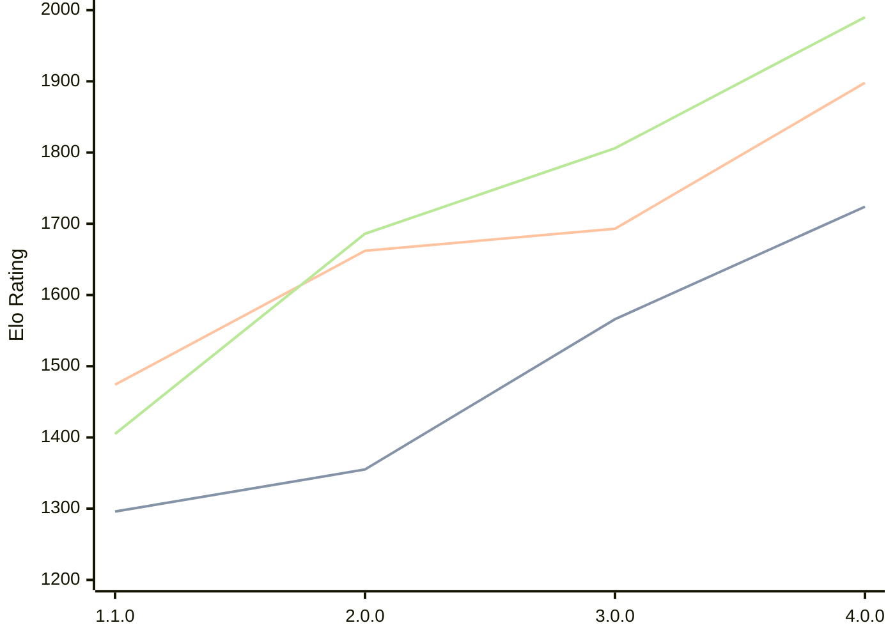

# Engine: Laura

Author: Hans Tibberio

Home: https://github.com/HansTibberio/Laura

## Elo Ratings

| Version | Published | STC 8.0+0.08s  | LTC 60.0+0.60s | VLTC 2m24s+1.12s | Comment |
| --- | --- | --- | --- | --- | --- |
| 4.0.0 | 2026-05-09 | 1724(+158) | 1898(+205) | 1990(+184) |  |
| 3.0.0 | 2026-04-29 | 1566(+211) | 1693(+31) | 1806(+120) |  |
| 2.0.0 | 2026-04-23 | 1355(+59) | 1662(+188) | 1686(+281) |  |
| 1.1.0 | 2026-01-26 | 1296 | 1474 | 1405 |  |
 | | | cElo (∆ prev) | cElo (∆ prev) | cElo (∆ prev) | 

<a href="https://github.com/computer-chess-index/cci/issues/new?template=submit-version.yml&title=[VERSION]+Laura+<version>&body=###%20Engine%20name%0ALaura%0A%0A###%20Version%0A4.0.0" target="_blank">Submit new version</a>

 Test Conditions:

GUI/CLI: <a href=https://github.com/cutechess/cutechess target="_blank">Cute-Chess</a> 
Elo Calculation: <a href=https://www.remi-coulom.fr/Bayesian-Elo/ target="_blank">Bayesian-Elo</a> 
CPU: Intel(R) Core(TM) i5-7500T 2.70GHz 
Opening book: 8_moves_v3 
\* STC: 8.0+0.08s, LTC: 60.0+0.60s, VLTC: 2m24s+1.12s

 Lists:
Ratings: <a href=https://github.com/computer-chess-index/cci/blob/main/lists/CCIRatings.csv target="_blank">Complete list</a>

Generated: 2026-08-20 06:26:40

## Ratings Verlauf

⬛ STC (8.0+0.08s) &nbsp;&nbsp; 🟧 LTC (60.0+0.60s) &nbsp;&nbsp; 🟩 VLTC (2m24s+1.12s)

dark mode: 🟩STC (8.0+0.08s) 🟧LTC (60.0+0.60s) ⬜VLTC (2m24s+1.12s)

## Detailed Evaluation Results

| Version | Time Control | Elo  | Range +/- | Matches | Score | Average Opponent Elo | Draws |
| --- | --- | --- | --- | --- | --- | --- | --- |
| 4.0.0 | VLTC (2m24s+1.12s) | 1990 | 43 | 194 | 51% | 1986 | 18% |
| 4.0.0 | LTC (60.0+0.60s) | 1898 | 42 | 216 | 50% | 1898 | 15% |
| 4.0.0 | STC (8.0+0.08s) | 1724 | 42 | 220 | 51% | 1717 | 15% |
| --- | --- | --- | --- | --- | --- | --- | --- |
| 3.0.0 | VLTC (2m24s+1.12s) | 1806 | 51 | 152 | 50% | 1786 | 13% |
| 3.0.0 | LTC (60.0+0.60s) | 1693 | 53 | 136 | 50% | 1701 | 15% |
| 3.0.0 | STC (8.0+0.08s) | 1566 | 54 | 126 | 49% | 1574 | 21% |
| --- | --- | --- | --- | --- | --- | --- | --- |
| 2.0.0 | VLTC (2m24s+1.12s) | 1686 | 56 | 98 | 53% | 1666 | 45% |
| 2.0.0 | LTC (60.0+0.60s) | 1662 | 55 | 104 | 48% | 1688 | 39% |
| 2.0.0 | STC (8.0+0.08s) | 1355 | 56 | 108 | 55% | 1285 | 37% |
| --- | --- | --- | --- | --- | --- | --- | --- |
| 1.1.0 | VLTC (2m24s+1.12s) | 1405 | 52 | 132 | 43% | 1581 | 37% |
| 1.1.0 | LTC (60.0+0.60s) | 1474 | 51 | 134 | 43% | 1601 | 34% |
| 1.1.0 | STC (8.0+0.08s) | 1296 | 62 | 134 | 47% | 1339 | 25% |
| --- | --- | --- | --- | --- | --- | --- | --- |