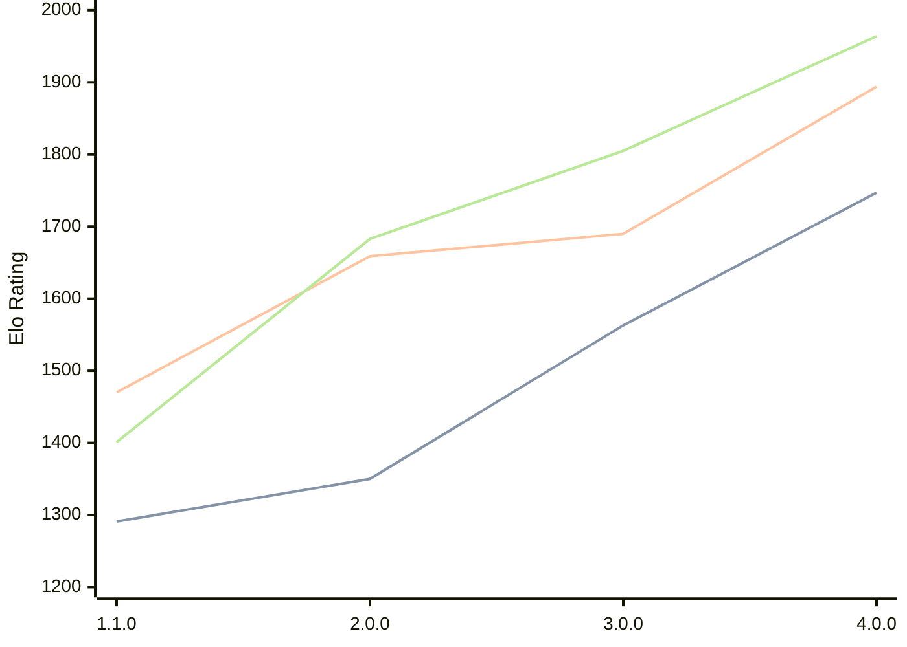

# Engine: Laura

Author: Hans Tibberio

Home: https://github.com/HansTibberio/Laura

## Elo Ratings

| Version | Published | STC 8.0+0.08s  | LTC 60.0+0.60s | VLTC 2m24s+1.12s | Comment |
| --- | --- | --- | --- | --- | --- |
| 4.0.0 | 2026-05-09 | 1747(+184) | 1894(+204) | 1964(+159) |  |
| 3.0.0 | 2026-04-29 | 1563(+213) | 1690(+31) | 1805(+122) |  |
| 2.0.0 | 2026-04-23 | 1350(+59) | 1659(+189) | 1683(+282) |  |
| 1.1.0 | 2026-01-26 | 1291(+new) | 1470(+new) | 1401(+new) |  |
| 1.0.0 | 2025-05-30 |  |  |  |  |
 | | | cElo (∆ prev) | cElo (∆ prev) | cElo (∆ prev) | 

<a href="https://github.com/computer-chess-index/cci/issues/new?template=submit-version.yml&title=[VERSION]+Laura+<version>&body=###%20Engine%20name%0ALaura%0A%0A###%20Version%0A4.0.0" target="_blank">Submit new version</a>

 Test Conditions:

GUI/CLI: <a href=https://github.com/cutechess/cutechess target="_blank">Cute-Chess</a> 
Elo Calculation: <a href=https://www.remi-coulom.fr/Bayesian-Elo/ target="_blank">Bayesian-Elo</a> 
CPU: Intel(R) Core(TM) i5-7500T 2.70GHz 
Opening book: 8_moves_v3 
\* STC: 8.0+0.08s, LTC: 60.0+0.60s, VLTC: 2m24s+1.12s

 Lists:
Ratings: <a href=https://github.com/computer-chess-index/cci/blob/main/lists/CCIRatings.csv target="_blank">Complete list</a>

Generated: 2026-06-08 06:25:33

## Ratings Verlauf

⬛ STC (8.0+0.08s) &nbsp;&nbsp; 🟧 LTC (60.0+0.60s) &nbsp;&nbsp; 🟩 VLTC (2m24s+1.12s)

dark mode: 🟩STC (8.0+0.08s) 🟧LTC (60.0+0.60s) ⬜VLTC (2m24s+1.12s)

## Detailed Evaluation Results

| Version | Time Control | Elo  | Range +/- | Matches | Score | Average Opponent Elo | Draws |
| --- | --- | --- | --- | --- | --- | --- | --- |
| 4.0.0 | VLTC (2m24s+1.12s) | 1964 | 49 | 156 | 48% | 1982 | 17% |
| 4.0.0 | LTC (60.0+0.60s) | 1894 | 47 | 168 | 50% | 1895 | 15% |
| 4.0.0 | STC (8.0+0.08s) | 1747 | 50 | 156 | 54% | 1709 | 14% |
| --- | --- | --- | --- | --- | --- | --- | --- |
| 3.0.0 | VLTC (2m24s+1.12s) | 1805 | 51 | 152 | 50% | 1785 | 13% |
| 3.0.0 | LTC (60.0+0.60s) | 1690 | 53 | 136 | 50% | 1700 | 15% |
| 3.0.0 | STC (8.0+0.08s) | 1563 | 54 | 126 | 49% | 1571 | 21% |
| --- | --- | --- | --- | --- | --- | --- | --- |
| 2.0.0 | VLTC (2m24s+1.12s) | 1683 | 56 | 98 | 53% | 1665 | 45% |
| 2.0.0 | LTC (60.0+0.60s) | 1659 | 55 | 104 | 48% | 1686 | 39% |
| 2.0.0 | STC (8.0+0.08s) | 1350 | 56 | 108 | 55% | 1281 | 37% |
| --- | --- | --- | --- | --- | --- | --- | --- |
| 1.1.0 | VLTC (2m24s+1.12s) | 1401 | 52 | 132 | 43% | 1575 | 37% |
| 1.1.0 | LTC (60.0+0.60s) | 1470 | 51 | 134 | 43% | 1597 | 34% |
| 1.1.0 | STC (8.0+0.08s) | 1291 | 62 | 134 | 47% | 1337 | 25% |
| --- | --- | --- | --- | --- | --- | --- | --- |