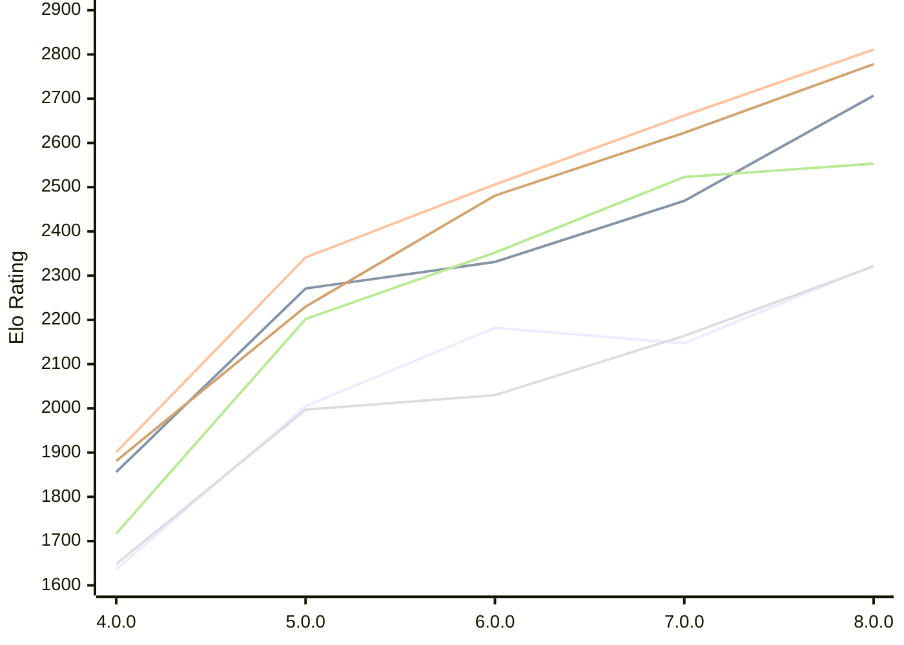
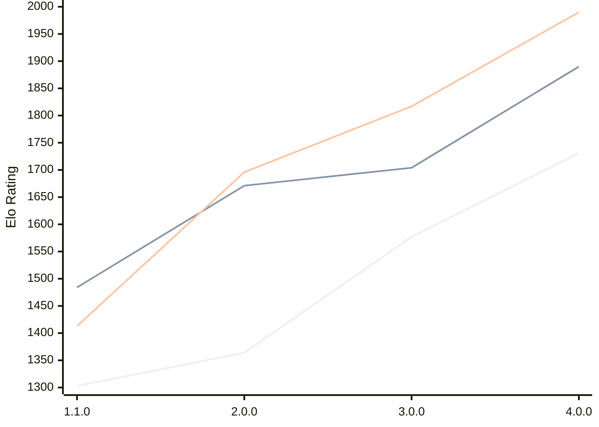

# Engine: Laura

Author: Hans Tibberio

Home: https://github.com/HansTibberio/Laura

## Elo Ratings E1 (Ultra 7 265T (1.50 GHz) - E-Core)

| Version | Published | STC 8.0+0.08s  | LTC 60.0+0.60s | VLTC 2m24s+1.12s | Comment |
| --- | --- | --- | --- | --- | --- |
| 8.0.0 | 2026-11-22 | 2323(+176) | 2707(+238) | 2811(+149) |  |
| 7.0.0 | 2026-11-14 | 2147(-35) | 2469(+138) | 2662(+156) |  |
| 6.0.0 | 2026-11-12 | 2182(+177) | 2331(+60) | 2506(+165) |  |
| 5.0.0 | 2026-11-10 | 2005(+369) | 2271(+415) | 2341(+440) |  |
| 4.0.0 | 2026-05-09 | 1636 | 1856 | 1901 |  |
 | | | cElo (∆ prev) | cElo (∆ prev) | cElo (∆ prev) | 

## Elo Ratings P1 (Ultra 7 265T (1.50 GHz) - P-Core)

| Version | Published | STC 8.0+0.08s  | LTC 60.0+0.60s | VLTC 2m24s+1.12s | Comment |
| --- | --- | --- | --- | --- | --- |
| 8.0.0 | 2026-11-22 | 2321(+157) | 2553(+30) | 2778(+155) |  |
| 7.0.0 | 2026-11-14 | 2164(+134) | 2523(+171) | 2623(+142) |  |
| 6.0.0 | 2026-11-12 | 2030(+33) | 2352(+150) | 2481(+251) |  |
| 5.0.0 | 2026-11-10 | 1997(+349) | 2202(+485) | 2230(+349) |  |
| 4.0.0 | 2026-05-09 | 1648 | 1717 | 1881 |  |
 | | | cElo (∆ prev) | cElo (∆ prev) | cElo (∆ prev) | 

## Elo Ratings T1 (i5-7500T 2.70GHz)

| Version | Published | STC 8.0+0.08s  | LTC 60.0+0.60s | VLTC 2m24s+1.12s | Comment |
| --- | --- | --- | --- | --- | --- |
| 4.0.0 | 2026-05-09 | 1731(+154) | 1890(+186) | 1990(+173) |  |
| 3.0.0 | 2026-04-29 | 1577(+213) | 1704(+33) | 1817(+121) |  |
| 2.0.0 | 2026-04-23 | 1364(+61) | 1671(+187) | 1696(+283) |  |
| 1.1.0 | 2026-01-26 | 1303 | 1484 | 1413 |  |
 | | | cElo (∆ prev) | cElo (∆ prev) | cElo (∆ prev) | 

<a href="https://github.com/computer-chess-index/cci/issues/new?template=submit-version.yml&title=[VERSION]+Laura+<version>&body=###%20Engine%20name%0ALaura%0A%0A###%20Version%0A4.0.0" target="_blank">Submit new version</a>

 Test Conditions:

GUI/CLI: <a href=https://github.com/cutechess/cutechess target="_blank">Cute-Chess</a> 
Elo Calculation: <a href=https://www.remi-coulom.fr/Bayesian-Elo/ target="_blank">Bayesian-Elo</a> 
CPU for P1: Intel(R) Core(TM) Ultra 7 265T (1.50 GHz) - P-Core 
CPU for E1: Intel(R) Core(TM) Ultra 7 265T (1.50 GHz) - E-Core 
CPU for T1: Intel(R) Core(TM) i5-7500T 2.70GHz 
Opening book: 8_moves_v3 
\* STC: 8.0+0.08s, LTC: 60.0+0.60s, VLTC: 2m24s+1.12s

 Lists:
Ratings: <a href=https://github.com/computer-chess-index/cci/blob/main/lists/CCIRatings.csv target="_blank">Complete list</a>

Generated: 2026-11-28 05:39:53

## Ratings Verlauf E1 / P1

```mermaid
%%{init: {"theme":"base","themeVariables":{"seriesColors:['#a3a3a3','#222221','#faa371']}}}%%
xychart-beta
  x-axis ["4.0.0", "5.0.0", "6.0.0", "7.0.0", "8.0.0"]
  y-axis "Elo Rating" 1600 --> 2900
  line "E1: STC (8.0+0.08s)" [1636, 2005, 2182, 2147, 2323]
  line "E1: LTC (60.0+0.60s)" [1856, 2271, 2331, 2469, 2707]
  line "E1: VLTC (2m24s+1.12s)" [1901, 2341, 2506, 2662, 2811]
  line "P1: STC (8.0+0.08s)" [1648, 1997, 2030, 2164, 2321]
  line "P1: LTC (60.0+0.60s)" [1717, 2202, 2352, 2523, 2553]
  line "P1: VLTC (2m24s+1.12s)" [1881, 2230, 2481, 2623, 2778]
```

## Ratings Verlauf T1

```mermaid
%%{init: {"theme":"base","themeVariables":{"seriesColors:['#a3a3a3','#222221','#faa371']}}}%%
xychart-beta
  x-axis ["1.1.0", "2.0.0", "3.0.0", "4.0.0"]
  y-axis "Elo Rating" 1300 --> 2000
  line "T1: STC (8.0+0.08s)" [1303, 1364, 1577, 1731]
  line "T1: LTC (60.0+0.60s)" [1484, 1671, 1704, 1890]
  line "T1: VLTC (2m24s+1.12s)" [1413, 1696, 1817, 1990]
```

## Detailed Evaluation Results

| Version | Time Control | Variant | Elo  | Range +/- | Matches | Score | Average Opponent Elo | Draws |
| --- | --- |--- | --- | --- | --- | --- | --- | --- |
| 8.0.0 | VLTC (2m24s+1.12s) | E1 | 2811 | 54 | 116 | 55% | 2768 | 28% |
|  |  | P1 | 2778 | 80 | 52 | 53% | 2753 | 25% |
|  | LTC (60.0+0.60s) | P1 | 2553 | 107 | 28 | 41% | 2637 | 32% |
|  |  | E1 | 2707 | 53 | 126 | 46% | 2738 | 20% |
|  | STC (8.0+0.08s) | P1 | 2321 | 69 | 74 | 47% | 2356 | 18% |
|  |  | E1 | 2323 | 70 | 68 | 53% | 2298 | 26% |
| --- | --- |--- | --- | --- | --- | --- | --- | --- |
| 7.0.0 | VLTC (2m24s+1.12s) | P1 | 2623 | 52 | 130 | 45% | 2673 | 22% |
|  |  | E1 | 2662 | 45 | 176 | 55% | 2611 | 20% |
|  | LTC (60.0+0.60s) | P1 | 2523 | 55 | 110 | 49% | 2527 | 25% |
|  |  | E1 | 2469 | 47 | 158 | 53% | 2442 | 20% |
|  | STC (8.0+0.08s) | P1 | 2164 | 69 | 72 | 51% | 2157 | 24% |
|  |  | E1 | 2147 | 53 | 128 | 50% | 2137 | 18% |
| --- | --- |--- | --- | --- | --- | --- | --- | --- |
| 6.0.0 | VLTC (2m24s+1.12s) | E1 | 2506 | 62 | 92 | 51% | 2492 | 20% |
|  |  | P1 | 2481 | 64 | 86 | 53% | 2449 | 21% |
|  | LTC (60.0+0.60s) | E1 | 2331 | 60 | 96 | 46% | 2371 | 24% |
|  |  | P1 | 2352 | 60 | 92 | 47% | 2380 | 27% |
|  | STC (8.0+0.08s) | E1 | 2182 | 65 | 82 | 54% | 2130 | 26% |
|  |  | P1 | 2030 | 94 | 40 | 50% | 2030 | 15% |
| --- | --- |--- | --- | --- | --- | --- | --- | --- |
| 5.0.0 | VLTC (2m24s+1.12s) | P1 | 2230 | 69 | 72 | 49% | 2234 | 24% |
|  |  | E1 | 2341 | 54 | 120 | 48% | 2358 | 22% |
|  | LTC (60.0+0.60s) | P1 | 2202 | 77 | 68 | 61% | 2082 | 10% |
|  |  | E1 | 2271 | 55 | 122 | 54% | 2201 | 23% |
|  | STC (8.0+0.08s) | P1 | 1997 | 85 | 50 | 55% | 1941 | 18% |
|  |  | E1 | 2005 | 60 | 106 | 53% | 1947 | 17% |
| --- | --- |--- | --- | --- | --- | --- | --- | --- |
| 4.0.0 | VLTC (2m24s+1.12s) | T1 | 1990 | 39 | 238 | 50% | 1995 | 19% |
|  |  | P1 | 1881 | 59 | 116 | 41% | 2026 | 16% |
|  |  | E1 | 1901 | 46 | 192 | 42% | 2045 | 16% |
|  | LTC (60.0+0.60s) | T1 | 1890 | 38 | 268 | 48% | 1910 | 13% |
|  |  | P1 | 1717 | 68 | 100 | 38% | 1922 | 12% |
|  |  | E1 | 1856 | 49 | 168 | 49% | 1905 | 15% |
|  | STC (8.0+0.08s) | P1 | 1648 | 72 | 92 | 39% | 1864 | 9% |
|  |  | E1 | 1636 | 50 | 170 | 48% | 1740 | 15% |
|  |  | T1 | 1731 | 37 | 280 | 51% | 1725 | 14% |
| --- | --- |--- | --- | --- | --- | --- | --- | --- |
| 3.0.0 | VLTC (2m24s+1.12s) | T1 | 1817 | 51 | 152 | 50% | 1797 | 13% |
|  | LTC (60.0+0.60s) | T1 | 1704 | 53 | 136 | 50% | 1712 | 15% |
|  | STC (8.0+0.08s) | T1 | 1577 | 54 | 126 | 49% | 1585 | 21% |
| --- | --- |--- | --- | --- | --- | --- | --- | --- |
| 2.0.0 | VLTC (2m24s+1.12s) | T1 | 1696 | 56 | 98 | 53% | 1675 | 45% |
|  | LTC (60.0+0.60s) | T1 | 1671 | 55 | 104 | 48% | 1698 | 39% |
|  | STC (8.0+0.08s) | T1 | 1364 | 56 | 108 | 55% | 1293 | 37% |
| --- | --- |--- | --- | --- | --- | --- | --- | --- |
| 1.1.0 | VLTC (2m24s+1.12s) | T1 | 1413 | 52 | 132 | 43% | 1589 | 37% |
|  | LTC (60.0+0.60s) | T1 | 1484 | 51 | 134 | 43% | 1611 | 34% |
|  | STC (8.0+0.08s) | T1 | 1303 | 62 | 134 | 47% | 1347 | 25% |