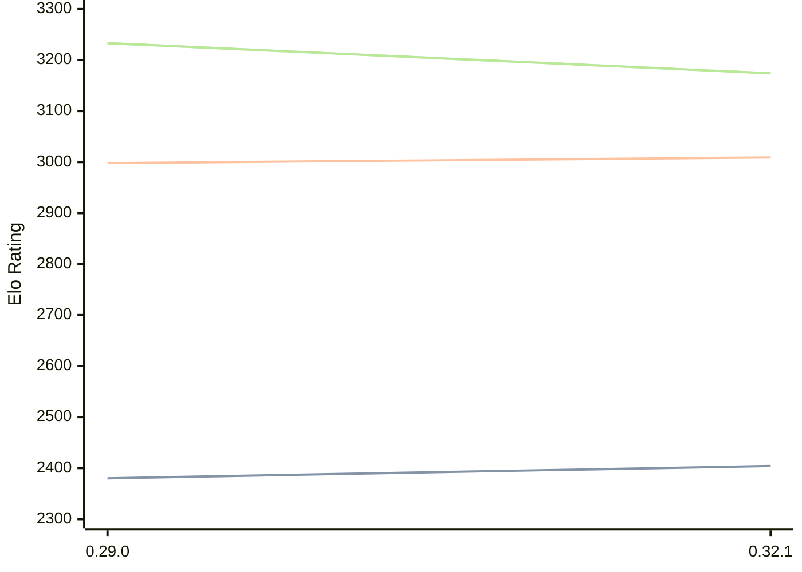

# Engine: Lc0

Author: https://lczero.org/

Home: https://github.com/LeelaChessZero/lc0

## Elo Ratings

| Version | Published | STC 8.0+0.08s  | LTC 60.0+0.60s | VLTC 2m24s+1.12s | Comment |
| --- | --- | --- | --- | --- | --- |
| 0.32.1 | 2025-11-23 | 2404(+24) | 3009(+11) | 3174(-59) |  |
| 0.29.0 | 2022-12-13 | 2380 | 2998 | 3233 |  |
 | | | cElo (∆ prev) | cElo (∆ prev) | cElo (∆ prev) | 

<a href="https://github.com/computer-chess-index/cci/issues/new?template=submit-version.yml&title=[VERSION]+Lc0+<version>&body=###%20Engine%20name%0ALc0%0A%0A###%20Version%0A0.32.1" target="_blank">Submit new version</a>

 Test Conditions:

GUI/CLI: <a href=https://github.com/cutechess/cutechess target="_blank">Cute-Chess</a> 
Elo Calculation: <a href=https://www.remi-coulom.fr/Bayesian-Elo/ target="_blank">Bayesian-Elo</a> 
CPU: Intel(R) Core(TM) i5-7500T 2.70GHz 
Opening book: 8_moves_v3 
\* STC: 8.0+0.08s, LTC: 60.0+0.60s, VLTC: 2m24s+1.12s

 Lists:
Ratings: <a href=https://github.com/computer-chess-index/cci/blob/main/lists/CCIRatings.csv target="_blank">Complete list</a>

Generated: 2026-09-15 04:39:38

## Ratings Verlauf

## Detailed Evaluation Results

| Version | Time Control | Elo  | Range +/- | Matches | Score | Average Opponent Elo | Draws |
| --- | --- | --- | --- | --- | --- | --- | --- |
| 0.32.1 | VLTC (2m24s+1.12s) | 3174 | 23 | 548 | 48% | 3186 | 53% |
| 0.32.1 | LTC (60.0+0.60s) | 3009 | 23 | 554 | 49% | 3017 | 45% |
| 0.32.1 | STC (8.0+0.08s) | 2404 | 21 | 786 | 49% | 2411 | 24% |
| --- | --- | --- | --- | --- | --- | --- | --- |
| 0.29.0 | VLTC (2m24s+1.12s) | 3233 | 28 | 356 | 50% | 3233 | 54% |
| 0.29.0 | LTC (60.0+0.60s) | 2998 | 30 | 328 | 48% | 3013 | 47% |
| 0.29.0 | STC (8.0+0.08s) | 2380 | 32 | 400 | 42% | 2493 | 19% |
| --- | --- | --- | --- | --- | --- | --- | --- |