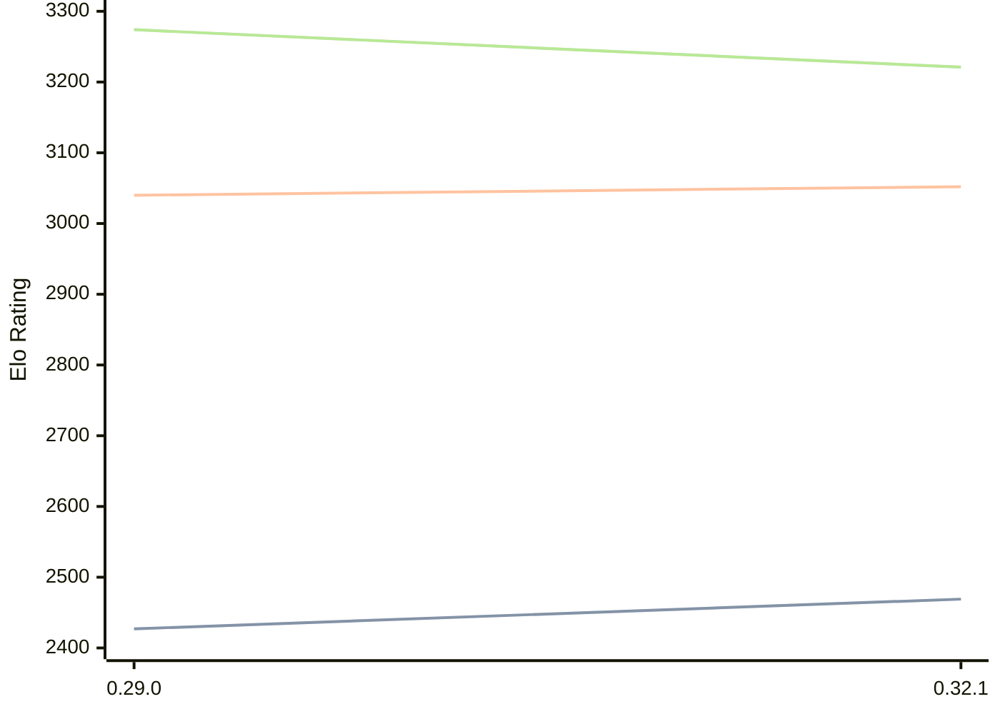

# Engine: Lc0

Author: https://lczero.org/

Home: https://github.com/LeelaChessZero/lc0

## Elo Ratings

| Version | Published | STC 8.0+0.08s  | LTC 60.0+0.60s | VLTC 2m24s+1.12s | Comment |
| --- | --- | --- | --- | --- | --- |
| 0.32.1 | 2025-11-23 | 2469(+new) | 3052(+new) | 3221(+new) |  |
| 0.32.0 | 2025-08-21 |  |  |  |  |
| 0.31.2 | 2024-10-20 |  |  |  |  |
| 0.31.1 | 2024-08-11 |  |  |  |  |
| 0.31.0 | 2024-06-16 |  |  |  |  |
| 0.30.0 | 2023-07-21 |  |  |  |  |
| 0.29.0 | 2022-12-13 | 2427(+new) | 3040(+new) | 3274(+new) |  |
| 0.28.2 | 2021-12-13 |  |  |  |  |
| 0.28.0 | 2021-08-25 |  |  |  |  |
| 0.27.0 | 2021-02-21 |  |  |  |  |
| 0.26.3 | 2020-10-10 |  |  |  |  |
| 0.26.2 | 2020-09-02 |  |  |  |  |
| 0.26.1 | 2020-07-15 |  |  |  |  |
| 0.26.0 | 2020-07-02 |  |  |  |  |
| 0.25.1 | 2020-04-30 |  |  |  |  |
| 0.25.0 | 2020-04-28 |  |  |  |  |
| 0.24.1 | 2020-03-15 |  |  |  |  |
| 0.24.0 | 2020-03-11 |  |  |  |  |
| 0.23.3 | 2020-02-18 |  |  |  |  |
| 0.23.2 | 2019-12-31 |  |  |  |  |
| 0.23.1 | 2019-12-03 |  |  |  |  |
| 0.23.0 | 2019-12-01 |  |  |  |  |
| 0.22.0 | 2019-08-05 |  |  |  |  |
| 0.21.4 | 2019-07-28 |  |  |  |  |
| 0.21.3 | 2019-07-21 |  |  |  |  |
| 0.21.2 | 2019-06-09 |  |  |  |  |
| 0.21.1 | 2019-03-23 |  |  |  |  |
| 0.21.0 | 2019-03-08 |  |  |  |  |
| 0.20.2 | 2019-02-01 |  |  |  |  |
| 0.20.1 | 2019-01-07 |  |  |  |  |
| 0.20.0 | 2019-01-01 |  |  |  |  |
| 0.19.1.1 | 2018-12-11 |  |  |  |  |
| 0.19.1 | 2018-12-10 |  |  |  |  |
| 0.19.0 | 2018-11-19 |  |  |  |  |
| 0.18.1 | 2018-10-02 |  |  |  |  |
| 0.18.0 | 2018-09-30 |  |  |  |  |
| 0.17.0 | 2018-08-27 |  |  |  |  |
| 0.16.0 | 2018-07-20 |  |  |  |  |
 | | | cElo (∆ prev) | cElo (∆ prev) | cElo (∆ prev) | 

<a href="https://github.com/computer-chess-index/cci/issues/new?template=submit-version.yml&title=[VERSION]+Lc0+<version>&body=###%20Engine%20name%0ALc0%0A%0A###%20Version%0A0.32.1" target="_blank">Submit new version</a>

 Test Conditions:

GUI/CLI: <a href=https://github.com/cutechess/cutechess target="_blank">Cute-Chess</a> 
Elo Calculation: <a href=https://www.remi-coulom.fr/Bayesian-Elo/ target="_blank">Bayesian-Elo</a> 
CPU: Intel(R) Core(TM) i5-7500T 2.70GHz 
Opening book: 8_moves_v3 
\* STC: 8.0+0.08s, LTC: 60.0+0.60s, VLTC: 2m24s+1.12s

 Lists:
Ratings: <a href=https://github.com/computer-chess-index/cci/blob/main/lists/CCIRatings.csv target="_blank">Complete list</a>

Generated: 2026-05-03 07:39:34

## Ratings Verlauf

⬛ STC (8.0+0.08s) &nbsp;&nbsp; 🟧 LTC (60.0+0.60s) &nbsp;&nbsp; 🟩 VLTC (2m24s+1.12s)

dark mode: 🟩STC (8.0+0.08s) 🟧LTC (60.0+0.60s) ⬜VLTC (2m24s+1.12s)

## Detailed Evaluation Results

| Version | Time Control | Elo  | Range +/- | Matches | Score | Average Opponent Elo | Draws |
| --- | --- | --- | --- | --- | --- | --- | --- |
| 0.32.1 | VLTC (2m24s+1.12s) | 3221 | 25 | 464 | 49% | 3229 | 52% |
| 0.32.1 | LTC (60.0+0.60s) | 3052 | 26 | 430 | 48% | 3066 | 46% |
| 0.32.1 | STC (8.0+0.08s) | 2469 | 25 | 576 | 51% | 2464 | 23% |
| --- | --- | --- | --- | --- | --- | --- | --- |
| 0.32.0 |  |  |  |  |  |  |  |
| 0.31.2 |  |  |  |  |  |  |  |
| 0.31.1 |  |  |  |  |  |  |  |
| 0.31.0 |  |  |  |  |  |  |  |
| 0.30.0 |  |  |  |  |  |  |  |
| 0.29.0 | VLTC (2m24s+1.12s) | 3274 | 28 | 356 | 50% | 3274 | 54% |
| 0.29.0 | D1 | 1746 | 16 | 1384 | 56% | 1679 | 21% |
| 0.29.0 | D2 | 1755 | 50 | 163 | 66% | 1588 | 12% |
| 0.29.0 | D3 | 2080 | 74 | 77 | 66% | 1901 | 8% |
| 0.29.0 | D4 | 2194 | 139 | 19 | 50% | 2194 | 5% |
| 0.29.0 | S10 | 2446 | 36 | 286 | 53% | 2388 | 21% |
| 0.29.0 | S40 | 2936 | 28 | 396 | 45% | 2979 | 39% |
| 0.29.0 | LTC (60.0+0.60s) | 3040 | 30 | 328 | 48% | 3055 | 47% |
| 0.29.0 | STC (8.0+0.08s) | 2427 | 32 | 400 | 42% | 2541 | 19% |
| --- | --- | --- | --- | --- | --- | --- | --- |
| 0.28.2 |  |  |  |  |  |  |  |
| 0.28.0 |  |  |  |  |  |  |  |
| 0.27.0 |  |  |  |  |  |  |  |
| 0.26.3 |  |  |  |  |  |  |  |
| 0.26.2 |  |  |  |  |  |  |  |
| 0.26.1 |  |  |  |  |  |  |  |
| 0.26.0 |  |  |  |  |  |  |  |
| 0.25.1 |  |  |  |  |  |  |  |
| 0.25.0 |  |  |  |  |  |  |  |
| 0.24.1 |  |  |  |  |  |  |  |
| 0.24.0 |  |  |  |  |  |  |  |
| 0.23.3 |  |  |  |  |  |  |  |
| 0.23.2 |  |  |  |  |  |  |  |
| 0.23.1 |  |  |  |  |  |  |  |
| 0.23.0 |  |  |  |  |  |  |  |
| 0.22.0 |  |  |  |  |  |  |  |
| 0.21.4 |  |  |  |  |  |  |  |
| 0.21.3 |  |  |  |  |  |  |  |
| 0.21.2 |  |  |  |  |  |  |  |
| 0.21.1 |  |  |  |  |  |  |  |
| 0.21.0 |  |  |  |  |  |  |  |
| 0.20.2 |  |  |  |  |  |  |  |
| 0.20.1 |  |  |  |  |  |  |  |
| 0.20.0 |  |  |  |  |  |  |  |
| 0.19.1.1 |  |  |  |  |  |  |  |
| 0.19.1 |  |  |  |  |  |  |  |
| 0.19.0 |  |  |  |  |  |  |  |
| 0.18.1 |  |  |  |  |  |  |  |
| 0.18.0 |  |  |  |  |  |  |  |
| 0.17.0 |  |  |  |  |  |  |  |
| 0.16.0 |  |  |  |  |  |  |  |