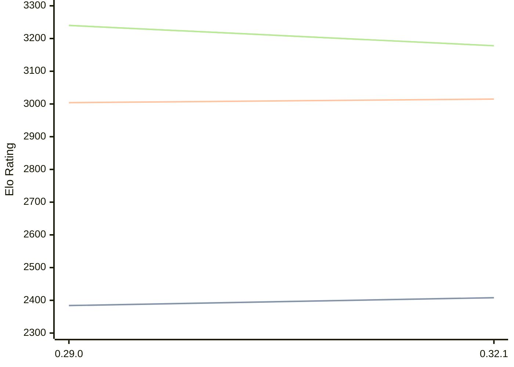

# Engine: Lc0

Author: https://lczero.org/

Home: https://github.com/LeelaChessZero/lc0

## Elo Ratings E1

| Version | Published | STC 8.0+0.08s  | LTC 60.0+0.60s | VLTC 2m24s+1.12s | Comment |
| --- | --- | --- | --- | --- | --- |
| 0.32.1 | 2025-11-23 | 2005 | 2723 | 2932 |  |
 | | | cElo (∆ prev) | cElo (∆ prev) | cElo (∆ prev) | 

## Elo Ratings P1

| Version | Published | STC 8.0+0.08s  | LTC 60.0+0.60s | VLTC 2m24s+1.12s | Comment |
| --- | --- | --- | --- | --- | --- |
| 0.32.1 | 2025-11-23 | 2313 | 3089 | 3290 |  |
 | | | cElo (∆ prev) | cElo (∆ prev) | cElo (∆ prev) | 

## Elo Ratings T1

| Version | Published | STC 8.0+0.08s  | LTC 60.0+0.60s | VLTC 2m24s+1.12s | Comment |
| --- | --- | --- | --- | --- | --- |
| 0.32.1 | 2025-11-23 | 2408(+24) | 3015(+11) | 3178(-62) |  |
| 0.29.0 | 2022-12-13 | 2384 | 3004 | 3240 |  |
 | | | cElo (∆ prev) | cElo (∆ prev) | cElo (∆ prev) | 

<a href="https://github.com/computer-chess-index/cci/issues/new?template=submit-version.yml&title=[VERSION]+Lc0+<version>&body=###%20Engine%20name%0ALc0%0A%0A###%20Version%0A0.32.1" target="_blank">Submit new version</a>

 Test Conditions:

GUI/CLI: <a href=https://github.com/cutechess/cutechess target="_blank">Cute-Chess</a> 
Elo Calculation: <a href=https://www.remi-coulom.fr/Bayesian-Elo/ target="_blank">Bayesian-Elo</a> 
CPU for P1: Intel(R) Core(TM) Ultra 7 265T (1.50 GHz) - P-Core 
CPU for E1: Intel(R) Core(TM) Ultra 7 265T (1.50 GHz) - E-Core 
CPU for T1: Intel(R) Core(TM) i5-7500T 2.70GHz 
Opening book: 8_moves_v3 
\* STC: 8.0+0.08s, LTC: 60.0+0.60s, VLTC: 2m24s+1.12s

 Lists:
Ratings: <a href=https://github.com/computer-chess-index/cci/blob/main/lists/CCIRatings.csv target="_blank">Complete list</a>

Generated: 2026-10-09 14:13:09

## Ratings Verlauf

```mermaid
%%{init: {"theme":"base","themeVariables":{"seriesColors:['#a3a3a3','#222221','#faa371']}}}%%
xychart-beta
  x-axis ["0.29.0", "0.32.1"]
  y-axis "Elo Rating" 2300 --> 3300
  line "" [2384, 2408]
  line "STC (8.0+0.08s)" [2384, 2408]
  line "LTC (60.0+0.60s)" [3004, 3015]
  line "" [3240, 3178]
  line "VLTC (2m24s+1.12s)" [3240, 3178]
```

## Detailed Evaluation Results

| Version | Time Control | Elo  | Range +/- | Matches | Score | Average Opponent Elo | Draws |
| --- | --- | --- | --- | --- | --- | --- | --- |
| 0.32.1 | VLTC (2m24s+1.12s) | 3178 | 22 | 556 | 48% | 3193 | 53% |
| 0.32.1 | VLTC (2m24s+1.12s) | 3290 | 43 | 156 | 58% | 3200 | 53% |
| 0.32.1 | VLTC (2m24s+1.12s) | 2932 | 33 | 282 | 57% | 2853 | 41% |
| 0.32.1 | LTC (60.0+0.60s) | 3015 | 23 | 574 | 49% | 3024 | 46% |
| 0.32.1 | LTC (60.0+0.60s) | 3089 | 42 | 180 | 48% | 3101 | 38% |
| 0.32.1 | LTC (60.0+0.60s) | 2723 | 43 | 196 | 56% | 2638 | 33% |
| 0.32.1 | STC (8.0+0.08s) | 2408 | 21 | 814 | 49% | 2415 | 24% |
| --- | --- | --- | --- | --- | --- | --- | --- |
| 0.32.1 | STC (8.0+0.08s) | 2313 | 41 | 196 | 40% | 2404 | 35% |
| --- | --- | --- | --- | --- | --- | --- | --- |
| 0.32.1 | STC (8.0+0.08s) | 2005 | 38 | 272 | 36% | 2148 | 23% |
| --- | --- | --- | --- | --- | --- | --- | --- |
| 0.29.0 | VLTC (2m24s+1.12s) | 3240 | 28 | 356 | 50% | 3239 | 54% |
| 0.29.0 | LTC (60.0+0.60s) | 3004 | 30 | 328 | 48% | 3019 | 47% |
| 0.29.0 | STC (8.0+0.08s) | 2384 | 32 | 400 | 42% | 2498 | 19% |
| --- | --- | --- | --- | --- | --- | --- | --- |