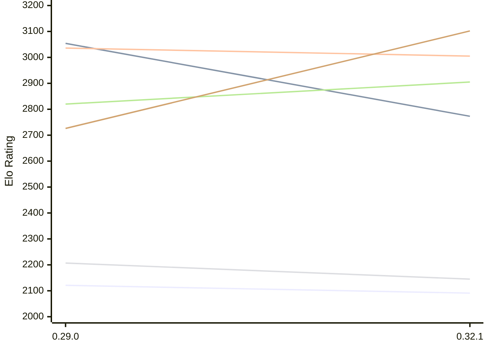
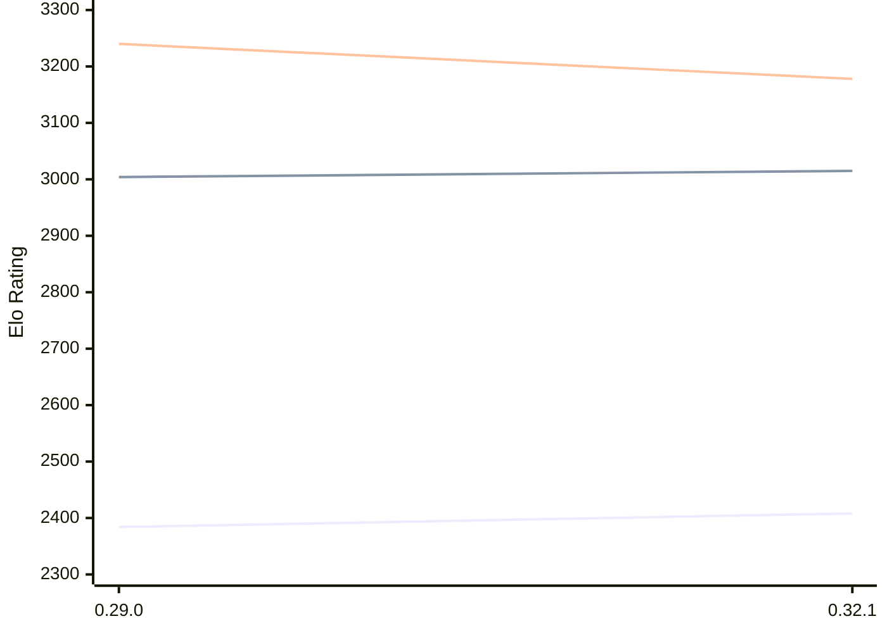

# Engine: Lc0

Author: https://lczero.org/

Home: https://github.com/LeelaChessZero/lc0

## Elo Ratings E1 (Ultra 7 265T (1.50 GHz) - E-Core)

| Version | Published | STC 8.0+0.08s  | LTC 60.0+0.60s | VLTC 2m24s+1.12s | Comment |
| --- | --- | --- | --- | --- | --- |
| 0.32.1 | 2025-11-23 | 2091(-30) | 2773(-281) | 3005(-31) |  |
| 0.29.0 | 2022-12-13 | 2121 | 3054 | 3036 |  |
 | | | cElo (∆ prev) | cElo (∆ prev) | cElo (∆ prev) | 

## Elo Ratings P1 (Ultra 7 265T (1.50 GHz) - P-Core)

| Version | Published | STC 8.0+0.08s  | LTC 60.0+0.60s | VLTC 2m24s+1.12s | Comment |
| --- | --- | --- | --- | --- | --- |
| 0.32.1 | 2025-11-23 | 2145(-62) | 2905(+85) | 3102(+376) |  |
| 0.29.0 | 2022-12-13 | 2207 | 2820 | 2726 |  |
 | | | cElo (∆ prev) | cElo (∆ prev) | cElo (∆ prev) | 

## Elo Ratings T1 (i5-7500T 2.70GHz)

| Version | Published | STC 8.0+0.08s  | LTC 60.0+0.60s | VLTC 2m24s+1.12s | Comment |
| --- | --- | --- | --- | --- | --- |
| 0.32.1 | 2025-11-23 | 2408(+24) | 3015(+11) | 3178(-62) |  |
| 0.29.0 | 2022-12-13 | 2384 | 3004 | 3240 |  |
 | | | cElo (∆ prev) | cElo (∆ prev) | cElo (∆ prev) | 

<a href="https://github.com/computer-chess-index/cci/issues/new?template=submit-version.yml&title=[VERSION]+Lc0+<version>&body=###%20Engine%20name%0ALc0%0A%0A###%20Version%0A0.32.1" target="_blank">Submit new version</a>

 Test Conditions:

GUI/CLI: <a href=https://github.com/cutechess/cutechess target="_blank">Cute-Chess</a> 
Elo Calculation: <a href=https://www.remi-coulom.fr/Bayesian-Elo/ target="_blank">Bayesian-Elo</a> 
CPU for P1: Intel(R) Core(TM) Ultra 7 265T (1.50 GHz) - P-Core 
CPU for E1: Intel(R) Core(TM) Ultra 7 265T (1.50 GHz) - E-Core 
CPU for T1: Intel(R) Core(TM) i5-7500T 2.70GHz 
Opening book: 8_moves_v3 
\* STC: 8.0+0.08s, LTC: 60.0+0.60s, VLTC: 2m24s+1.12s

 Lists:
Ratings: <a href=https://github.com/computer-chess-index/cci/blob/main/lists/CCIRatings.csv target="_blank">Complete list</a>

Generated: 2026-11-13 05:39:44

## Ratings Verlauf E1 / P1

```mermaid
%%{init: {"theme":"base","themeVariables":{"seriesColors:['#a3a3a3','#222221','#faa371']}}}%%
xychart-beta
  x-axis ["0.29.0", "0.32.1"]
  y-axis "Elo Rating" 2000 --> 3200
  line "E1: STC (8.0+0.08s)" [2121, 2091]
  line "E1: LTC (60.0+0.60s)" [3054, 2773]
  line "E1: VLTC (2m24s+1.12s)" [3036, 3005]
  line "P1: STC (8.0+0.08s)" [2207, 2145]
  line "P1: LTC (60.0+0.60s)" [2820, 2905]
  line "P1: VLTC (2m24s+1.12s)" [2726, 3102]
```

## Ratings Verlauf T1

```mermaid
%%{init: {"theme":"base","themeVariables":{"seriesColors:['#a3a3a3','#222221','#faa371']}}}%%
xychart-beta
  x-axis ["0.29.0", "0.32.1"]
  y-axis "Elo Rating" 2300 --> 3300
  line "T1: STC (8.0+0.08s)" [2384, 2408]
  line "T1: LTC (60.0+0.60s)" [3004, 3015]
  line "T1: VLTC (2m24s+1.12s)" [3240, 3178]
```

## Detailed Evaluation Results

| Version | Time Control | Variant | Elo  | Range +/- | Matches | Score | Average Opponent Elo | Draws |
| --- | --- |--- | --- | --- | --- | --- | --- | --- |
| 0.32.1 | VLTC (2m24s+1.12s) | P1 | 3102 | 36 | 216 | 54% | 3047 | 53% |
|  |  | E1 | 3005 | 25 | 482 | 56% | 2944 | 45% |
|  |  | T1 | 3178 | 22 | 556 | 48% | 3193 | 53% |
|  | LTC (60.0+0.60s) | P1 | 2905 | 35 | 258 | 48% | 2917 | 37% |
|  |  | E1 | 2773 | 29 | 408 | 51% | 2747 | 36% |
|  |  | T1 | 3015 | 23 | 574 | 49% | 3024 | 46% |
|  | STC (8.0+0.08s) | E1 | 2091 | 30 | 426 | 40% | 2198 | 19% |
|  |  | T1 | 2408 | 21 | 814 | 49% | 2415 | 24% |
|  |  | P1 | 2145 | 35 | 280 | 42% | 2221 | 30% |
| --- | --- |--- | --- | --- | --- | --- | --- | --- |
| 0.29.0 | VLTC (2m24s+1.12s) | P1 | 2726 | 216 | 8 | 88% | 2400 | 25% |
|  |  | E1 | 3036 | 112 | 28 | 63% | 2866 | 32% |
|  |  | T1 | 3240 | 28 | 356 | 50% | 3239 | 54% |
|  | LTC (60.0+0.60s) | E1 | 3054 | 128 | 24 | 65% | 2673 | 38% |
|  |  | T1 | 3004 | 30 | 328 | 48% | 3019 | 47% |
|  |  | P1 | 2820 | 162 | 24 | 83% | 2232 | 17% |
|  | STC (8.0+0.08s) | E1 | 2121 | 116 | 32 | 38% | 2294 | 19% |
|  |  | T1 | 2384 | 32 | 400 | 42% | 2498 | 19% |
|  |  | P1 | 2207 | 119 | 32 | 50% | 2226 | 19% |