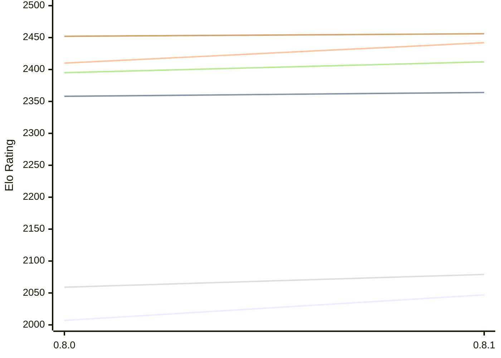

# Engine: LittleWing

Author: Vincent Ollivier

Home: https://github.com/vinc/littlewing

## Elo Ratings E1 (Ultra 7 265T (1.50 GHz) - E-Core)

| Version | Published | STC 8.0+0.08s  | LTC 60.0+0.60s | VLTC 2m24s+1.12s | Comment |
| --- | --- | --- | --- | --- | --- |
| 0.8.1 | 2026-10-17 | 2047(+40) | 2364(+6) | 2442(+32) |  |
| 0.8.0 | 2026-03-03 | 2007 | 2358 | 2410 |  |
 | | | cElo (∆ prev) | cElo (∆ prev) | cElo (∆ prev) | 

## Elo Ratings P1 (Ultra 7 265T (1.50 GHz) - P-Core)

| Version | Published | STC 8.0+0.08s  | LTC 60.0+0.60s | VLTC 2m24s+1.12s | Comment |
| --- | --- | --- | --- | --- | --- |
| 0.8.1 | 2026-10-17 | 2079(+20) | 2412(+17) | 2456(+4) |  |
| 0.8.0 | 2026-03-03 | 2059 | 2395 | 2452 |  |
 | | | cElo (∆ prev) | cElo (∆ prev) | cElo (∆ prev) | 

## Elo Ratings T1 (i5-7500T 2.70GHz)

| Version | Published | STC 8.0+0.08s  | LTC 60.0+0.60s | VLTC 2m24s+1.12s | Comment |
| --- | --- | --- | --- | --- | --- |
| 0.8.0 | 2026-03-03 | 2074 | 2344 | 2407 |  |
 | | | cElo (∆ prev) | cElo (∆ prev) | cElo (∆ prev) | 

<a href="https://github.com/computer-chess-index/cci/issues/new?template=submit-version.yml&title=[VERSION]+LittleWing+<version>&body=###%20Engine%20name%0ALittleWing%0A%0A###%20Version%0A0.8.0" target="_blank">Submit new version</a>

 Test Conditions:

GUI/CLI: <a href=https://github.com/cutechess/cutechess target="_blank">Cute-Chess</a> 
Elo Calculation: <a href=https://www.remi-coulom.fr/Bayesian-Elo/ target="_blank">Bayesian-Elo</a> 
CPU for P1: Intel(R) Core(TM) Ultra 7 265T (1.50 GHz) - P-Core 
CPU for E1: Intel(R) Core(TM) Ultra 7 265T (1.50 GHz) - E-Core 
CPU for T1: Intel(R) Core(TM) i5-7500T 2.70GHz 
Opening book: 8_moves_v3 
\* STC: 8.0+0.08s, LTC: 60.0+0.60s, VLTC: 2m24s+1.12s

 Lists:
Ratings: <a href=https://github.com/computer-chess-index/cci/blob/main/lists/CCIRatings.csv target="_blank">Complete list</a>

Generated: 2026-11-03 05:39:41

## Ratings Verlauf E1 / P1

```mermaid
%%{init: {"theme":"base","themeVariables":{"seriesColors:['#a3a3a3','#222221','#faa371']}}}%%
xychart-beta
  x-axis ["0.8.0", "0.8.1"]
  y-axis "Elo Rating" 2000 --> 2500
  line "E1: STC (8.0+0.08s)" [2007, 2047]
  line "E1: LTC (60.0+0.60s)" [2358, 2364]
  line "E1: VLTC (2m24s+1.12s)" [2410, 2442]
  line "P1: STC (8.0+0.08s)" [2059, 2079]
  line "P1: LTC (60.0+0.60s)" [2395, 2412]
  line "P1: VLTC (2m24s+1.12s)" [2452, 2456]
```

## Detailed Evaluation Results

| Version | Time Control | Variant | Elo  | Range +/- | Matches | Score | Average Opponent Elo | Draws |
| --- | --- |--- | --- | --- | --- | --- | --- | --- |
| 0.8.1 | VLTC (2m24s+1.12s) | E1 | 2442 | 42 | 192 | 51% | 2429 | 27% |
|  |  | P1 | 2456 | 53 | 126 | 51% | 2468 | 21% |
|  | LTC (60.0+0.60s) | E1 | 2364 | 41 | 204 | 51% | 2353 | 21% |
|  |  | P1 | 2412 | 53 | 124 | 49% | 2422 | 23% |
|  | STC (8.0+0.08s) | P1 | 2079 | 50 | 144 | 47% | 2114 | 19% |
|  |  | E1 | 2047 | 41 | 216 | 50% | 2053 | 16% |
| --- | --- |--- | --- | --- | --- | --- | --- | --- |
| 0.8.0 | VLTC (2m24s+1.12s) | T1 | 2407 | 26 | 516 | 51% | 2398 | 22% |
|  |  | P1 | 2452 | 45 | 168 | 44% | 2503 | 24% |
|  |  | E1 | 2410 | 43 | 194 | 49% | 2398 | 26% |
|  | LTC (60.0+0.60s) | T1 | 2344 | 26 | 524 | 53% | 2313 | 23% |
|  |  | P1 | 2395 | 53 | 124 | 49% | 2403 | 24% |
|  |  | E1 | 2358 | 42 | 212 | 48% | 2385 | 18% |
|  | STC (8.0+0.08s) | T1 | 2074 | 24 | 644 | 52% | 2052 | 20% |
|  |  | P1 | 2059 | 47 | 172 | 49% | 2082 | 19% |
|  |  | E1 | 2007 | 36 | 284 | 44% | 2091 | 18% |