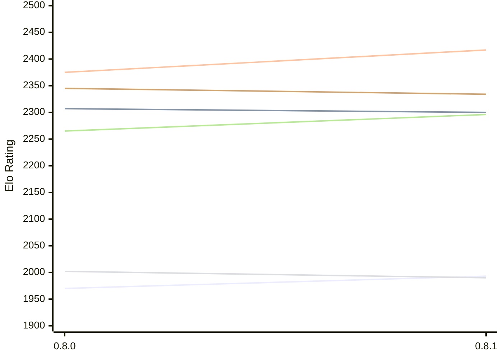

# Engine: LittleWing

Author: Vincent Ollivier

Home: https://github.com/vinc/littlewing

## Elo Ratings E1 (Ultra 7 265T (1.50 GHz) - E-Core)

| Version | Published | STC 8.0+0.08s  | LTC 60.0+0.60s | VLTC 2m24s+1.12s | Comment |
| --- | --- | --- | --- | --- | --- |
| 0.8.1 | 2026-10-17 | 1993(+23) | 2300(-7) | 2417(+42) |  |
| 0.8.0 | 2026-03-03 | 1970 | 2307 | 2375 |  |
 | | | cElo (∆ prev) | cElo (∆ prev) | cElo (∆ prev) | 

## Elo Ratings P1 (Ultra 7 265T (1.50 GHz) - P-Core)

| Version | Published | STC 8.0+0.08s  | LTC 60.0+0.60s | VLTC 2m24s+1.12s | Comment |
| --- | --- | --- | --- | --- | --- |
| 0.8.1 | 2026-10-17 | 1990(-12) | 2296(+31) | 2334(-11) |  |
| 0.8.0 | 2026-03-03 | 2002 | 2265 | 2345 |  |
 | | | cElo (∆ prev) | cElo (∆ prev) | cElo (∆ prev) | 

## Elo Ratings T1 (i5-7500T 2.70GHz)

| Version | Published | STC 8.0+0.08s  | LTC 60.0+0.60s | VLTC 2m24s+1.12s | Comment |
| --- | --- | --- | --- | --- | --- |
| 0.8.0 | 2026-03-03 | 2074 | 2344 | 2407 |  |
 | | | cElo (∆ prev) | cElo (∆ prev) | cElo (∆ prev) | 

<a href="https://github.com/computer-chess-index/cci/issues/new?template=submit-version.yml&title=[VERSION]+LittleWing+<version>&body=###%20Engine%20name%0ALittleWing%0A%0A###%20Version%0A0.8.0" target="_blank">Submit new version</a>

 Test Conditions:

GUI/CLI: <a href=https://github.com/cutechess/cutechess target="_blank">Cute-Chess</a> 
Elo Calculation: <a href=https://www.remi-coulom.fr/Bayesian-Elo/ target="_blank">Bayesian-Elo</a> 
CPU for P1: Intel(R) Core(TM) Ultra 7 265T (1.50 GHz) - P-Core 
CPU for E1: Intel(R) Core(TM) Ultra 7 265T (1.50 GHz) - E-Core 
CPU for T1: Intel(R) Core(TM) i5-7500T 2.70GHz 
Opening book: 8_moves_v3 
\* STC: 8.0+0.08s, LTC: 60.0+0.60s, VLTC: 2m24s+1.12s

 Lists:
Ratings: <a href=https://github.com/computer-chess-index/cci/blob/main/lists/CCIRatings.csv target="_blank">Complete list</a>

Generated: 2026-11-23 05:39:52

## Ratings Verlauf E1 / P1

```mermaid
%%{init: {"theme":"base","themeVariables":{"seriesColors:['#a3a3a3','#222221','#faa371']}}}%%
xychart-beta
  x-axis ["0.8.0", "0.8.1"]
  y-axis "Elo Rating" 1900 --> 2500
  line "E1: STC (8.0+0.08s)" [1970, 1993]
  line "E1: LTC (60.0+0.60s)" [2307, 2300]
  line "E1: VLTC (2m24s+1.12s)" [2375, 2417]
  line "P1: STC (8.0+0.08s)" [2002, 1990]
  line "P1: LTC (60.0+0.60s)" [2265, 2296]
  line "P1: VLTC (2m24s+1.12s)" [2345, 2334]
```

## Detailed Evaluation Results

| Version | Time Control | Variant | Elo  | Range +/- | Matches | Score | Average Opponent Elo | Draws |
| --- | --- |--- | --- | --- | --- | --- | --- | --- |
| 0.8.1 | VLTC (2m24s+1.12s) | E1 | 2417 | 34 | 296 | 54% | 2361 | 25% |
|  |  | P1 | 2334 | 44 | 186 | 48% | 2376 | 20% |
|  | LTC (60.0+0.60s) | E1 | 2300 | 34 | 316 | 50% | 2287 | 21% |
|  |  | P1 | 2296 | 49 | 144 | 48% | 2317 | 23% |
|  | STC (8.0+0.08s) | E1 | 1993 | 35 | 312 | 51% | 1976 | 16% |
|  |  | P1 | 1990 | 40 | 228 | 48% | 2007 | 20% |
| --- | --- |--- | --- | --- | --- | --- | --- | --- |
| 0.8.0 | VLTC (2m24s+1.12s) | T1 | 2407 | 26 | 516 | 51% | 2398 | 22% |
|  |  | P1 | 2345 | 42 | 200 | 47% | 2354 | 25% |
|  |  | E1 | 2375 | 38 | 248 | 50% | 2369 | 24% |
|  | LTC (60.0+0.60s) | T1 | 2344 | 26 | 524 | 53% | 2313 | 23% |
|  |  | P1 | 2265 | 45 | 172 | 48% | 2283 | 27% |
|  |  | E1 | 2307 | 40 | 228 | 48% | 2327 | 19% |
|  | STC (8.0+0.08s) | T1 | 2074 | 24 | 644 | 52% | 2052 | 20% |
|  |  | P1 | 2002 | 42 | 224 | 50% | 2016 | 17% |
|  |  | E1 | 1970 | 35 | 312 | 45% | 2039 | 19% |