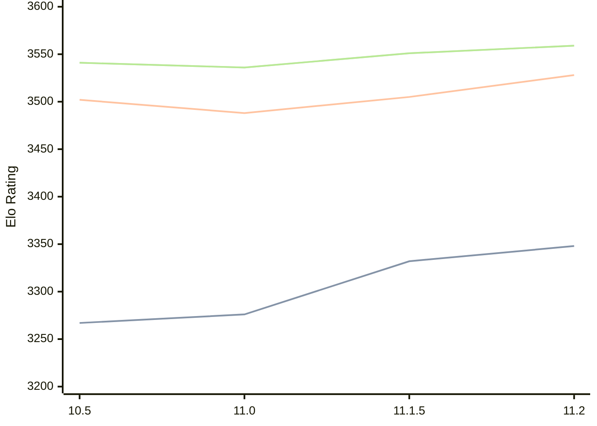

# Engine: Lizard

Author: Liam McGuire

Home: https://github.com/liamt19/Lizard

## Elo Ratings

| Version | Published | STC 8.0+0.08s  | LTC 60.0+0.60s | VLTC 2m24s+1.12s | Comment |
| --- | --- | --- | --- | --- | --- |
| 11.2 | 2025-01-08 | 3348(+16) | 3528(+23) | 3559(+8) |  |
| 11.1.5 | 2024-12-30 | 3332(+new) | 3505(+new) | 3551(+new) |  |
| 11.1 | 2024-11-11 |  |  |  |  |
| 11.0 | 2024-09-26 | 3276(+9) | 3488(-14) | 3536(-5) |  |
| 10.5 | 2024-07-13 | 3267(+new) | 3502(+new) | 3541(+new) |  |
| 10.4 | 2024-06-03 |  |  |  |  |
| 10.3 | 2024-03-09 |  |  |  |  |
| 10.2 | 2024-02-10 |  |  |  |  |
| 10.1 | 2024-01-13 |  |  |  |  |
| 10.0 | 2024-01-05 |  |  |  |  |
| 9.3.1 | 2023-12-30 |  |  |  |  |
| 9.3 | 2023-12-23 |  |  |  |  |
| 9.2 | 2023-11-06 |  |  |  |  |
| 9.1 | 2023-10-10 |  |  |  |  |
| 8.4 | 2023-09-18 |  |  |  |  |
| 6.2 | 2023-07-13 |  |  |  |  |
 | | | cElo (∆ prev) | cElo (∆ prev) | cElo (∆ prev) | 

<a href="https://github.com/computer-chess-index/cci/issues/new?template=submit-version.yml&title=[VERSION]+Lizard+<version>&body=###%20Engine%20name%0ALizard%0A%0A###%20Version%0A11.2" target="_blank">Submit new version</a>

 Test Conditions:

GUI/CLI: <a href=https://github.com/cutechess/cutechess target="_blank">Cute-Chess</a> 
Elo Calculation: <a href=https://www.remi-coulom.fr/Bayesian-Elo/ target="_blank">Bayesian-Elo</a> 
CPU: Intel(R) Core(TM) i5-7500T 2.70GHz 
Opening book: 8_moves_v3 
\* STC: 8.0+0.08s, LTC: 60.0+0.60s, VLTC: 2m24s+1.12s

 Lists:
Ratings: <a href=https://github.com/computer-chess-index/cci/blob/main/lists/CCIRatings.csv target="_blank">Complete list</a>

Generated: 2026-05-03 07:39:39

## Ratings Verlauf

⬛ STC (8.0+0.08s) &nbsp;&nbsp; 🟧 LTC (60.0+0.60s) &nbsp;&nbsp; 🟩 VLTC (2m24s+1.12s)

dark mode: 🟩STC (8.0+0.08s) 🟧LTC (60.0+0.60s) ⬜VLTC (2m24s+1.12s)

## Detailed Evaluation Results

| Version | Time Control | Elo  | Range +/- | Matches | Score | Average Opponent Elo | Draws |
| --- | --- | --- | --- | --- | --- | --- | --- |
| 11.2 | VLTC (2m24s+1.12s) | 3559 | 12 | 1580 | 50% | 3561 | 87% |
| 11.2 | D1 | 1067 | 16 | 1368 | 48% | 1087 | 29% |
| 11.2 | D10 | 2996 | 14 | 1524 | 50% | 2988 | 49% |
| 11.2 | D11 | 3131 | 13 | 1512 | 50% | 3132 | 58% |
| 11.2 | D12 | 3205 | 13 | 1614 | 51% | 3195 | 59% |
| 11.2 | D13 | 3279 | 13 | 1676 | 51% | 3274 | 61% |
| 11.2 | D14 | 3332 | 13 | 1564 | 50% | 3329 | 69% |
| 11.2 | D15 | 3372 | 12 | 1608 | 50% | 3374 | 73% |
| 11.2 | D16 | 3426 | 12 | 1670 | 51% | 3420 | 75% |
| 11.2 | D17 | 3449 | 12 | 1726 | 50% | 3452 | 78% |
| 11.2 | D18 | 3483 | 16 | 1004 | 50% | 3484 | 78% |
| 11.2 | D2 | 1312 | 17 | 1312 | 47% | 1346 | 17% |
| 11.2 | D3 | 1111 | 17 | 1364 | 49% | 1131 | 14% |
| 11.2 | D4 | 1141 | 17 | 1340 | 50% | 1148 | 12% |
| 11.2 | D5 | 1304 | 17 | 1324 | 49% | 1315 | 11% |
| 11.2 | D6 | 1685 | 16 | 1428 | 47% | 1715 | 14% |
| 11.2 | D7 | 2199 | 15 | 1542 | 47% | 2226 | 23% |
| 11.2 | D8 | 2566 | 15 | 1486 | 50% | 2569 | 30% |
| 11.2 | D9 | 2831 | 14 | 1498 | 48% | 2844 | 44% |
| 11.2 | S10 | 3379 | 13 | 1502 | 51% | 3370 | 69% |
| 11.2 | S40 | 3498 | 12 | 1540 | 50% | 3497 | 81% |
| 11.2 | LTC (60.0+0.60s) | 3528 | 12 | 1568 | 50% | 3525 | 82% |
| 11.2 | STC (8.0+0.08s) | 3348 | 13 | 1528 | 51% | 3341 | 64% |
| --- | --- | --- | --- | --- | --- | --- | --- |
| 11.1.5 | VLTC (2m24s+1.12s) | 3551 | 21 | 544 | 50% | 3546 | 85% |
| 11.1.5 | D1 | 1130 | 26 | 548 | 49% | 1134 | 22% |
| 11.1.5 | D10 | 2957 | 23 | 544 | 50% | 2955 | 55% |
| 11.1.5 | D11 | 3086 | 22 | 568 | 50% | 3090 | 56% |
| 11.1.5 | D12 | 3178 | 22 | 552 | 51% | 3175 | 61% |
| 11.1.5 | D13 | 3260 | 22 | 536 | 50% | 3258 | 65% |
| 11.1.5 | D14 | 3287 | 22 | 552 | 50% | 3286 | 66% |
| 11.1.5 | D15 | 3356 | 22 | 528 | 51% | 3349 | 68% |
| 11.1.5 | D16 | 3405 | 22 | 528 | 50% | 3403 | 74% |
| 11.1.5 | D17 | 3425 | 20 | 584 | 49% | 3429 | 77% |
| 11.1.5 | D2 | 1307 | 25 | 584 | 50% | 1310 | 18% |
| 11.1.5 | D3 | 1177 | 27 | 536 | 50% | 1175 | 11% |
| 11.1.5 | D4 | 1202 | 26 | 552 | 51% | 1195 | 14% |
| 11.1.5 | D5 | 1307 | 27 | 544 | 48% | 1324 | 13% |
| 11.1.5 | D6 | 1681 | 26 | 560 | 47% | 1706 | 18% |
| 11.1.5 | D7 | 2124 | 25 | 552 | 51% | 2111 | 22% |
| 11.1.5 | D8 | 2543 | 24 | 560 | 50% | 2539 | 36% |
| 11.1.5 | D9 | 2773 | 23 | 576 | 50% | 2769 | 44% |
| 11.1.5 | S10 | 3359 | 22 | 544 | 50% | 3362 | 63% |
| 11.1.5 | S40 | 3498 | 21 | 536 | 50% | 3497 | 81% |
| 11.1.5 | LTC (60.0+0.60s) | 3505 | 21 | 544 | 50% | 3506 | 83% |
| 11.1.5 | STC (8.0+0.08s) | 3332 | 22 | 552 | 49% | 3340 | 65% |
| --- | --- | --- | --- | --- | --- | --- | --- |
| 11.1 |  |  |  |  |  |  |  |
| 11.0 | VLTC (2m24s+1.12s) | 3536 | 18 | 760 | 50% | 3534 | 81% |
| 11.0 | D1 | 1021 | 25 | 544 | 50% | 1017 | 26% |
| 11.0 | D10 | 2904 | 23 | 556 | 50% | 2901 | 45% |
| 11.0 | D11 | 3055 | 23 | 544 | 48% | 3066 | 52% |
| 11.0 | D12 | 3143 | 22 | 576 | 51% | 3136 | 59% |
| 11.0 | D13 | 3217 | 20 | 636 | 50% | 3221 | 63% |
| 11.0 | D14 | 3286 | 21 | 624 | 50% | 3289 | 59% |
| 11.0 | D15 | 3328 | 21 | 600 | 50% | 3325 | 64% |
| 11.0 | D16 | 3366 | 19 | 668 | 49% | 3370 | 70% |
| 11.0 | D17 | 3403 | 19 | 716 | 50% | 3407 | 74% |
| 11.0 | D2 | 1210 | 26 | 552 | 50% | 1206 | 17% |
| 11.0 | D3 | 1102 | 25 | 564 | 50% | 1106 | 19% |
| 11.0 | D4 | 1154 | 26 | 548 | 50% | 1156 | 17% |
| 11.0 | D5 | 1266 | 27 | 544 | 49% | 1278 | 12% |
| 11.0 | D6 | 1667 | 26 | 564 | 49% | 1678 | 14% |
| 11.0 | D7 | 2152 | 26 | 532 | 53% | 2124 | 20% |
| 11.0 | D8 | 2549 | 23 | 644 | 53% | 2519 | 27% |
| 11.0 | D9 | 2773 | 23 | 584 | 49% | 2777 | 36% |
| 11.0 | S10 | 3318 | 19 | 736 | 49% | 3321 | 62% |
| 11.0 | S40 | 3472 | 18 | 764 | 51% | 3467 | 75% |
| 11.0 | LTC (60.0+0.60s) | 3488 | 18 | 768 | 49% | 3497 | 80% |
| 11.0 | STC (8.0+0.08s) | 3276 | 18 | 816 | 49% | 3281 | 64% |
| --- | --- | --- | --- | --- | --- | --- | --- |
| 10.5 | VLTC (2m24s+1.12s) | 3541 | 31 | 252 | 52% | 3486 | 77% |
| 10.5 | D1 | 968 | 17 | 1200 | 47% | 998 | 24% |
| 10.5 | D10 | 2917 | 19 | 804 | 53% | 2893 | 51% |
| 10.5 | D11 | 3028 | 17 | 1032 | 51% | 3011 | 53% |
| 10.5 | D12 | 3127 | 17 | 1024 | 53% | 3092 | 56% |
| 10.5 | D13 | 3206 | 18 | 844 | 54% | 3156 | 58% |
| 10.5 | D14 | 3267 | 16 | 1084 | 54% | 3205 | 63% |
| 10.5 | D15 | 3328 | 16 | 1048 | 53% | 3255 | 64% |
| 10.5 | D16 | 3367 | 18 | 772 | 49% | 3375 | 72% |
| 10.5 | D17 | 3403 | 17 | 818 | 49% | 3414 | 76% |
| 10.5 | D2 | 1222 | 19 | 1000 | 51% | 1215 | 14% |
| 10.5 | D3 | 1118 | 18 | 1164 | 50% | 1121 | 15% |
| 10.5 | D4 | 1172 | 17 | 1260 | 53% | 1142 | 18% |
| 10.5 | D5 | 1277 | 18 | 1159 | 51% | 1264 | 11% |
| 10.5 | D6 | 1605 | 19 | 1088 | 48% | 1628 | 16% |
| 10.5 | D7 | 2067 | 19 | 960 | 50% | 2068 | 20% |
| 10.5 | D8 | 2480 | 17 | 1208 | 53% | 2452 | 27% |
| 10.5 | D9 | 2730 | 19 | 912 | 49% | 2736 | 38% |
| 10.5 | S10 | 3299 | 34 | 224 | 52% | 3287 | 67% |
| 10.5 | S40 | 3452 | 33 | 224 | 50% | 3449 | 76% |
| 10.5 | LTC (60.0+0.60s) | 3502 | 35 | 192 | 50% | 3501 | 83% |
| 10.5 | STC (8.0+0.08s) | 3267 | 31 | 272 | 48% | 3279 | 61% |
| --- | --- | --- | --- | --- | --- | --- | --- |
| 10.4 |  |  |  |  |  |  |  |
| 10.3 |  |  |  |  |  |  |  |
| 10.2 |  |  |  |  |  |  |  |
| 10.1 |  |  |  |  |  |  |  |
| 10.0 |  |  |  |  |  |  |  |
| 9.3.1 |  |  |  |  |  |  |  |
| 9.3 |  |  |  |  |  |  |  |
| 9.2 |  |  |  |  |  |  |  |
| 9.1 |  |  |  |  |  |  |  |
| 8.4 |  |  |  |  |  |  |  |
| 6.2 |  |  |  |  |  |  |  |