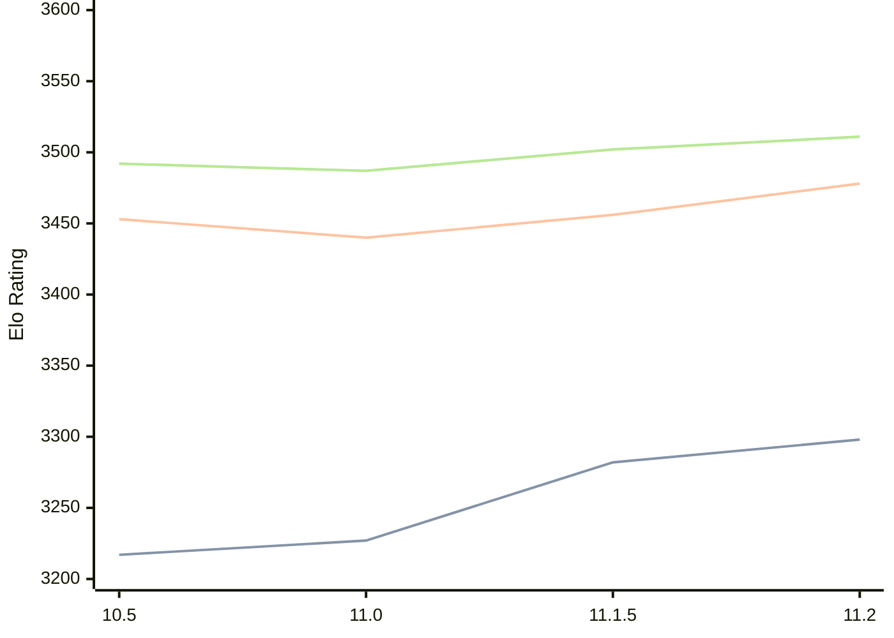

# Engine: Lizard

Author: Liam McGuire

Home: https://github.com/liamt19/Lizard

## Elo Ratings

| Version | Published | STC 8.0+0.08s  | LTC 60.0+0.60s | VLTC 2m24s+1.12s | Comment |
| --- | --- | --- | --- | --- | --- |
| 11.2 | 2025-01-08 | 3298(+16) | 3478(+22) | 3511(+9) |  |
| 11.1.5 | 2024-12-30 | 3282(+55) | 3456(+16) | 3502(+15) |  |
| 11.0 | 2024-09-26 | 3227(+10) | 3440(-13) | 3487(-5) |  |
| 10.5 | 2024-07-13 | 3217 | 3453 | 3492 |  |
 | | | cElo (∆ prev) | cElo (∆ prev) | cElo (∆ prev) | 

<a href="https://github.com/computer-chess-index/cci/issues/new?template=submit-version.yml&title=[VERSION]+Lizard+<version>&body=###%20Engine%20name%0ALizard%0A%0A###%20Version%0A11.2" target="_blank">Submit new version</a>

 Test Conditions:

GUI/CLI: <a href=https://github.com/cutechess/cutechess target="_blank">Cute-Chess</a> 
Elo Calculation: <a href=https://www.remi-coulom.fr/Bayesian-Elo/ target="_blank">Bayesian-Elo</a> 
CPU: Intel(R) Core(TM) i5-7500T 2.70GHz 
Opening book: 8_moves_v3 
\* STC: 8.0+0.08s, LTC: 60.0+0.60s, VLTC: 2m24s+1.12s

 Lists:
Ratings: <a href=https://github.com/computer-chess-index/cci/blob/main/lists/CCIRatings.csv target="_blank">Complete list</a>

Generated: 2026-08-20 06:26:48

## Ratings Verlauf

⬛ STC (8.0+0.08s) &nbsp;&nbsp; 🟧 LTC (60.0+0.60s) &nbsp;&nbsp; 🟩 VLTC (2m24s+1.12s)

dark mode: 🟩STC (8.0+0.08s) 🟧LTC (60.0+0.60s) ⬜VLTC (2m24s+1.12s)

## Detailed Evaluation Results

| Version | Time Control | Elo  | Range +/- | Matches | Score | Average Opponent Elo | Draws |
| --- | --- | --- | --- | --- | --- | --- | --- |
| 11.2 | VLTC (2m24s+1.12s) | 3511 | 12 | 1656 | 50% | 3514 | 87% |
| 11.2 | LTC (60.0+0.60s) | 3478 | 12 | 1626 | 50% | 3476 | 82% |
| 11.2 | STC (8.0+0.08s) | 3298 | 13 | 1680 | 51% | 3291 | 63% |
| --- | --- | --- | --- | --- | --- | --- | --- |
| 11.1.5 | VLTC (2m24s+1.12s) | 3502 | 21 | 544 | 50% | 3498 | 85% |
| 11.1.5 | LTC (60.0+0.60s) | 3456 | 21 | 544 | 50% | 3457 | 83% |
| 11.1.5 | STC (8.0+0.08s) | 3282 | 22 | 552 | 49% | 3290 | 65% |
| --- | --- | --- | --- | --- | --- | --- | --- |
| 11.0 | VLTC (2m24s+1.12s) | 3487 | 18 | 760 | 50% | 3486 | 81% |
| 11.0 | LTC (60.0+0.60s) | 3440 | 18 | 768 | 49% | 3448 | 80% |
| 11.0 | STC (8.0+0.08s) | 3227 | 18 | 816 | 49% | 3231 | 64% |
| --- | --- | --- | --- | --- | --- | --- | --- |
| 10.5 | VLTC (2m24s+1.12s) | 3492 | 31 | 252 | 52% | 3437 | 77% |
| 10.5 | LTC (60.0+0.60s) | 3453 | 35 | 192 | 50% | 3452 | 83% |
| 10.5 | STC (8.0+0.08s) | 3217 | 31 | 272 | 48% | 3228 | 61% |
| --- | --- | --- | --- | --- | --- | --- | --- |