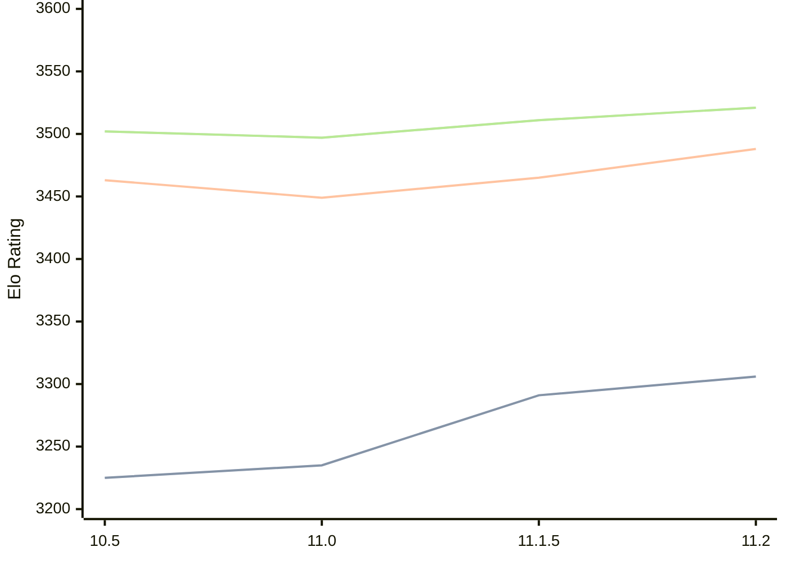

# Engine: Lizard

Author: Liam McGuire

Home: https://github.com/liamt19/Lizard

## Elo Ratings

| Version | Published | STC 8.0+0.08s  | LTC 60.0+0.60s | VLTC 2m24s+1.12s | Comment |
| --- | --- | --- | --- | --- | --- |
| 11.2 | 2025-01-08 | 3306(+15) | 3488(+23) | 3521(+10) |  |
| 11.1.5 | 2024-12-30 | 3291(+56) | 3465(+16) | 3511(+14) |  |
| 11.0 | 2024-09-26 | 3235(+10) | 3449(-14) | 3497(-5) |  |
| 10.5 | 2024-07-13 | 3225 | 3463 | 3502 |  |
 | | | cElo (∆ prev) | cElo (∆ prev) | cElo (∆ prev) | 

<a href="https://github.com/computer-chess-index/cci/issues/new?template=submit-version.yml&title=[VERSION]+Lizard+<version>&body=###%20Engine%20name%0ALizard%0A%0A###%20Version%0A11.2" target="_blank">Submit new version</a>

 Test Conditions:

GUI/CLI: <a href=https://github.com/cutechess/cutechess target="_blank">Cute-Chess</a> 
Elo Calculation: <a href=https://www.remi-coulom.fr/Bayesian-Elo/ target="_blank">Bayesian-Elo</a> 
CPU: Intel(R) Core(TM) i5-7500T 2.70GHz 
Opening book: 8_moves_v3 
\* STC: 8.0+0.08s, LTC: 60.0+0.60s, VLTC: 2m24s+1.12s

 Lists:
Ratings: <a href=https://github.com/computer-chess-index/cci/blob/main/lists/CCIRatings.csv target="_blank">Complete list</a>

Generated: 2026-09-11 04:39:35

## Ratings Verlauf

## Detailed Evaluation Results

| Version | Time Control | Elo  | Range +/- | Matches | Score | Average Opponent Elo | Draws |
| --- | --- | --- | --- | --- | --- | --- | --- |
| 11.2 | VLTC (2m24s+1.12s) | 3521 | 12 | 1684 | 50% | 3524 | 87% |
| 11.2 | LTC (60.0+0.60s) | 3488 | 12 | 1666 | 50% | 3486 | 82% |
| 11.2 | STC (8.0+0.08s) | 3306 | 12 | 1720 | 51% | 3301 | 63% |
| --- | --- | --- | --- | --- | --- | --- | --- |
| 11.1.5 | VLTC (2m24s+1.12s) | 3511 | 21 | 544 | 50% | 3507 | 85% |
| 11.1.5 | LTC (60.0+0.60s) | 3465 | 21 | 544 | 50% | 3467 | 83% |
| 11.1.5 | STC (8.0+0.08s) | 3291 | 22 | 552 | 49% | 3298 | 65% |
| --- | --- | --- | --- | --- | --- | --- | --- |
| 11.0 | VLTC (2m24s+1.12s) | 3497 | 18 | 760 | 50% | 3495 | 81% |
| 11.0 | LTC (60.0+0.60s) | 3449 | 18 | 768 | 49% | 3457 | 80% |
| 11.0 | STC (8.0+0.08s) | 3235 | 18 | 816 | 49% | 3239 | 64% |
| --- | --- | --- | --- | --- | --- | --- | --- |
| 10.5 | VLTC (2m24s+1.12s) | 3502 | 31 | 252 | 52% | 3447 | 77% |
| 10.5 | LTC (60.0+0.60s) | 3463 | 35 | 192 | 50% | 3461 | 83% |
| 10.5 | STC (8.0+0.08s) | 3225 | 31 | 272 | 48% | 3237 | 61% |
| --- | --- | --- | --- | --- | --- | --- | --- |