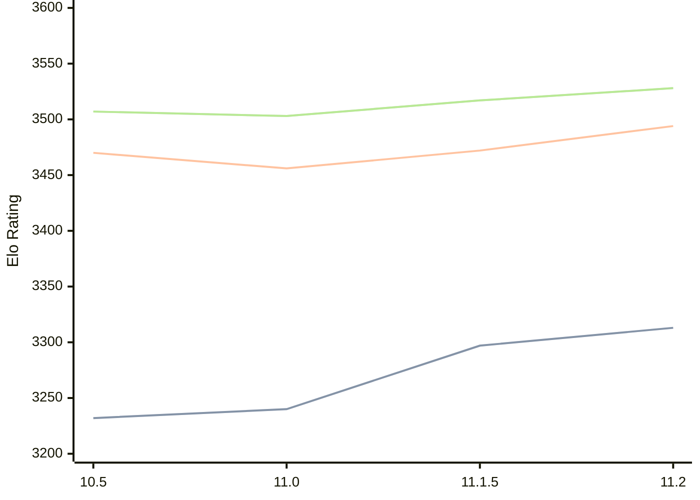

# Engine: Lizard

Author: Liam McGuire

Home: https://github.com/liamt19/Lizard

## Elo Ratings

| Version | Published | STC 8.0+0.08s  | LTC 60.0+0.60s | VLTC 2m24s+1.12s | Comment |
| --- | --- | --- | --- | --- | --- |
| 11.2 | 2025-01-08 | 3313(+16) | 3494(+22) | 3528(+11) |  |
| 11.1.5 | 2024-12-30 | 3297(+57) | 3472(+16) | 3517(+14) |  |
| 11.0 | 2024-09-26 | 3240(+8) | 3456(-14) | 3503(-4) |  |
| 10.5 | 2024-07-13 | 3232 | 3470 | 3507 |  |
 | | | cElo (∆ prev) | cElo (∆ prev) | cElo (∆ prev) | 

<a href="https://github.com/computer-chess-index/cci/issues/new?template=submit-version.yml&title=[VERSION]+Lizard+<version>&body=###%20Engine%20name%0ALizard%0A%0A###%20Version%0A11.2" target="_blank">Submit new version</a>

 Test Conditions:

GUI/CLI: <a href=https://github.com/cutechess/cutechess target="_blank">Cute-Chess</a> 
Elo Calculation: <a href=https://www.remi-coulom.fr/Bayesian-Elo/ target="_blank">Bayesian-Elo</a> 
CPU: Intel(R) Core(TM) i5-7500T 2.70GHz 
Opening book: 8_moves_v3 
\* STC: 8.0+0.08s, LTC: 60.0+0.60s, VLTC: 2m24s+1.12s

 Lists:
Ratings: <a href=https://github.com/computer-chess-index/cci/blob/main/lists/CCIRatings.csv target="_blank">Complete list</a>

Generated: 2026-10-08 04:40:06

## Ratings Verlauf

```mermaid
%%{init: {"theme":"base","themeVariables":{"seriesColors:['#a3a3a3','#222221','#faa371']}}}%%
xychart-beta
  x-axis ["10.5", "11.0", "11.1.5", "11.2"]
  y-axis "Elo Rating" 3200 --> 3600
  line "" [3232, 3240, 3297, 3313]
  line "STC (8.0+0.08s)" [3232, 3240, 3297, 3313]
  line "LTC (60.0+0.60s)" [3470, 3456, 3472, 3494]
  line "" [3507, 3503, 3517, 3528]
  line "VLTC (2m24s+1.12s)" [3507, 3503, 3517, 3528]
```

## Detailed Evaluation Results

| Version | Time Control | Elo  | Range +/- | Matches | Score | Average Opponent Elo | Draws |
| --- | --- | --- | --- | --- | --- | --- | --- |
| 11.2 | VLTC (2m24s+1.12s) | 3528 | 12 | 1692 | 50% | 3529 | 87% |
| 11.2 | LTC (60.0+0.60s) | 3494 | 12 | 1674 | 50% | 3492 | 82% |
| 11.2 | STC (8.0+0.08s) | 3313 | 12 | 1734 | 51% | 3306 | 63% |
| --- | --- | --- | --- | --- | --- | --- | --- |
| 11.1.5 | VLTC (2m24s+1.12s) | 3517 | 21 | 544 | 50% | 3514 | 85% |
| 11.1.5 | LTC (60.0+0.60s) | 3472 | 21 | 544 | 50% | 3474 | 83% |
| 11.1.5 | STC (8.0+0.08s) | 3297 | 22 | 552 | 49% | 3305 | 65% |
| --- | --- | --- | --- | --- | --- | --- | --- |
| 11.0 | VLTC (2m24s+1.12s) | 3503 | 18 | 760 | 50% | 3502 | 81% |
| 11.0 | LTC (60.0+0.60s) | 3456 | 18 | 768 | 49% | 3464 | 80% |
| 11.0 | STC (8.0+0.08s) | 3240 | 18 | 816 | 49% | 3244 | 64% |
| --- | --- | --- | --- | --- | --- | --- | --- |
| 10.5 | VLTC (2m24s+1.12s) | 3507 | 31 | 252 | 52% | 3453 | 77% |
| 10.5 | LTC (60.0+0.60s) | 3470 | 35 | 192 | 50% | 3467 | 83% |
| 10.5 | STC (8.0+0.08s) | 3232 | 31 | 272 | 48% | 3243 | 61% |
| --- | --- | --- | --- | --- | --- | --- | --- |