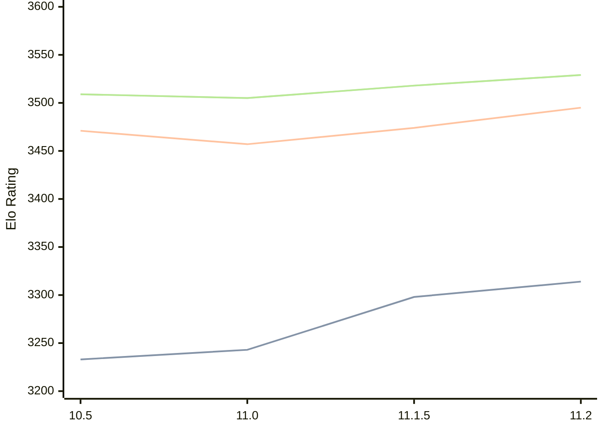

# Engine: Lizard

Author: Liam McGuire

Home: https://github.com/liamt19/Lizard

## Elo Ratings E1

| Version | Published | STC 8.0+0.08s  | LTC 60.0+0.60s | VLTC 2m24s+1.12s | Comment |
| --- | --- | --- | --- | --- | --- |
| 11.2 | 2025-01-08 | 3204 | 3424 | 3518 |  |
 | | | cElo (∆ prev) | cElo (∆ prev) | cElo (∆ prev) | 

## Elo Ratings P1

| Version | Published | STC 8.0+0.08s  | LTC 60.0+0.60s | VLTC 2m24s+1.12s | Comment |
| --- | --- | --- | --- | --- | --- |
| 11.2 | 2025-01-08 | 3488 | 3692 | 3752 |  |
 | | | cElo (∆ prev) | cElo (∆ prev) | cElo (∆ prev) | 

## Elo Ratings T1

| Version | Published | STC 8.0+0.08s  | LTC 60.0+0.60s | VLTC 2m24s+1.12s | Comment |
| --- | --- | --- | --- | --- | --- |
| 11.2 | 2025-01-08 | 3314(+16) | 3495(+21) | 3529(+11) |  |
| 11.1.5 | 2024-12-30 | 3298(+55) | 3474(+17) | 3518(+13) |  |
| 11.0 | 2024-09-26 | 3243(+10) | 3457(-14) | 3505(-4) |  |
| 10.5 | 2024-07-13 | 3233 | 3471 | 3509 |  |
 | | | cElo (∆ prev) | cElo (∆ prev) | cElo (∆ prev) | 

<a href="https://github.com/computer-chess-index/cci/issues/new?template=submit-version.yml&title=[VERSION]+Lizard+<version>&body=###%20Engine%20name%0ALizard%0A%0A###%20Version%0A11.2" target="_blank">Submit new version</a>

 Test Conditions:

GUI/CLI: <a href=https://github.com/cutechess/cutechess target="_blank">Cute-Chess</a> 
Elo Calculation: <a href=https://www.remi-coulom.fr/Bayesian-Elo/ target="_blank">Bayesian-Elo</a> 
CPU for P1: Intel(R) Core(TM) Ultra 7 265T (1.50 GHz) - P-Core 
CPU for E1: Intel(R) Core(TM) Ultra 7 265T (1.50 GHz) - E-Core 
CPU for T1: Intel(R) Core(TM) i5-7500T 2.70GHz 
Opening book: 8_moves_v3 
\* STC: 8.0+0.08s, LTC: 60.0+0.60s, VLTC: 2m24s+1.12s

 Lists:
Ratings: <a href=https://github.com/computer-chess-index/cci/blob/main/lists/CCIRatings.csv target="_blank">Complete list</a>

Generated: 2026-10-10 04:39:52

## Ratings Verlauf

```mermaid
%%{init: {"theme":"base","themeVariables":{"seriesColors:['#a3a3a3','#222221','#faa371']}}}%%
xychart-beta
  x-axis ["10.5", "11.0", "11.1.5", "11.2"]
  y-axis "Elo Rating" 3200 --> 3600
  line "" [3233, 3243, 3298, 3314]
  line "STC (8.0+0.08s)" [3233, 3243, 3298, 3314]
  line "LTC (60.0+0.60s)" [3471, 3457, 3474, 3495]
  line "" [3509, 3505, 3518, 3529]
  line "VLTC (2m24s+1.12s)" [3509, 3505, 3518, 3529]
```

## Detailed Evaluation Results

| Version | Time Control | Elo  | Range +/- | Matches | Score | Average Opponent Elo | Draws |
| --- | --- | --- | --- | --- | --- | --- | --- |
| 11.2 | VLTC (2m24s+1.12s) | 3518 | 41 | 132 | 50% | 3515 | 89% |
| 11.2 | VLTC (2m24s+1.12s) | 3529 | 12 | 1692 | 50% | 3530 | 87% |
| 11.2 | VLTC (2m24s+1.12s) | 3752 | 46 | 108 | 52% | 3734 | 84% |
| 11.2 | LTC (60.0+0.60s) | 3495 | 12 | 1678 | 50% | 3494 | 82% |
| 11.2 | LTC (60.0+0.60s) | 3692 | 44 | 120 | 52% | 3681 | 83% |
| 11.2 | LTC (60.0+0.60s) | 3424 | 42 | 140 | 49% | 3433 | 76% |
| 11.2 | STC (8.0+0.08s) | 3314 | 12 | 1734 | 51% | 3308 | 63% |
| --- | --- | --- | --- | --- | --- | --- | --- |
| 11.2 | STC (8.0+0.08s) | 3488 | 38 | 180 | 49% | 3495 | 64% |
| --- | --- | --- | --- | --- | --- | --- | --- |
| 11.2 | STC (8.0+0.08s) | 3204 | 30 | 304 | 45% | 3239 | 62% |
| --- | --- | --- | --- | --- | --- | --- | --- |
| 11.1.5 | VLTC (2m24s+1.12s) | 3518 | 21 | 544 | 50% | 3515 | 85% |
| 11.1.5 | LTC (60.0+0.60s) | 3474 | 21 | 544 | 50% | 3475 | 83% |
| 11.1.5 | STC (8.0+0.08s) | 3298 | 22 | 552 | 49% | 3306 | 65% |
| --- | --- | --- | --- | --- | --- | --- | --- |
| 11.0 | VLTC (2m24s+1.12s) | 3505 | 18 | 760 | 50% | 3503 | 81% |
| 11.0 | LTC (60.0+0.60s) | 3457 | 18 | 768 | 49% | 3465 | 80% |
| 11.0 | STC (8.0+0.08s) | 3243 | 18 | 816 | 49% | 3245 | 64% |
| --- | --- | --- | --- | --- | --- | --- | --- |
| 10.5 | VLTC (2m24s+1.12s) | 3509 | 31 | 252 | 52% | 3455 | 77% |
| 10.5 | LTC (60.0+0.60s) | 3471 | 35 | 192 | 50% | 3468 | 83% |
| 10.5 | STC (8.0+0.08s) | 3233 | 31 | 272 | 48% | 3244 | 61% |
| --- | --- | --- | --- | --- | --- | --- | --- |