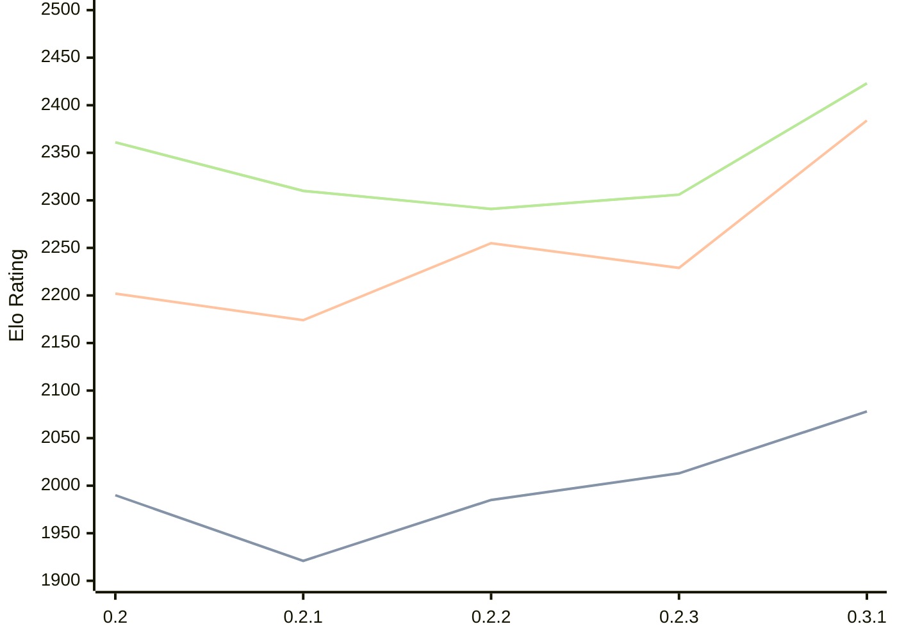

# Engine: Lolbot

Author: Lorentz Vedeler

Home: https://github.com/loldot/lolbot

## Elo Ratings

| Version | Published | STC 8.0+0.08s  | LTC 60.0+0.60s | VLTC 2m24s+1.12s | Comment |
| --- | --- | --- | --- | --- | --- |
| 0.3.1 | 2026-04-13 | 2078(+65) | 2384(+155) | 2423(+117) |  |
| 0.2.3 | 2025-12-08 | 2013(+28) | 2229(-26) | 2306(+15) |  |
| 0.2.2 | 2025-11-29 | 1985(+64) | 2255(+81) | 2291(-19) |  |
| 0.2.1 | 2025-11-16 | 1921(-69) | 2174(-28) | 2310(-51) |  |
| 0.2 | 2025-11-15 | 1990(+new) | 2202(+new) | 2361(+new) |  |
| 0.1-alpha | 2025-03-29 |  |  |  |  |
 | | | cElo (∆ prev) | cElo (∆ prev) | cElo (∆ prev) | 

<a href="https://github.com/computer-chess-index/cci/issues/new?template=submit-version.yml&title=[VERSION]+Lolbot+<version>&body=###%20Engine%20name%0ALolbot%0A%0A###%20Version%0A0.3.1" target="_blank">Submit new version</a>

 Test Conditions:

GUI/CLI: <a href=https://github.com/cutechess/cutechess target="_blank">Cute-Chess</a> 
Elo Calculation: <a href=https://www.remi-coulom.fr/Bayesian-Elo/ target="_blank">Bayesian-Elo</a> 
CPU: Intel(R) Core(TM) i5-7500T 2.70GHz 
Opening book: 8_moves_v3 
\* STC: 8.0+0.08s, LTC: 60.0+0.60s, VLTC: 2m24s+1.12s

 Lists:
Ratings: <a href=https://github.com/computer-chess-index/cci/blob/main/lists/CCIRatings.csv target="_blank">Complete list</a>

Generated: 2026-07-07 06:26:35

## Ratings Verlauf

## Ratings Verlauf

⬛ STC (8.0+0.08s) &nbsp;&nbsp; 🟧 LTC (60.0+0.60s) &nbsp;&nbsp; 🟩 VLTC (2m24s+1.12s)

dark mode: 🟩STC (8.0+0.08s) 🟧LTC (60.0+0.60s) ⬜VLTC (2m24s+1.12s)

## Detailed Evaluation Results

| Version | Time Control | Elo  | Range +/- | Matches | Score | Average Opponent Elo | Draws |
| --- | --- | --- | --- | --- | --- | --- | --- |
| 0.3.1 | VLTC (2m24s+1.12s) | 2423 | 28 | 456 | 51% | 2406 | 24% |
| 0.3.1 | LTC (60.0+0.60s) | 2384 | 28 | 460 | 52% | 2365 | 22% |
| 0.3.1 | STC (8.0+0.08s) | 2078 | 29 | 418 | 49% | 2078 | 23% |
| --- | --- | --- | --- | --- | --- | --- | --- |
| 0.2.3 | VLTC (2m24s+1.12s) | 2306 | 31 | 362 | 48% | 2325 | 26% |
| 0.2.3 | LTC (60.0+0.60s) | 2229 | 31 | 376 | 51% | 2214 | 22% |
| 0.2.3 | STC (8.0+0.08s) | 2013 | 28 | 468 | 49% | 2021 | 20% |
| --- | --- | --- | --- | --- | --- | --- | --- |
| 0.2.2 | VLTC (2m24s+1.12s) | 2291 | 53 | 128 | 53% | 2261 | 20% |
| 0.2.2 | LTC (60.0+0.60s) | 2255 | 66 | 76 | 51% | 2252 | 28% |
| 0.2.2 | STC (8.0+0.08s) | 1985 | 59 | 104 | 49% | 1997 | 16% |
| --- | --- | --- | --- | --- | --- | --- | --- |
| 0.2.1 | VLTC (2m24s+1.12s) | 2310 | 55 | 132 | 44% | 2385 | 14% |
| 0.2.1 | LTC (60.0+0.60s) | 2174 | 64 | 88 | 46% | 2213 | 17% |
| 0.2.1 | STC (8.0+0.08s) | 1921 | 70 | 76 | 50% | 1921 | 16% |
| --- | --- | --- | --- | --- | --- | --- | --- |
| 0.2 | VLTC (2m24s+1.12s) | 2361 | 56 | 116 | 52% | 2341 | 16% |
| 0.2 | LTC (60.0+0.60s) | 2202 | 47 | 160 | 49% | 2215 | 20% |
| 0.2 | STC (8.0+0.08s) | 1990 | 59 | 100 | 54% | 1949 | 22% |
| --- | --- | --- | --- | --- | --- | --- | --- |