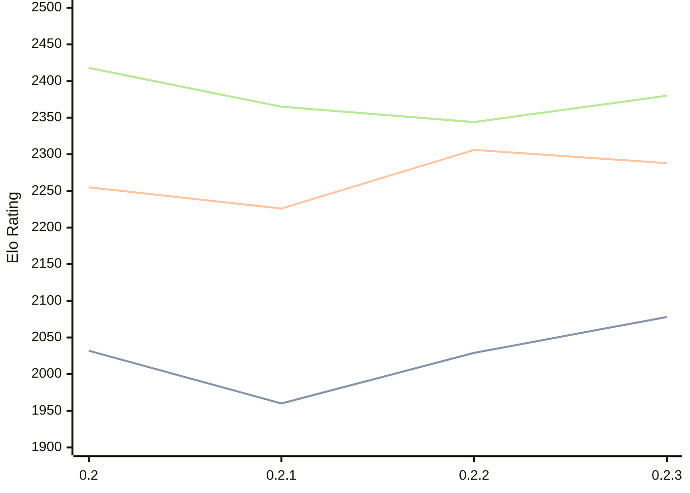

# Engine: Lolbot

Author: Vedeler Lorentz

Home: https://github.com/loldot/lolbot

## Ratings nach Version

| Version | Published | STC 8.0+0.08s  | LTC 60.0+0.60s | VLTC 2m24s+1.12s | Comment |
| --- | --- | --- | --- | --- | --- |
| 0.2.3 | 2025-12-08 | 2078(+49) | 2288(-18) | 2380(+36) |  |
| 0.2.2 | 2025-11-29 | 2029(+69) | 2306(+80) | 2344(-21) |  |
| 0.2.1 | 2025-11-16 | 1960(-72) | 2226(-29) | 2365(-53) |  |
| 0.2 | 2025-11-15 | 2032(+new) | 2255(+new) | 2418(+new) |  |
| 0.1-alpha | 2025-03-29 |  |  |  |  |
 | | | cElo (∆ prev) | cElo (∆ prev) | cElo (∆ prev) | 

 Test Conditions:

GUI/CLI: <a href=https://github.com/cutechess/cutechess target="_blank">Cute-Chess</a> 
Elo Calculation: <a href=https://www.remi-coulom.fr/Bayesian-Elo/ target="_blank">Bayesian-Elo</a> 
CPU: Intel(R) Core(TM) i5-7500T 2.70GHz 
Opening book: 8_moves_v3 
\* STC: 8.0+0.08s, LTC: 60.0+0.60s, VLTC: 2m24s+1.12s

 Lists:
Ratings: <a href=https://github.com/computer-chess-index/cci/blob/main/lists/CCIRatings.csv target="_blank">Complete list</a>

Generated: 2026-03-11 06:24:15

## Ratings Verlauf

⬛ STC (8.0+0.08s) &nbsp;&nbsp; 🟧 LTC (60.0+0.60s) &nbsp;&nbsp; 🟩 VLTC (2m24s+1.12s)

