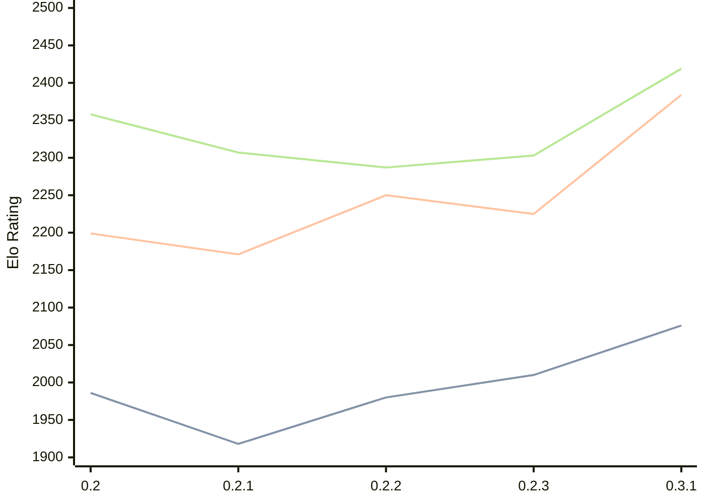

# Engine: Lolbot

Author: Lorentz Vedeler

Home: https://github.com/loldot/lolbot

## Elo Ratings

| Version | Published | STC 8.0+0.08s  | LTC 60.0+0.60s | VLTC 2m24s+1.12s | Comment |
| --- | --- | --- | --- | --- | --- |
| 0.3.1 | 2026-04-13 | 2076(+66) | 2384(+159) | 2419(+116) |  |
| 0.2.3 | 2025-12-08 | 2010(+30) | 2225(-25) | 2303(+16) |  |
| 0.2.2 | 2025-11-29 | 1980(+62) | 2250(+79) | 2287(-20) |  |
| 0.2.1 | 2025-11-16 | 1918(-68) | 2171(-28) | 2307(-51) |  |
| 0.2 | 2025-11-15 | 1986(+new) | 2199(+new) | 2358(+new) |  |
| 0.1-alpha | 2025-03-29 |  |  |  |  |
 | | | cElo (∆ prev) | cElo (∆ prev) | cElo (∆ prev) | 

<a href="https://github.com/computer-chess-index/cci/issues/new?template=submit-version.yml&title=[VERSION]+Lolbot+<version>&body=###%20Engine%20name%0ALolbot%0A%0A###%20Version%0A0.3.1" target="_blank">Submit new version</a>

 Test Conditions:

GUI/CLI: <a href=https://github.com/cutechess/cutechess target="_blank">Cute-Chess</a> 
Elo Calculation: <a href=https://www.remi-coulom.fr/Bayesian-Elo/ target="_blank">Bayesian-Elo</a> 
CPU: Intel(R) Core(TM) i5-7500T 2.70GHz 
Opening book: 8_moves_v3 
\* STC: 8.0+0.08s, LTC: 60.0+0.60s, VLTC: 2m24s+1.12s

 Lists:
Ratings: <a href=https://github.com/computer-chess-index/cci/blob/main/lists/CCIRatings.csv target="_blank">Complete list</a>

Generated: 2026-07-16 06:26:05

## Ratings Verlauf

## Ratings Verlauf

⬛ STC (8.0+0.08s) &nbsp;&nbsp; 🟧 LTC (60.0+0.60s) &nbsp;&nbsp; 🟩 VLTC (2m24s+1.12s)

dark mode: 🟩STC (8.0+0.08s) 🟧LTC (60.0+0.60s) ⬜VLTC (2m24s+1.12s)

## Detailed Evaluation Results

| Version | Time Control | Elo  | Range +/- | Matches | Score | Average Opponent Elo | Draws |
| --- | --- | --- | --- | --- | --- | --- | --- |
| 0.3.1 | VLTC (2m24s+1.12s) | 2419 | 27 | 468 | 51% | 2403 | 24% |
| 0.3.1 | LTC (60.0+0.60s) | 2384 | 27 | 476 | 52% | 2363 | 22% |
| 0.3.1 | STC (8.0+0.08s) | 2076 | 28 | 438 | 49% | 2080 | 23% |
| --- | --- | --- | --- | --- | --- | --- | --- |
| 0.2.3 | VLTC (2m24s+1.12s) | 2303 | 31 | 362 | 48% | 2321 | 26% |
| 0.2.3 | LTC (60.0+0.60s) | 2225 | 31 | 376 | 51% | 2210 | 22% |
| 0.2.3 | STC (8.0+0.08s) | 2010 | 28 | 468 | 49% | 2018 | 20% |
| --- | --- | --- | --- | --- | --- | --- | --- |
| 0.2.2 | VLTC (2m24s+1.12s) | 2287 | 53 | 128 | 53% | 2257 | 20% |
| 0.2.2 | LTC (60.0+0.60s) | 2250 | 66 | 76 | 51% | 2248 | 28% |
| 0.2.2 | STC (8.0+0.08s) | 1980 | 59 | 104 | 49% | 1994 | 16% |
| --- | --- | --- | --- | --- | --- | --- | --- |
| 0.2.1 | VLTC (2m24s+1.12s) | 2307 | 55 | 132 | 44% | 2381 | 14% |
| 0.2.1 | LTC (60.0+0.60s) | 2171 | 64 | 88 | 46% | 2210 | 17% |
| 0.2.1 | STC (8.0+0.08s) | 1918 | 70 | 76 | 50% | 1917 | 16% |
| --- | --- | --- | --- | --- | --- | --- | --- |
| 0.2 | VLTC (2m24s+1.12s) | 2358 | 56 | 116 | 52% | 2338 | 16% |
| 0.2 | LTC (60.0+0.60s) | 2199 | 47 | 160 | 49% | 2211 | 20% |
| 0.2 | STC (8.0+0.08s) | 1986 | 59 | 100 | 54% | 1947 | 22% |
| --- | --- | --- | --- | --- | --- | --- | --- |