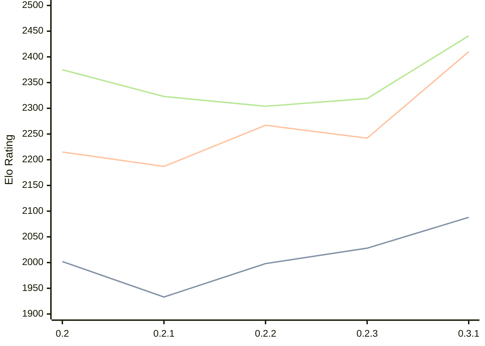

# Engine: Lolbot

Author: Lorentz Vedeler

Home: https://github.com/loldot/lolbot

## Elo Ratings

| Version | Published | STC 8.0+0.08s  | LTC 60.0+0.60s | VLTC 2m24s+1.12s | Comment |
| --- | --- | --- | --- | --- | --- |
| 0.3.1 | 2026-04-13 | 2088(+60) | 2410(+168) | 2441(+122) |  |
| 0.2.3 | 2025-12-08 | 2028(+30) | 2242(-25) | 2319(+15) |  |
| 0.2.2 | 2025-11-29 | 1998(+65) | 2267(+80) | 2304(-19) |  |
| 0.2.1 | 2025-11-16 | 1933(-69) | 2187(-28) | 2323(-52) |  |
| 0.2 | 2025-11-15 | 2002 | 2215 | 2375 |  |
 | | | cElo (∆ prev) | cElo (∆ prev) | cElo (∆ prev) | 

<a href="https://github.com/computer-chess-index/cci/issues/new?template=submit-version.yml&title=[VERSION]+Lolbot+<version>&body=###%20Engine%20name%0ALolbot%0A%0A###%20Version%0A0.3.1" target="_blank">Submit new version</a>

 Test Conditions:

GUI/CLI: <a href=https://github.com/cutechess/cutechess target="_blank">Cute-Chess</a> 
Elo Calculation: <a href=https://www.remi-coulom.fr/Bayesian-Elo/ target="_blank">Bayesian-Elo</a> 
CPU: Intel(R) Core(TM) i5-7500T 2.70GHz 
Opening book: 8_moves_v3 
\* STC: 8.0+0.08s, LTC: 60.0+0.60s, VLTC: 2m24s+1.12s

 Lists:
Ratings: <a href=https://github.com/computer-chess-index/cci/blob/main/lists/CCIRatings.csv target="_blank">Complete list</a>

Generated: 2026-09-26 04:39:33

## Ratings Verlauf

## Detailed Evaluation Results

| Version | Time Control | Elo  | Range +/- | Matches | Score | Average Opponent Elo | Draws |
| --- | --- | --- | --- | --- | --- | --- | --- |
| 0.3.1 | VLTC (2m24s+1.12s) | 2441 | 26 | 516 | 51% | 2421 | 24% |
| 0.3.1 | LTC (60.0+0.60s) | 2410 | 26 | 530 | 53% | 2381 | 22% |
| 0.3.1 | STC (8.0+0.08s) | 2088 | 26 | 552 | 49% | 2086 | 22% |
| --- | --- | --- | --- | --- | --- | --- | --- |
| 0.2.3 | VLTC (2m24s+1.12s) | 2319 | 31 | 362 | 48% | 2338 | 26% |
| 0.2.3 | LTC (60.0+0.60s) | 2242 | 31 | 376 | 51% | 2228 | 22% |
| 0.2.3 | STC (8.0+0.08s) | 2028 | 28 | 468 | 49% | 2036 | 20% |
| --- | --- | --- | --- | --- | --- | --- | --- |
| 0.2.2 | VLTC (2m24s+1.12s) | 2304 | 53 | 128 | 53% | 2275 | 20% |
| 0.2.2 | LTC (60.0+0.60s) | 2267 | 66 | 76 | 51% | 2265 | 28% |
| 0.2.2 | STC (8.0+0.08s) | 1998 | 59 | 104 | 49% | 2012 | 16% |
| --- | --- | --- | --- | --- | --- | --- | --- |
| 0.2.1 | VLTC (2m24s+1.12s) | 2323 | 55 | 132 | 44% | 2399 | 14% |
| 0.2.1 | LTC (60.0+0.60s) | 2187 | 64 | 88 | 46% | 2228 | 17% |
| 0.2.1 | STC (8.0+0.08s) | 1933 | 70 | 76 | 50% | 1933 | 16% |
| --- | --- | --- | --- | --- | --- | --- | --- |
| 0.2 | VLTC (2m24s+1.12s) | 2375 | 56 | 116 | 52% | 2354 | 16% |
| 0.2 | LTC (60.0+0.60s) | 2215 | 47 | 160 | 49% | 2228 | 20% |
| 0.2 | STC (8.0+0.08s) | 2002 | 59 | 100 | 54% | 1963 | 22% |
| --- | --- | --- | --- | --- | --- | --- | --- |