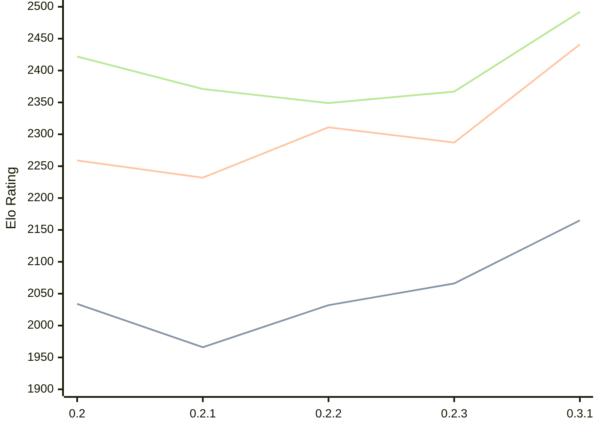

# Engine: Lolbot

Author: Lorentz Vedeler

Home: https://github.com/loldot/lolbot

## Elo Ratings

| Version | Published | STC 8.0+0.08s  | LTC 60.0+0.60s | VLTC 2m24s+1.12s | Comment |
| --- | --- | --- | --- | --- | --- |
| 0.3.1 | 2026-04-13 | 2165(+99) | 2441(+154) | 2492(+125) |  |
| 0.2.3 | 2025-12-08 | 2066(+34) | 2287(-24) | 2367(+18) |  |
| 0.2.2 | 2025-11-29 | 2032(+66) | 2311(+79) | 2349(-22) |  |
| 0.2.1 | 2025-11-16 | 1966(-68) | 2232(-27) | 2371(-51) |  |
| 0.2 | 2025-11-15 | 2034(+new) | 2259(+new) | 2422(+new) |  |
| 0.1-alpha | 2025-03-29 |  |  |  |  |
 | | | cElo (∆ prev) | cElo (∆ prev) | cElo (∆ prev) | 

<a href="https://github.com/computer-chess-index/cci/issues/new?template=submit-version.yml&title=[VERSION]+Lolbot+<version>&body=###%20Engine%20name%0ALolbot%0A%0A###%20Version%0A0.3.1" target="_blank">Submit new version</a>

 Test Conditions:

GUI/CLI: <a href=https://github.com/cutechess/cutechess target="_blank">Cute-Chess</a> 
Elo Calculation: <a href=https://www.remi-coulom.fr/Bayesian-Elo/ target="_blank">Bayesian-Elo</a> 
CPU: Intel(R) Core(TM) i5-7500T 2.70GHz 
Opening book: 8_moves_v3 
\* STC: 8.0+0.08s, LTC: 60.0+0.60s, VLTC: 2m24s+1.12s

 Lists:
Ratings: <a href=https://github.com/computer-chess-index/cci/blob/main/lists/CCIRatings.csv target="_blank">Complete list</a>

Generated: 2026-05-15 06:25:30

## Ratings Verlauf

⬛ STC (8.0+0.08s) &nbsp;&nbsp; 🟧 LTC (60.0+0.60s) &nbsp;&nbsp; 🟩 VLTC (2m24s+1.12s)

dark mode: 🟩STC (8.0+0.08s) 🟧LTC (60.0+0.60s) ⬜VLTC (2m24s+1.12s)

## Detailed Evaluation Results

| Version | Time Control | Elo  | Range +/- | Matches | Score | Average Opponent Elo | Draws |
| --- | --- | --- | --- | --- | --- | --- | --- |
| 0.3.1 | VLTC (2m24s+1.12s) | 2492 | 30 | 380 | 52% | 2465 | 24% |
| 0.3.1 | LTC (60.0+0.60s) | 2441 | 31 | 356 | 52% | 2425 | 24% |
| 0.3.1 | STC (8.0+0.08s) | 2165 | 32 | 334 | 53% | 2140 | 22% |
| --- | --- | --- | --- | --- | --- | --- | --- |
| 0.2.3 | VLTC (2m24s+1.12s) | 2367 | 31 | 362 | 48% | 2385 | 26% |
| 0.2.3 | LTC (60.0+0.60s) | 2287 | 31 | 376 | 51% | 2272 | 22% |
| 0.2.3 | STC (8.0+0.08s) | 2066 | 28 | 468 | 49% | 2074 | 20% |
| --- | --- | --- | --- | --- | --- | --- | --- |
| 0.2.2 | VLTC (2m24s+1.12s) | 2349 | 53 | 128 | 53% | 2319 | 20% |
| 0.2.2 | LTC (60.0+0.60s) | 2311 | 66 | 76 | 51% | 2310 | 28% |
| 0.2.2 | STC (8.0+0.08s) | 2032 | 59 | 104 | 49% | 2045 | 16% |
| --- | --- | --- | --- | --- | --- | --- | --- |
| 0.2.1 | VLTC (2m24s+1.12s) | 2371 | 55 | 132 | 44% | 2445 | 14% |
| 0.2.1 | LTC (60.0+0.60s) | 2232 | 64 | 88 | 46% | 2271 | 17% |
| 0.2.1 | STC (8.0+0.08s) | 1966 | 70 | 76 | 50% | 1964 | 16% |
| --- | --- | --- | --- | --- | --- | --- | --- |
| 0.2 | VLTC (2m24s+1.12s) | 2422 | 56 | 116 | 52% | 2402 | 16% |
| 0.2 | LTC (60.0+0.60s) | 2259 | 47 | 160 | 49% | 2272 | 20% |
| 0.2 | STC (8.0+0.08s) | 2034 | 59 | 100 | 54% | 1994 | 22% |
| --- | --- | --- | --- | --- | --- | --- | --- |