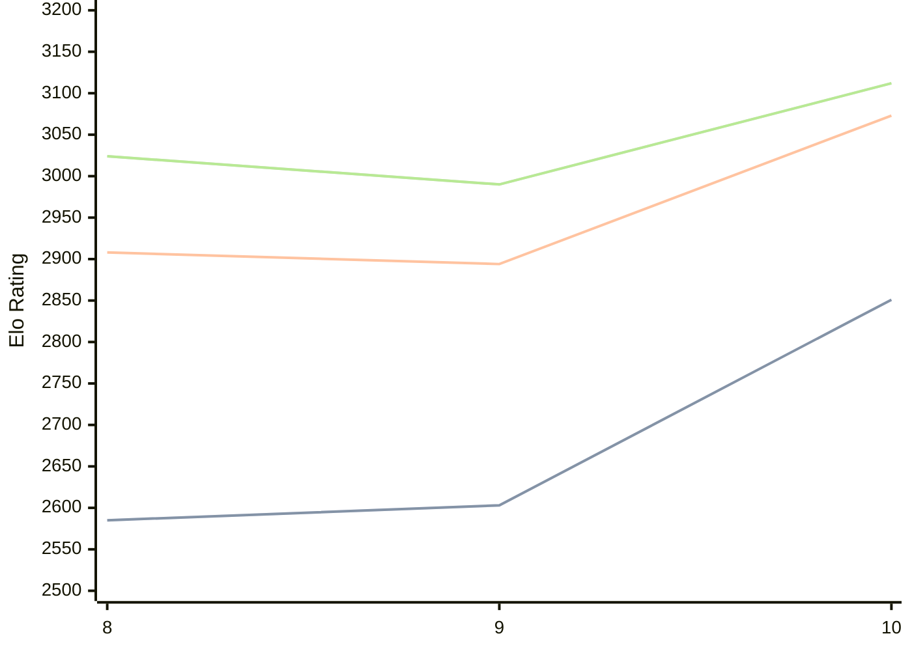

# Engine: Lozza

Author: Colin Jenkins

Home: https://github.com/op12no2/lozza

## Elo Ratings

| Version | Published | STC 8.0+0.08s  | LTC 60.0+0.60s | VLTC 2m24s+1.12s | Comment |
| --- | --- | --- | --- | --- | --- |
| 6 | 2026-02-13 |  |  |  |  |
| 2 | 2026-02-13 |  |  |  |  |
| 10 | 2026-01-17 | 2851(+248) | 3073(+179) | 3112(+122) |  |
| 9 | 2026-01-10 | 2603(+18) | 2894(-14) | 2990(-34) |  |
| 8 | 2025-09-25 | 2585(+new) | 2908(+new) | 3024(+new) |  |
| 7 | 2025-07-12 |  |  |  |  |
| 5.1 | 2025-06-02 |  |  |  |  |
| 5 | 2025-02-25 |  |  |  |  |
| 4 | 2025-01-06 |  |  |  |  |
| 3 | 2024-10-06 |  |  |  |  |
| 2.5 | 2023-02-10 |  |  |  |  |
 | | | cElo (∆ prev) | cElo (∆ prev) | cElo (∆ prev) | 

<a href="https://github.com/computer-chess-index/cci/issues/new?template=submit-version.yml&title=[VERSION]+Lozza+<version>&body=###%20Engine%20name%0ALozza%0A%0A###%20Version%0A6" target="_blank">Submit new version</a>

 Test Conditions:

GUI/CLI: <a href=https://github.com/cutechess/cutechess target="_blank">Cute-Chess</a> 
Elo Calculation: <a href=https://www.remi-coulom.fr/Bayesian-Elo/ target="_blank">Bayesian-Elo</a> 
CPU: Intel(R) Core(TM) i5-7500T 2.70GHz 
Opening book: 8_moves_v3 
\* STC: 8.0+0.08s, LTC: 60.0+0.60s, VLTC: 2m24s+1.12s

 Lists:
Ratings: <a href=https://github.com/computer-chess-index/cci/blob/main/lists/CCIRatings.csv target="_blank">Complete list</a>

Generated: 2026-07-14 06:26:22

## Ratings Verlauf

## Ratings Verlauf

⬛ STC (8.0+0.08s) &nbsp;&nbsp; 🟧 LTC (60.0+0.60s) &nbsp;&nbsp; 🟩 VLTC (2m24s+1.12s)

dark mode: 🟩STC (8.0+0.08s) 🟧LTC (60.0+0.60s) ⬜VLTC (2m24s+1.12s)

## Detailed Evaluation Results

| Version | Time Control | Elo  | Range +/- | Matches | Score | Average Opponent Elo | Draws |
| --- | --- | --- | --- | --- | --- | --- | --- |
| 10 | VLTC (2m24s+1.12s) | 3112 | 26 | 432 | 51% | 3104 | 50% |
| 10 | LTC (60.0+0.60s) | 3073 | 26 | 420 | 52% | 3048 | 50% |
| 10 | STC (8.0+0.08s) | 2851 | 22 | 624 | 48% | 2859 | 39% |
| --- | --- | --- | --- | --- | --- | --- | --- |
| 9 | VLTC (2m24s+1.12s) | 2990 | 36 | 216 | 51% | 2981 | 52% |
| 9 | LTC (60.0+0.60s) | 2894 | 40 | 182 | 48% | 2912 | 46% |
| 9 | STC (8.0+0.08s) | 2603 | 49 | 128 | 50% | 2604 | 37% |
| --- | --- | --- | --- | --- | --- | --- | --- |
| 8 | VLTC (2m24s+1.12s) | 3024 | 38 | 198 | 51% | 3015 | 50% |
| 8 | LTC (60.0+0.60s) | 2908 | 37 | 208 | 52% | 2889 | 52% |
| 8 | STC (8.0+0.08s) | 2585 | 43 | 176 | 51% | 2576 | 30% |
| --- | --- | --- | --- | --- | --- | --- | --- |