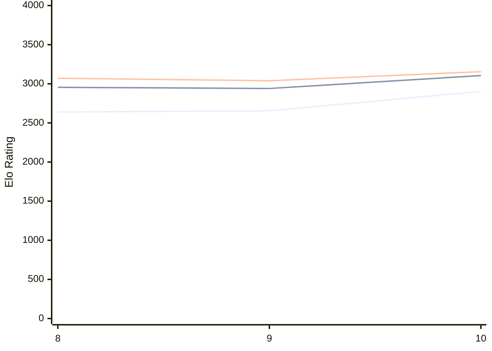

# Engine: Lozza

Author: Colin Jenkins

Home: https://github.com/op12no2/lozza

## Ratings nach Version

| Version | Published | STC 8.0+0.08s  | LTC 60.0+0.60s | VLTC 2m24s+1.12s | Comment |
| --- | --- | --- | --- | --- | --- |
| 10 | 2026-01-17 | 2903(+248) | 3105(+165) | 3155(+116) |  |
| 9 | 2026-01-10 | 2655(+16) | 2940(-15) | 3039(-32) |  |
| 8 | 2025-09-25 | 2639(new) | 2955(new) | 3071(new) |  |
| 7 | 2025-07-12 |  |  |  |  |
| 5.1 | 2025-06-02 |  |  |  |  |
| 5 | 2025-02-25 |  |  |  |  |
| 4 | 2025-01-06 |  |  |  |  |
| 3 | 2024-10-06 |  |  |  |  |
 | | | cElo (∆ prev) | cElo (∆ prev) | cElo (∆ prev) | 

 Test Conditions:

GUI/CLI: <a href=https://github.com/cutechess/cutechess target="_blank">Cute-Chess</a> 
Elo Calculation: <a href=https://www.remi-coulom.fr/Bayesian-Elo/ target="_blank">Bayesian-Elo</a> 
CPU: Intel(R) Core(TM) i5-7500T 2.70GHz 
Opening book: 8_moves_v3 
\* STC: 8.0+0.08s, LTC: 60.0+0.60s, VLTC: 2m24s+1.12s

 Lists:
Ratings: <a href=https://github.com/computer-chess-index/cci/blob/main/lists/CCIRatings.csv target="_blank">Complete list</a>

Generated: 2026-02-10 22:37:09

## Ratings Verlauf

⬜ STC (8.0+0.08s) &nbsp;&nbsp; ⬛ LTC (60.0+0.60s) &nbsp;&nbsp; 🟧 VLTC (2m24s+1.12s)

