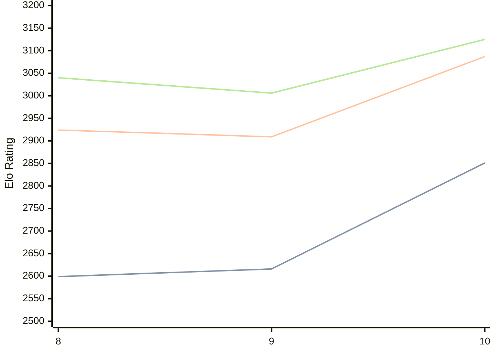

# Engine: Lozza

Author: Colin Jenkins

Home: https://github.com/op12no2/lozza

## Elo Ratings

| Version | Published | STC 8.0+0.08s  | LTC 60.0+0.60s | VLTC 2m24s+1.12s | Comment |
| --- | --- | --- | --- | --- | --- |
| 10 | 2026-01-17 | 2851(+235) | 3087(+178) | 3125(+119) |  |
| 9 | 2026-01-10 | 2616(+17) | 2909(-15) | 3006(-34) |  |
| 8 | 2025-09-25 | 2599 | 2924 | 3040 |  |
 | | | cElo (∆ prev) | cElo (∆ prev) | cElo (∆ prev) | 

<a href="https://github.com/computer-chess-index/cci/issues/new?template=submit-version.yml&title=[VERSION]+Lozza+<version>&body=###%20Engine%20name%0ALozza%0A%0A###%20Version%0A10" target="_blank">Submit new version</a>

 Test Conditions:

GUI/CLI: <a href=https://github.com/cutechess/cutechess target="_blank">Cute-Chess</a> 
Elo Calculation: <a href=https://www.remi-coulom.fr/Bayesian-Elo/ target="_blank">Bayesian-Elo</a> 
CPU: Intel(R) Core(TM) i5-7500T 2.70GHz 
Opening book: 8_moves_v3 
\* STC: 8.0+0.08s, LTC: 60.0+0.60s, VLTC: 2m24s+1.12s

 Lists:
Ratings: <a href=https://github.com/computer-chess-index/cci/blob/main/lists/CCIRatings.csv target="_blank">Complete list</a>

Generated: 2026-10-08 04:40:11

## Ratings Verlauf

```mermaid
%%{init: {"theme":"base","themeVariables":{"seriesColors:['#a3a3a3','#222221','#faa371']}}}%%
xychart-beta
  x-axis ["8", "9", "10"]
  y-axis "Elo Rating" 2500 --> 3200
  line "" [2599, 2616, 2851]
  line "STC (8.0+0.08s)" [2599, 2616, 2851]
  line "LTC (60.0+0.60s)" [2924, 2909, 3087]
  line "" [3040, 3006, 3125]
  line "VLTC (2m24s+1.12s)" [3040, 3006, 3125]
```

## Detailed Evaluation Results

| Version | Time Control | Elo  | Range +/- | Matches | Score | Average Opponent Elo | Draws |
| --- | --- | --- | --- | --- | --- | --- | --- |
| 10 | VLTC (2m24s+1.12s) | 3125 | 24 | 512 | 50% | 3121 | 50% |
| 10 | LTC (60.0+0.60s) | 3087 | 23 | 536 | 51% | 3069 | 52% |
| 10 | STC (8.0+0.08s) | 2851 | 20 | 792 | 46% | 2873 | 40% |
| --- | --- | --- | --- | --- | --- | --- | --- |
| 9 | VLTC (2m24s+1.12s) | 3006 | 36 | 216 | 51% | 2997 | 52% |
| 9 | LTC (60.0+0.60s) | 2909 | 40 | 182 | 48% | 2927 | 46% |
| 9 | STC (8.0+0.08s) | 2616 | 49 | 128 | 50% | 2618 | 37% |
| --- | --- | --- | --- | --- | --- | --- | --- |
| 8 | VLTC (2m24s+1.12s) | 3040 | 38 | 198 | 51% | 3031 | 50% |
| 8 | LTC (60.0+0.60s) | 2924 | 37 | 208 | 52% | 2905 | 52% |
| 8 | STC (8.0+0.08s) | 2599 | 43 | 176 | 51% | 2589 | 30% |
| --- | --- | --- | --- | --- | --- | --- | --- |