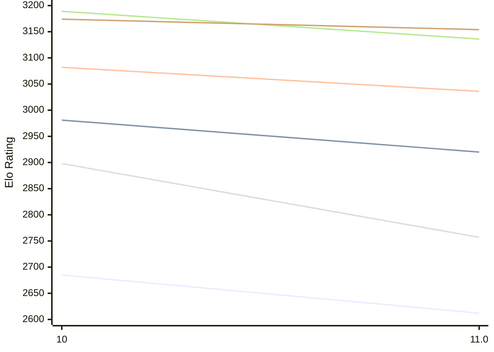
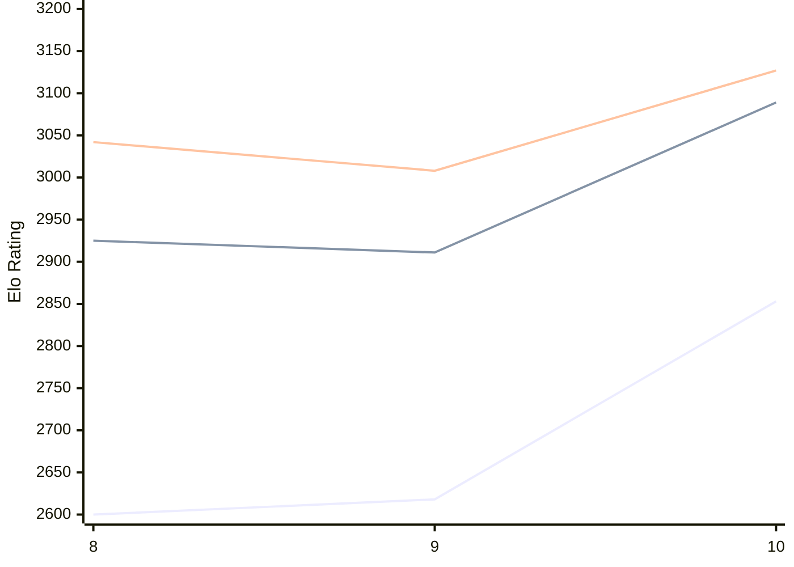

# Engine: Lozza

Author: Colin Jenkins

Home: https://github.com/op12no2/lozza

## Elo Ratings E1 (Ultra 7 265T (1.50 GHz) - E-Core)

| Version | Published | STC 8.0+0.08s  | LTC 60.0+0.60s | VLTC 2m24s+1.12s | Comment |
| --- | --- | --- | --- | --- | --- |
| 11.0 | 2026-10-14 | 2612(-73) | 2920(-61) | 3036(-46) |  |
| 10 | 2026-01-17 | 2685 | 2981 | 3082 |  |
 | | | cElo (∆ prev) | cElo (∆ prev) | cElo (∆ prev) | 

## Elo Ratings P1 (Ultra 7 265T (1.50 GHz) - P-Core)

| Version | Published | STC 8.0+0.08s  | LTC 60.0+0.60s | VLTC 2m24s+1.12s | Comment |
| --- | --- | --- | --- | --- | --- |
| 11.0 | 2026-10-14 | 2757(-141) | 3136(-53) | 3154(-20) |  |
| 10 | 2026-01-17 | 2898 | 3189 | 3174 |  |
 | | | cElo (∆ prev) | cElo (∆ prev) | cElo (∆ prev) | 

## Elo Ratings T1 (i5-7500T 2.70GHz)

| Version | Published | STC 8.0+0.08s  | LTC 60.0+0.60s | VLTC 2m24s+1.12s | Comment |
| --- | --- | --- | --- | --- | --- |
| 10 | 2026-01-17 | 2853(+235) | 3089(+178) | 3127(+119) |  |
| 9 | 2026-01-10 | 2618(+18) | 2911(-14) | 3008(-34) |  |
| 8 | 2025-09-25 | 2600 | 2925 | 3042 |  |
 | | | cElo (∆ prev) | cElo (∆ prev) | cElo (∆ prev) | 

<a href="https://github.com/computer-chess-index/cci/issues/new?template=submit-version.yml&title=[VERSION]+Lozza+<version>&body=###%20Engine%20name%0ALozza%0A%0A###%20Version%0A10" target="_blank">Submit new version</a>

 Test Conditions:

GUI/CLI: <a href=https://github.com/cutechess/cutechess target="_blank">Cute-Chess</a> 
Elo Calculation: <a href=https://www.remi-coulom.fr/Bayesian-Elo/ target="_blank">Bayesian-Elo</a> 
CPU for P1: Intel(R) Core(TM) Ultra 7 265T (1.50 GHz) - P-Core 
CPU for E1: Intel(R) Core(TM) Ultra 7 265T (1.50 GHz) - E-Core 
CPU for T1: Intel(R) Core(TM) i5-7500T 2.70GHz 
Opening book: 8_moves_v3 
\* STC: 8.0+0.08s, LTC: 60.0+0.60s, VLTC: 2m24s+1.12s

 Lists:
Ratings: <a href=https://github.com/computer-chess-index/cci/blob/main/lists/CCIRatings.csv target="_blank">Complete list</a>

Generated: 2026-10-16 04:40:30

## Ratings Verlauf E1 / P1

```mermaid
%%{init: {"theme":"base","themeVariables":{"seriesColors:['#a3a3a3','#222221','#faa371']}}}%%
xychart-beta
  x-axis ["10", "11.0"]
  y-axis "Elo Rating" 2600 --> 3200
  line "E1: STC (8.0+0.08s)" [2685, 2612]
  line "E1: LTC (60.0+0.60s)" [2981, 2920]
  line "E1: VLTC (2m24s+1.12s)" [3082, 3036]
  line "P1: STC (8.0+0.08s)" [2898, 2757]
  line "P1: LTC (60.0+0.60s)" [3189, 3136]
  line "P1: VLTC (2m24s+1.12s)" [3174, 3154]
```

## Ratings Verlauf T1

```mermaid
%%{init: {"theme":"base","themeVariables":{"seriesColors:['#a3a3a3','#222221','#faa371']}}}%%
xychart-beta
  x-axis ["8", "9", "10"]
  y-axis "Elo Rating" 2600 --> 3200
  line "T1: STC (8.0+0.08s)" [2600, 2618, 2853]
  line "T1: LTC (60.0+0.60s)" [2925, 2911, 3089]
  line "T1: VLTC (2m24s+1.12s)" [3042, 3008, 3127]
```

## Detailed Evaluation Results

| Version | Time Control | Variant | Elo  | Range +/- | Matches | Score | Average Opponent Elo | Draws |
| --- | --- |--- | --- | --- | --- | --- | --- | --- |
| 11.0 | VLTC (2m24s+1.12s) | P1 | 3154 | 83 | 38 | 55% | 3117 | 58% |
|  |  | E1 | 3036 | 50 | 110 | 48% | 3050 | 56% |
|  | LTC (60.0+0.60s) | P1 | 3136 | 66 | 64 | 44% | 3186 | 53% |
|  |  | E1 | 2920 | 51 | 120 | 50% | 2919 | 38% |
|  | STC (8.0+0.08s) | P1 | 2757 | 62 | 80 | 43% | 2817 | 39% |
|  |  | E1 | 2612 | 49 | 126 | 53% | 2587 | 41% |
| --- | --- |--- | --- | --- | --- | --- | --- | --- |
| 10 | VLTC (2m24s+1.12s) | T1 | 3127 | 24 | 512 | 50% | 3123 | 50% |
|  |  | P1 | 3174 | 43 | 166 | 58% | 3087 | 48% |
|  |  | E1 | 3082 | 38 | 204 | 53% | 3021 | 50% |
|  | LTC (60.0+0.60s) | T1 | 3089 | 23 | 536 | 51% | 3071 | 52% |
|  |  | P1 | 3189 | 42 | 162 | 45% | 3233 | 56% |
|  |  | E1 | 2981 | 39 | 202 | 49% | 2981 | 43% |
|  | STC (8.0+0.08s) | T1 | 2853 | 20 | 792 | 46% | 2874 | 40% |
|  |  | P1 | 2898 | 55 | 98 | 49% | 2907 | 45% |
|  |  | E1 | 2685 | 37 | 218 | 45% | 2734 | 44% |
| --- | --- |--- | --- | --- | --- | --- | --- | --- |
| 9 | VLTC (2m24s+1.12s) | T1 | 3008 | 36 | 216 | 51% | 2998 | 52% |
|  | LTC (60.0+0.60s) | T1 | 2911 | 40 | 182 | 48% | 2928 | 46% |
|  | STC (8.0+0.08s) | T1 | 2618 | 49 | 128 | 50% | 2619 | 37% |
| --- | --- |--- | --- | --- | --- | --- | --- | --- |
| 8 | VLTC (2m24s+1.12s) | T1 | 3042 | 38 | 198 | 51% | 3032 | 50% |
|  | LTC (60.0+0.60s) | T1 | 2925 | 37 | 208 | 52% | 2907 | 52% |
|  | STC (8.0+0.08s) | T1 | 2600 | 43 | 176 | 51% | 2591 | 30% |