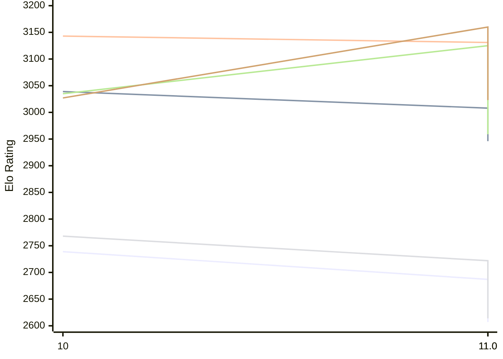
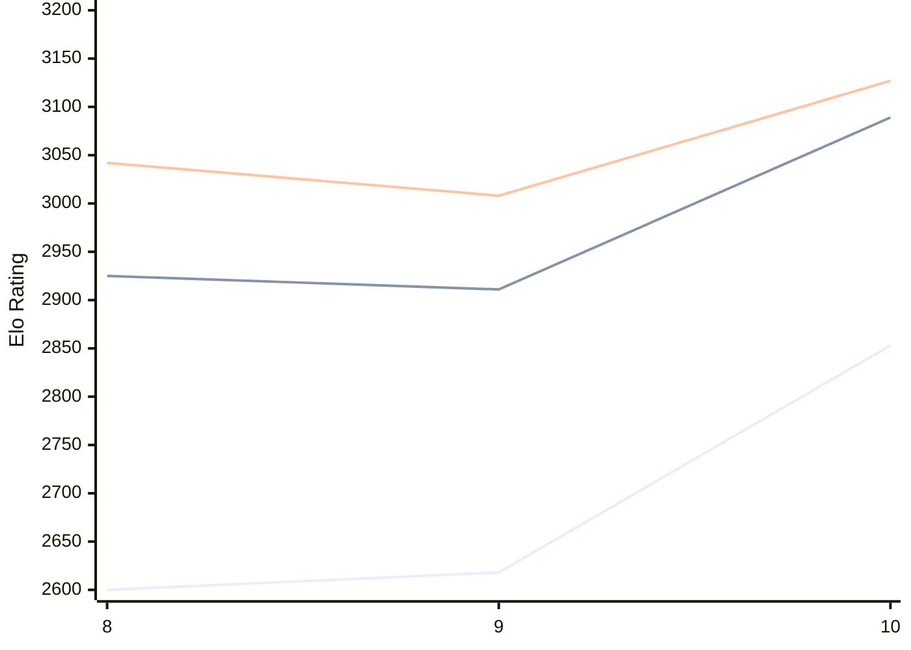

# Engine: Lozza

Author: Colin Jenkins

Home: https://github.com/op12no2/lozza

## Elo Ratings E1 (Ultra 7 265T (1.50 GHz) - E-Core)

| Version | Published | STC 8.0+0.08s  | LTC 60.0+0.60s | VLTC 2m24s+1.12s | Comment |
| --- | --- | --- | --- | --- | --- |
| 11.0 | 2026-10-30 | 2607(-80) | 2946(-62) | 3082(-49) |  |
| 11.0 | 2026-10-14 | 2687(-52) | 3008(-31) | 3131(-12) |  |
| 10 | 2026-01-17 | 2739 | 3039 | 3143 |  |
 | | | cElo (∆ prev) | cElo (∆ prev) | cElo (∆ prev) | 

## Elo Ratings P1 (Ultra 7 265T (1.50 GHz) - P-Core)

| Version | Published | STC 8.0+0.08s  | LTC 60.0+0.60s | VLTC 2m24s+1.12s | Comment |
| --- | --- | --- | --- | --- | --- |
| 11.0 | 2026-10-30 | 2614(-108) | 2959(-166) | 3023(-137) |  |
| 11.0 | 2026-10-14 | 2722(-46) | 3125(+90) | 3160(+133) |  |
| 10 | 2026-01-17 | 2768 | 3035 | 3027 |  |
 | | | cElo (∆ prev) | cElo (∆ prev) | cElo (∆ prev) | 

## Elo Ratings T1 (i5-7500T 2.70GHz)

| Version | Published | STC 8.0+0.08s  | LTC 60.0+0.60s | VLTC 2m24s+1.12s | Comment |
| --- | --- | --- | --- | --- | --- |
| 10 | 2026-01-17 | 2853(+235) | 3089(+178) | 3127(+119) |  |
| 9 | 2026-01-10 | 2618(+18) | 2911(-14) | 3008(-34) |  |
| 8 | 2025-09-25 | 2600 | 2925 | 3042 |  |
 | | | cElo (∆ prev) | cElo (∆ prev) | cElo (∆ prev) | 

<a href="https://github.com/computer-chess-index/cci/issues/new?template=submit-version.yml&title=[VERSION]+Lozza+<version>&body=###%20Engine%20name%0ALozza%0A%0A###%20Version%0A10" target="_blank">Submit new version</a>

 Test Conditions:

GUI/CLI: <a href=https://github.com/cutechess/cutechess target="_blank">Cute-Chess</a> 
Elo Calculation: <a href=https://www.remi-coulom.fr/Bayesian-Elo/ target="_blank">Bayesian-Elo</a> 
CPU for P1: Intel(R) Core(TM) Ultra 7 265T (1.50 GHz) - P-Core 
CPU for E1: Intel(R) Core(TM) Ultra 7 265T (1.50 GHz) - E-Core 
CPU for T1: Intel(R) Core(TM) i5-7500T 2.70GHz 
Opening book: 8_moves_v3 
\* STC: 8.0+0.08s, LTC: 60.0+0.60s, VLTC: 2m24s+1.12s

 Lists:
Ratings: <a href=https://github.com/computer-chess-index/cci/blob/main/lists/CCIRatings.csv target="_blank">Complete list</a>

Generated: 2026-11-20 05:39:52

## Ratings Verlauf E1 / P1

```mermaid
%%{init: {"theme":"base","themeVariables":{"seriesColors:['#a3a3a3','#222221','#faa371']}}}%%
xychart-beta
  x-axis ["10", "11.0", "11.0"]
  y-axis "Elo Rating" 2600 --> 3200
  line "E1: STC (8.0+0.08s)" [2739, 2687, 2607]
  line "E1: LTC (60.0+0.60s)" [3039, 3008, 2946]
  line "E1: VLTC (2m24s+1.12s)" [3143, 3131, 3082]
  line "P1: STC (8.0+0.08s)" [2768, 2722, 2614]
  line "P1: LTC (60.0+0.60s)" [3035, 3125, 2959]
  line "P1: VLTC (2m24s+1.12s)" [3027, 3160, 3023]
```

## Ratings Verlauf T1

```mermaid
%%{init: {"theme":"base","themeVariables":{"seriesColors:['#a3a3a3','#222221','#faa371']}}}%%
xychart-beta
  x-axis ["8", "9", "10"]
  y-axis "Elo Rating" 2600 --> 3200
  line "T1: STC (8.0+0.08s)" [2600, 2618, 2853]
  line "T1: LTC (60.0+0.60s)" [2925, 2911, 3089]
  line "T1: VLTC (2m24s+1.12s)" [3042, 3008, 3127]
```

## Detailed Evaluation Results

| Version | Time Control | Variant | Elo  | Range +/- | Matches | Score | Average Opponent Elo | Draws |
| --- | --- |--- | --- | --- | --- | --- | --- | --- |
| 11.0 | VLTC (2m24s+1.12s) | P1 | 3023 | 33 | 250 | 52% | 3005 | 54% |
|  |  | E1 | 3082 | 29 | 334 | 49% | 3082 | 55% |
|  | LTC (60.0+0.60s) | P1 | 2959 | 34 | 248 | 46% | 2997 | 49% |
|  |  | E1 | 2946 | 26 | 426 | 48% | 2963 | 45% |
|  | STC (8.0+0.08s) | P1 | 2614 | 34 | 280 | 46% | 2657 | 36% |
|  |  | E1 | 2607 | 31 | 352 | 48% | 2604 | 34% |
|  | VLTC (2m24s+1.12s) | P1 | 3160 | 38 | 186 | 52% | 3144 | 55% |
|  |  | E1 | 3131 | 33 | 250 | 48% | 3150 | 58% |
|  | LTC (60.0+0.60s) | P1 | 3125 | 41 | 170 | 47% | 3150 | 48% |
|  |  | E1 | 3008 | 32 | 284 | 48% | 3023 | 44% |
|  | STC (8.0+0.08s) | P1 | 2722 | 40 | 196 | 46% | 2759 | 37% |
|  |  | E1 | 2687 | 37 | 228 | 50% | 2692 | 37% |
| --- | --- |--- | --- | --- | --- | --- | --- | --- |
| 10 | VLTC (2m24s+1.12s) | T1 | 3127 | 24 | 512 | 50% | 3123 | 50% |
|  |  | P1 | 3027 | 41 | 184 | 57% | 2948 | 47% |
|  |  | E1 | 3143 | 37 | 214 | 54% | 3078 | 51% |
|  | LTC (60.0+0.60s) | T1 | 3089 | 23 | 536 | 51% | 3071 | 52% |
|  |  | P1 | 3035 | 41 | 172 | 45% | 3079 | 56% |
|  |  | E1 | 3039 | 37 | 222 | 49% | 3042 | 45% |
|  | STC (8.0+0.08s) | T1 | 2853 | 20 | 792 | 46% | 2874 | 40% |
|  |  | P1 | 2768 | 48 | 134 | 47% | 2808 | 40% |
|  |  | E1 | 2739 | 35 | 244 | 44% | 2793 | 44% |
| --- | --- |--- | --- | --- | --- | --- | --- | --- |
| 9 | VLTC (2m24s+1.12s) | T1 | 3008 | 36 | 216 | 51% | 2998 | 52% |
|  | LTC (60.0+0.60s) | T1 | 2911 | 40 | 182 | 48% | 2928 | 46% |
|  | STC (8.0+0.08s) | T1 | 2618 | 49 | 128 | 50% | 2619 | 37% |
| --- | --- |--- | --- | --- | --- | --- | --- | --- |
| 8 | VLTC (2m24s+1.12s) | T1 | 3042 | 38 | 198 | 51% | 3032 | 50% |
|  | LTC (60.0+0.60s) | T1 | 2925 | 37 | 208 | 52% | 2907 | 52% |
|  | STC (8.0+0.08s) | T1 | 2600 | 43 | 176 | 51% | 2591 | 30% |