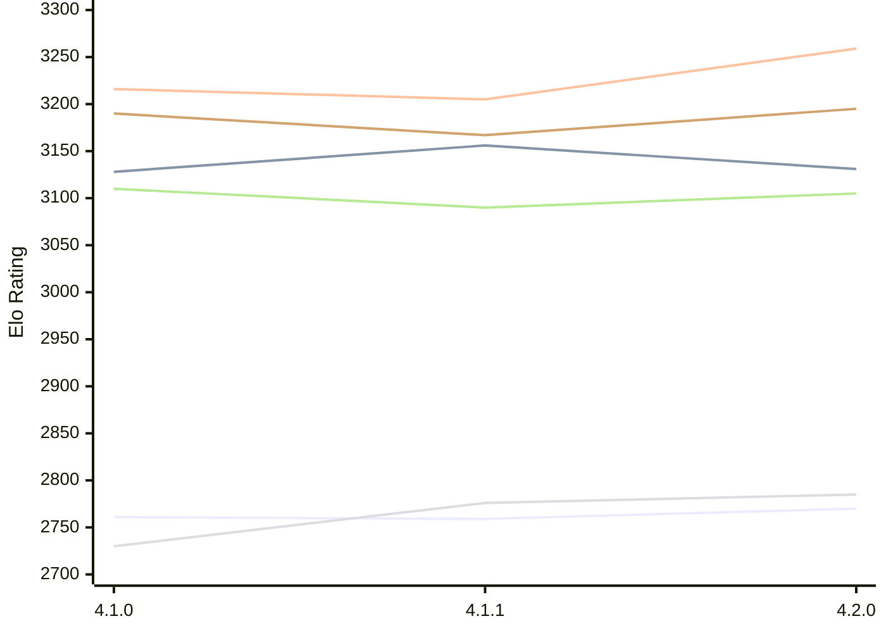

# Engine: LunaChessEngine

Author: Daniele Marpino

Home: https://github.com/Spunc595/Luna-Chess-Engine

## Elo Ratings E1 (Ultra 7 265T (1.50 GHz) - E-Core)

| Version | Published | STC 8.0+0.08s  | LTC 60.0+0.60s | VLTC 2m24s+1.12s | Comment |
| --- | --- | --- | --- | --- | --- |
| 4.2.0 | 2026-11-04 | 2770(+11) | 3131(-25) | 3259(+54) |  |
| 4.1.1 | 2026-11-02 | 2759(-2) | 3156(+28) | 3205(-11) |  |
| 4.1.0 | 2026-10-16 | 2761 | 3128 | 3216 |  |
 | | | cElo (∆ prev) | cElo (∆ prev) | cElo (∆ prev) | 

## Elo Ratings P1 (Ultra 7 265T (1.50 GHz) - P-Core)

| Version | Published | STC 8.0+0.08s  | LTC 60.0+0.60s | VLTC 2m24s+1.12s | Comment |
| --- | --- | --- | --- | --- | --- |
| 4.2.0 | 2026-11-04 | 2785(+9) | 3105(+15) | 3195(+28) |  |
| 4.1.1 | 2026-11-02 | 2776(+46) | 3090(-20) | 3167(-23) |  |
| 4.1.0 | 2026-10-16 | 2730 | 3110 | 3190 |  |
 | | | cElo (∆ prev) | cElo (∆ prev) | cElo (∆ prev) | 

## Elo Ratings T1 (i5-7500T 2.70GHz)

| Version | Published | STC 8.0+0.08s  | LTC 60.0+0.60s | VLTC 2m24s+1.12s | Comment |
| --- | --- | --- | --- | --- | --- |
| 4.1.0 | 2026-10-16 | 2730 | 3110 | 3190 |  |
 | | | cElo (∆ prev) | cElo (∆ prev) | cElo (∆ prev) | 

<a href="https://github.com/computer-chess-index/cci/issues/new?template=submit-version.yml&title=[VERSION]+LunaChessEngine+<version>&body=###%20Engine%20name%0ALunaChessEngine%0A%0A###%20Version%0A4.2.0" target="_blank">Submit new version</a>

 Test Conditions:

GUI/CLI: <a href=https://github.com/cutechess/cutechess target="_blank">Cute-Chess</a> 
Elo Calculation: <a href=https://www.remi-coulom.fr/Bayesian-Elo/ target="_blank">Bayesian-Elo</a> 
CPU for P1: Intel(R) Core(TM) Ultra 7 265T (1.50 GHz) - P-Core 
CPU for E1: Intel(R) Core(TM) Ultra 7 265T (1.50 GHz) - E-Core 
CPU for T1: Intel(R) Core(TM) i5-7500T 2.70GHz 
Opening book: 8_moves_v3 
\* STC: 8.0+0.08s, LTC: 60.0+0.60s, VLTC: 2m24s+1.12s

 Lists:
Ratings: <a href=https://github.com/computer-chess-index/cci/blob/main/lists/CCIRatings.csv target="_blank">Complete list</a>

Generated: 2026-11-22 05:40:01

## Ratings Verlauf E1 / P1

```mermaid
%%{init: {"theme":"base","themeVariables":{"seriesColors:['#a3a3a3','#222221','#faa371']}}}%%
xychart-beta
  x-axis ["4.1.0", "4.1.1", "4.2.0"]
  y-axis "Elo Rating" 2700 --> 3300
  line "E1: STC (8.0+0.08s)" [2761, 2759, 2770]
  line "E1: LTC (60.0+0.60s)" [3128, 3156, 3131]
  line "E1: VLTC (2m24s+1.12s)" [3216, 3205, 3259]
  line "P1: STC (8.0+0.08s)" [2730, 2776, 2785]
  line "P1: LTC (60.0+0.60s)" [3110, 3090, 3105]
  line "P1: VLTC (2m24s+1.12s)" [3190, 3167, 3195]
```

## Detailed Evaluation Results

| Version | Time Control | Variant | Elo  | Range +/- | Matches | Score | Average Opponent Elo | Draws |
| --- | --- |--- | --- | --- | --- | --- | --- | --- |
| 4.2.0 | VLTC (2m24s+1.12s) | P1 | 3195 | 36 | 196 | 49% | 3204 | 68% |
|  |  | E1 | 3259 | 25 | 406 | 48% | 3272 | 68% |
|  | LTC (60.0+0.60s) | P1 | 3105 | 37 | 192 | 47% | 3124 | 61% |
|  |  | E1 | 3131 | 32 | 266 | 50% | 3133 | 59% |
|  | STC (8.0+0.08s) | P1 | 2785 | 38 | 212 | 47% | 2813 | 40% |
|  |  | E1 | 2770 | 33 | 288 | 47% | 2780 | 39% |
| --- | --- |--- | --- | --- | --- | --- | --- | --- |
| 4.1.1 | VLTC (2m24s+1.12s) | P1 | 3167 | 36 | 212 | 50% | 3173 | 58% |
|  |  | E1 | 3205 | 33 | 248 | 50% | 3208 | 59% |
|  | LTC (60.0+0.60s) | P1 | 3090 | 38 | 196 | 52% | 3074 | 52% |
|  |  | E1 | 3156 | 38 | 188 | 51% | 3147 | 60% |
|  | STC (8.0+0.08s) | P1 | 2776 | 43 | 174 | 52% | 2757 | 36% |
|  |  | E1 | 2759 | 35 | 264 | 49% | 2770 | 37% |
| --- | --- |--- | --- | --- | --- | --- | --- | --- |
| 4.1.0 | VLTC (2m24s+1.12s) | P1 | 3190 | 38 | 190 | 52% | 3151 | 60% |
|  |  | E1 | 3216 | 32 | 280 | 56% | 3140 | 55% |
|  | LTC (60.0+0.60s) | P1 | 3110 | 42 | 174 | 56% | 2955 | 48% |
|  |  | E1 | 3128 | 33 | 294 | 58% | 2978 | 45% |
|  | STC (8.0+0.08s) | E1 | 2761 | 34 | 298 | 57% | 2530 | 36% |
|  |  | P1 | 2730 | 38 | 240 | 54% | 2569 | 35% |