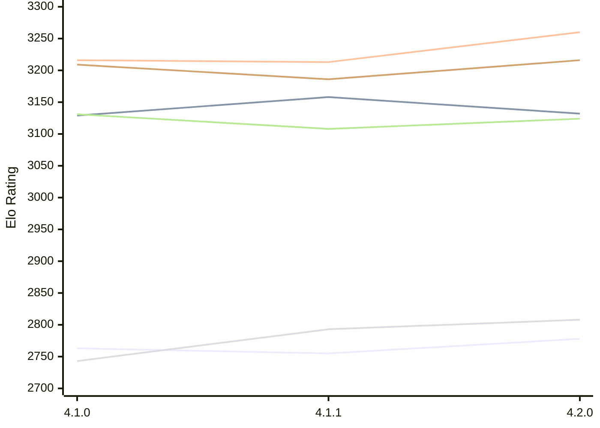

# Engine: LunaChessEngine

Author: Daniele Marpino

Home: https://github.com/Spunc595/Luna-Chess-Engine

## Elo Ratings E1 (Ultra 7 265T (1.50 GHz) - E-Core)

| Version | Published | STC 8.0+0.08s  | LTC 60.0+0.60s | VLTC 2m24s+1.12s | Comment |
| --- | --- | --- | --- | --- | --- |
| 4.2.0 | 2026-11-04 | 2778(+23) | 3132(-26) | 3260(+47) |  |
| 4.1.1 | 2026-11-02 | 2755(-8) | 3158(+29) | 3213(-3) |  |
| 4.1.0 | 2026-10-16 | 2763 | 3129 | 3216 |  |
 | | | cElo (∆ prev) | cElo (∆ prev) | cElo (∆ prev) | 

## Elo Ratings P1 (Ultra 7 265T (1.50 GHz) - P-Core)

| Version | Published | STC 8.0+0.08s  | LTC 60.0+0.60s | VLTC 2m24s+1.12s | Comment |
| --- | --- | --- | --- | --- | --- |
| 4.2.0 | 2026-11-04 | 2808(+15) | 3124(+16) | 3216(+30) |  |
| 4.1.1 | 2026-11-02 | 2793(+50) | 3108(-23) | 3186(-23) |  |
| 4.1.0 | 2026-10-16 | 2743 | 3131 | 3209 |  |
 | | | cElo (∆ prev) | cElo (∆ prev) | cElo (∆ prev) | 

## Elo Ratings T1 (i5-7500T 2.70GHz)

| Version | Published | STC 8.0+0.08s  | LTC 60.0+0.60s | VLTC 2m24s+1.12s | Comment |
| --- | --- | --- | --- | --- | --- |
| 4.1.0 | 2026-10-16 | 2743 | 3131 | 3209 |  |
 | | | cElo (∆ prev) | cElo (∆ prev) | cElo (∆ prev) | 

<a href="https://github.com/computer-chess-index/cci/issues/new?template=submit-version.yml&title=[VERSION]+LunaChessEngine+<version>&body=###%20Engine%20name%0ALunaChessEngine%0A%0A###%20Version%0A4.2.0" target="_blank">Submit new version</a>

 Test Conditions:

GUI/CLI: <a href=https://github.com/cutechess/cutechess target="_blank">Cute-Chess</a> 
Elo Calculation: <a href=https://www.remi-coulom.fr/Bayesian-Elo/ target="_blank">Bayesian-Elo</a> 
CPU for P1: Intel(R) Core(TM) Ultra 7 265T (1.50 GHz) - P-Core 
CPU for E1: Intel(R) Core(TM) Ultra 7 265T (1.50 GHz) - E-Core 
CPU for T1: Intel(R) Core(TM) i5-7500T 2.70GHz 
Opening book: 8_moves_v3 
\* STC: 8.0+0.08s, LTC: 60.0+0.60s, VLTC: 2m24s+1.12s

 Lists:
Ratings: <a href=https://github.com/computer-chess-index/cci/blob/main/lists/CCIRatings.csv target="_blank">Complete list</a>

Generated: 2026-11-25 05:40:14

## Ratings Verlauf E1 / P1

```mermaid
%%{init: {"theme":"base","themeVariables":{"seriesColors:['#a3a3a3','#222221','#faa371']}}}%%
xychart-beta
  x-axis ["4.1.0", "4.1.1", "4.2.0"]
  y-axis "Elo Rating" 2700 --> 3300
  line "E1: STC (8.0+0.08s)" [2763, 2755, 2778]
  line "E1: LTC (60.0+0.60s)" [3129, 3158, 3132]
  line "E1: VLTC (2m24s+1.12s)" [3216, 3213, 3260]
  line "P1: STC (8.0+0.08s)" [2743, 2793, 2808]
  line "P1: LTC (60.0+0.60s)" [3131, 3108, 3124]
  line "P1: VLTC (2m24s+1.12s)" [3209, 3186, 3216]
```

## Detailed Evaluation Results

| Version | Time Control | Variant | Elo  | Range +/- | Matches | Score | Average Opponent Elo | Draws |
| --- | --- |--- | --- | --- | --- | --- | --- | --- |
| 4.2.0 | VLTC (2m24s+1.12s) | P1 | 3216 | 36 | 196 | 49% | 3222 | 68% |
|  |  | E1 | 3260 | 25 | 410 | 48% | 3274 | 69% |
|  | LTC (60.0+0.60s) | P1 | 3124 | 36 | 208 | 48% | 3141 | 61% |
|  |  | E1 | 3132 | 31 | 274 | 50% | 3133 | 60% |
|  | STC (8.0+0.08s) | P1 | 2808 | 37 | 228 | 48% | 2827 | 40% |
|  |  | E1 | 2778 | 32 | 308 | 48% | 2782 | 38% |
| --- | --- |--- | --- | --- | --- | --- | --- | --- |
| 4.1.1 | VLTC (2m24s+1.12s) | E1 | 3213 | 32 | 260 | 51% | 3209 | 59% |
|  |  | P1 | 3186 | 36 | 212 | 50% | 3193 | 58% |
|  | LTC (60.0+0.60s) | P1 | 3108 | 37 | 206 | 52% | 3094 | 51% |
|  |  | E1 | 3158 | 38 | 188 | 51% | 3147 | 60% |
|  | STC (8.0+0.08s) | P1 | 2793 | 42 | 182 | 52% | 2773 | 36% |
|  |  | E1 | 2755 | 33 | 288 | 48% | 2772 | 37% |
| --- | --- |--- | --- | --- | --- | --- | --- | --- |
| 4.1.0 | VLTC (2m24s+1.12s) | P1 | 3209 | 38 | 190 | 52% | 3168 | 60% |
|  |  | E1 | 3216 | 32 | 280 | 56% | 3140 | 55% |
|  | LTC (60.0+0.60s) | P1 | 3131 | 42 | 174 | 56% | 2973 | 48% |
|  |  | E1 | 3129 | 33 | 294 | 58% | 2979 | 45% |
|  | STC (8.0+0.08s) | P1 | 2743 | 38 | 240 | 54% | 2581 | 35% |
|  |  | E1 | 2763 | 34 | 298 | 57% | 2533 | 36% |