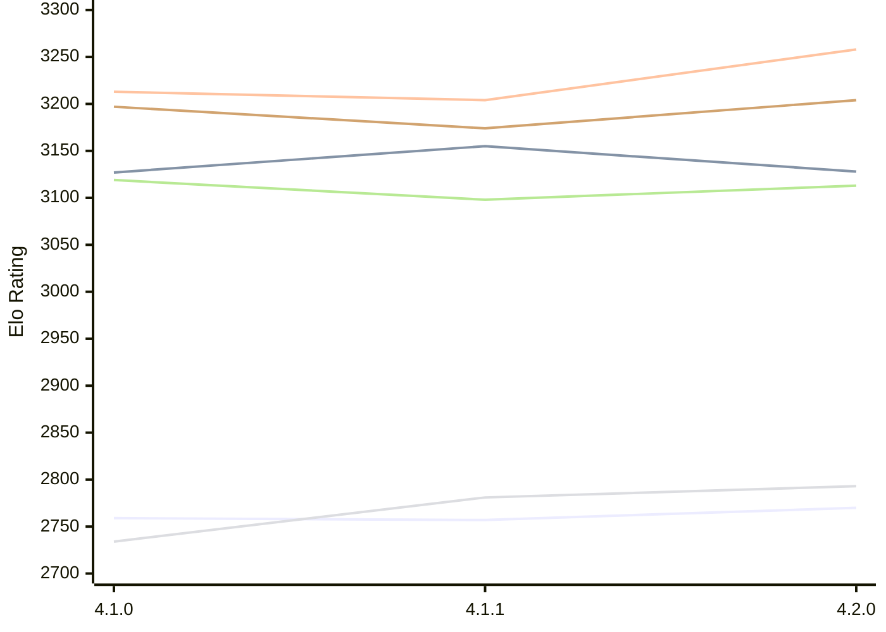

# Engine: LunaChessEngine

Author: Daniele Marpino

Home: https://github.com/Spunc595/Luna-Chess-Engine

## Elo Ratings E1 (Ultra 7 265T (1.50 GHz) - E-Core)

| Version | Published | STC 8.0+0.08s  | LTC 60.0+0.60s | VLTC 2m24s+1.12s | Comment |
| --- | --- | --- | --- | --- | --- |
| 4.2.0 | 2026-11-04 | 2770(+13) | 3128(-27) | 3258(+54) |  |
| 4.1.1 | 2026-11-02 | 2757(-2) | 3155(+28) | 3204(-9) |  |
| 4.1.0 | 2026-10-16 | 2759 | 3127 | 3213 |  |
 | | | cElo (∆ prev) | cElo (∆ prev) | cElo (∆ prev) | 

## Elo Ratings P1 (Ultra 7 265T (1.50 GHz) - P-Core)

| Version | Published | STC 8.0+0.08s  | LTC 60.0+0.60s | VLTC 2m24s+1.12s | Comment |
| --- | --- | --- | --- | --- | --- |
| 4.2.0 | 2026-11-04 | 2793(+12) | 3113(+15) | 3204(+30) |  |
| 4.1.1 | 2026-11-02 | 2781(+47) | 3098(-21) | 3174(-23) |  |
| 4.1.0 | 2026-10-16 | 2734 | 3119 | 3197 |  |
 | | | cElo (∆ prev) | cElo (∆ prev) | cElo (∆ prev) | 

## Elo Ratings T1 (i5-7500T 2.70GHz)

| Version | Published | STC 8.0+0.08s  | LTC 60.0+0.60s | VLTC 2m24s+1.12s | Comment |
| --- | --- | --- | --- | --- | --- |
| 4.1.0 | 2026-10-16 | 2734 | 3119 | 3197 |  |
 | | | cElo (∆ prev) | cElo (∆ prev) | cElo (∆ prev) | 

<a href="https://github.com/computer-chess-index/cci/issues/new?template=submit-version.yml&title=[VERSION]+LunaChessEngine+<version>&body=###%20Engine%20name%0ALunaChessEngine%0A%0A###%20Version%0A4.2.0" target="_blank">Submit new version</a>

 Test Conditions:

GUI/CLI: <a href=https://github.com/cutechess/cutechess target="_blank">Cute-Chess</a> 
Elo Calculation: <a href=https://www.remi-coulom.fr/Bayesian-Elo/ target="_blank">Bayesian-Elo</a> 
CPU for P1: Intel(R) Core(TM) Ultra 7 265T (1.50 GHz) - P-Core 
CPU for E1: Intel(R) Core(TM) Ultra 7 265T (1.50 GHz) - E-Core 
CPU for T1: Intel(R) Core(TM) i5-7500T 2.70GHz 
Opening book: 8_moves_v3 
\* STC: 8.0+0.08s, LTC: 60.0+0.60s, VLTC: 2m24s+1.12s

 Lists:
Ratings: <a href=https://github.com/computer-chess-index/cci/blob/main/lists/CCIRatings.csv target="_blank">Complete list</a>

Generated: 2026-11-23 05:40:06

## Ratings Verlauf E1 / P1

```mermaid
%%{init: {"theme":"base","themeVariables":{"seriesColors:['#a3a3a3','#222221','#faa371']}}}%%
xychart-beta
  x-axis ["4.1.0", "4.1.1", "4.2.0"]
  y-axis "Elo Rating" 2700 --> 3300
  line "E1: STC (8.0+0.08s)" [2759, 2757, 2770]
  line "E1: LTC (60.0+0.60s)" [3127, 3155, 3128]
  line "E1: VLTC (2m24s+1.12s)" [3213, 3204, 3258]
  line "P1: STC (8.0+0.08s)" [2734, 2781, 2793]
  line "P1: LTC (60.0+0.60s)" [3119, 3098, 3113]
  line "P1: VLTC (2m24s+1.12s)" [3197, 3174, 3204]
```

## Detailed Evaluation Results

| Version | Time Control | Variant | Elo  | Range +/- | Matches | Score | Average Opponent Elo | Draws |
| --- | --- |--- | --- | --- | --- | --- | --- | --- |
| 4.2.0 | VLTC (2m24s+1.12s) | P1 | 3204 | 36 | 196 | 49% | 3210 | 68% |
|  |  | E1 | 3258 | 25 | 410 | 48% | 3270 | 69% |
|  | LTC (60.0+0.60s) | P1 | 3113 | 37 | 196 | 47% | 3131 | 61% |
|  |  | E1 | 3128 | 31 | 270 | 50% | 3131 | 60% |
|  | STC (8.0+0.08s) | P1 | 2793 | 38 | 216 | 47% | 2817 | 39% |
|  |  | E1 | 2770 | 33 | 296 | 47% | 2777 | 39% |
| --- | --- |--- | --- | --- | --- | --- | --- | --- |
| 4.1.1 | VLTC (2m24s+1.12s) | P1 | 3174 | 36 | 212 | 50% | 3181 | 58% |
|  |  | E1 | 3204 | 33 | 248 | 50% | 3205 | 59% |
|  | LTC (60.0+0.60s) | E1 | 3155 | 38 | 188 | 51% | 3144 | 60% |
|  |  | P1 | 3098 | 38 | 196 | 52% | 3082 | 52% |
|  | STC (8.0+0.08s) | E1 | 2757 | 35 | 264 | 49% | 2768 | 37% |
|  |  | P1 | 2781 | 43 | 174 | 52% | 2762 | 36% |
| --- | --- |--- | --- | --- | --- | --- | --- | --- |
| 4.1.0 | VLTC (2m24s+1.12s) | P1 | 3197 | 38 | 190 | 52% | 3156 | 60% |
|  |  | E1 | 3213 | 32 | 280 | 56% | 3137 | 55% |
|  | LTC (60.0+0.60s) | P1 | 3119 | 42 | 174 | 56% | 2962 | 48% |
|  |  | E1 | 3127 | 33 | 294 | 58% | 2977 | 45% |
|  | STC (8.0+0.08s) | P1 | 2734 | 38 | 240 | 54% | 2573 | 35% |
|  |  | E1 | 2759 | 34 | 298 | 57% | 2529 | 36% |