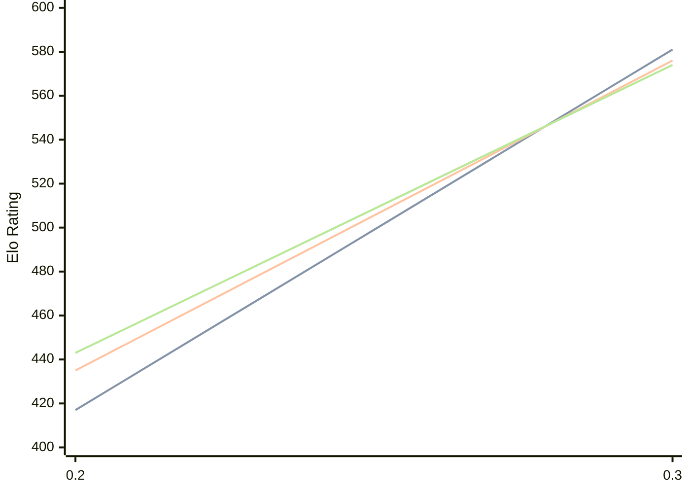

# Engine: Magpie

Author: George Bland

Home: https://github.com/mrgwbland/Magpie

## Elo Ratings

| Version | Published | STC 8.0+0.08s  | LTC 60.0+0.60s | VLTC 2m24s+1.12s | Comment |
| --- | --- | --- | --- | --- | --- |
| 0.3 | 2026-08-12 | 581(+164) | 576(+141) | 574(+131) |  |
| 0.2 | 2026-08-07 | 417 | 435 | 443 |  |
 | | | cElo (∆ prev) | cElo (∆ prev) | cElo (∆ prev) | 

<a href="https://github.com/computer-chess-index/cci/issues/new?template=submit-version.yml&title=[VERSION]+Magpie+<version>&body=###%20Engine%20name%0AMagpie%0A%0A###%20Version%0A0.3" target="_blank">Submit new version</a>

 Test Conditions:

GUI/CLI: <a href=https://github.com/cutechess/cutechess target="_blank">Cute-Chess</a> 
Elo Calculation: <a href=https://www.remi-coulom.fr/Bayesian-Elo/ target="_blank">Bayesian-Elo</a> 
CPU: Intel(R) Core(TM) i5-7500T 2.70GHz 
Opening book: 8_moves_v3 
\* STC: 8.0+0.08s, LTC: 60.0+0.60s, VLTC: 2m24s+1.12s

 Lists:
Ratings: <a href=https://github.com/computer-chess-index/cci/blob/main/lists/CCIRatings.csv target="_blank">Complete list</a>

Generated: 2026-09-06 06:26:01

## Ratings Verlauf

## Detailed Evaluation Results

| Version | Time Control | Elo  | Range +/- | Matches | Score | Average Opponent Elo | Draws |
| --- | --- | --- | --- | --- | --- | --- | --- |
| 0.3 | VLTC (2m24s+1.12s) | 574 | 45 | 192 | 49% | 586 | 22% |
| 0.3 | LTC (60.0+0.60s) | 576 | 45 | 196 | 50% | 563 | 24% |
| 0.3 | STC (8.0+0.08s) | 581 | 45 | 208 | 46% | 644 | 16% |
| --- | --- | --- | --- | --- | --- | --- | --- |
| 0.2 | VLTC (2m24s+1.12s) | 443 | 45 | 208 | 35% | 680 | 35% |
| 0.2 | LTC (60.0+0.60s) | 435 | 46 | 192 | 36% | 639 | 38% |
| 0.2 | STC (8.0+0.08s) | 417 | 46 | 188 | 37% | 591 | 35% |
| --- | --- | --- | --- | --- | --- | --- | --- |