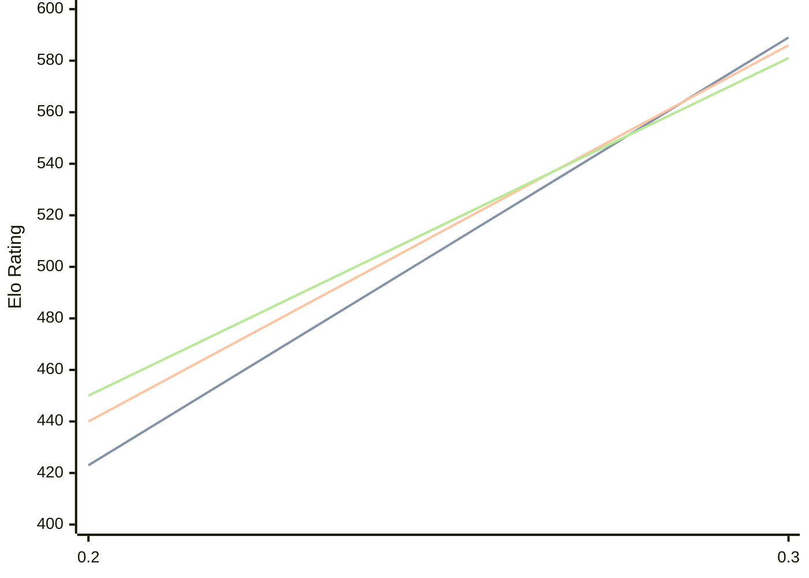

# Engine: Magpie

Author: George Bland

Home: https://github.com/mrgwbland/Magpie

## Elo Ratings E1

| Version | Published | STC 8.0+0.08s  | LTC 60.0+0.60s | VLTC 2m24s+1.12s | Comment |
| --- | --- | --- | --- | --- | --- |
| 0.3 | 2026-08-12 | 618 | 621 | 583 |  |
 | | | cElo (∆ prev) | cElo (∆ prev) | cElo (∆ prev) | 

## Elo Ratings P1

| Version | Published | STC 8.0+0.08s  | LTC 60.0+0.60s | VLTC 2m24s+1.12s | Comment |
| --- | --- | --- | --- | --- | --- |
| 0.3 | 2026-08-12 | 549 | 612 | 512 |  |
 | | | cElo (∆ prev) | cElo (∆ prev) | cElo (∆ prev) | 

## Elo Ratings T1

| Version | Published | STC 8.0+0.08s  | LTC 60.0+0.60s | VLTC 2m24s+1.12s | Comment |
| --- | --- | --- | --- | --- | --- |
| 0.3 | 2026-08-12 | 589(+166) | 586(+146) | 581(+131) |  |
| 0.2 | 2026-08-07 | 423 | 440 | 450 |  |
 | | | cElo (∆ prev) | cElo (∆ prev) | cElo (∆ prev) | 

<a href="https://github.com/computer-chess-index/cci/issues/new?template=submit-version.yml&title=[VERSION]+Magpie+<version>&body=###%20Engine%20name%0AMagpie%0A%0A###%20Version%0A0.3" target="_blank">Submit new version</a>

 Test Conditions:

GUI/CLI: <a href=https://github.com/cutechess/cutechess target="_blank">Cute-Chess</a> 
Elo Calculation: <a href=https://www.remi-coulom.fr/Bayesian-Elo/ target="_blank">Bayesian-Elo</a> 
CPU for P1: Intel(R) Core(TM) Ultra 7 265T (1.50 GHz) - P-Core 
CPU for E1: Intel(R) Core(TM) Ultra 7 265T (1.50 GHz) - E-Core 
CPU for T1: Intel(R) Core(TM) i5-7500T 2.70GHz 
Opening book: 8_moves_v3 
\* STC: 8.0+0.08s, LTC: 60.0+0.60s, VLTC: 2m24s+1.12s

 Lists:
Ratings: <a href=https://github.com/computer-chess-index/cci/blob/main/lists/CCIRatings.csv target="_blank">Complete list</a>

Generated: 2026-10-10 04:40:06

## Ratings Verlauf

```mermaid
%%{init: {"theme":"base","themeVariables":{"seriesColors:['#a3a3a3','#222221','#faa371']}}}%%
xychart-beta
  x-axis ["0.2", "0.3"]
  y-axis "Elo Rating" 400 --> 600
  line "" [423, 589]
  line "STC (8.0+0.08s)" [423, 589]
  line "LTC (60.0+0.60s)" [440, 586]
  line "" [450, 581]
  line "VLTC (2m24s+1.12s)" [450, 581]
```

## Detailed Evaluation Results

| Version | Time Control | Elo  | Range +/- | Matches | Score | Average Opponent Elo | Draws |
| --- | --- | --- | --- | --- | --- | --- | --- |
| 0.3 | VLTC (2m24s+1.12s) | 583 | 55 | 124 | 59% | 508 | 23% |
| 0.3 | VLTC (2m24s+1.12s) | 581 | 43 | 208 | 50% | 587 | 22% |
| 0.3 | VLTC (2m24s+1.12s) | 512 | 67 | 94 | 44% | 794 | 24% |
| 0.3 | LTC (60.0+0.60s) | 621 | 52 | 128 | 61% | 510 | 32% |
| 0.3 | LTC (60.0+0.60s) | 586 | 44 | 204 | 50% | 576 | 25% |
| 0.3 | LTC (60.0+0.60s) | 612 | 65 | 88 | 56% | 698 | 32% |
| 0.3 | STC (8.0+0.08s) | 589 | 44 | 220 | 47% | 648 | 16% |
| --- | --- | --- | --- | --- | --- | --- | --- |
| 0.3 | STC (8.0+0.08s) | 549 | 65 | 88 | 47% | 725 | 25% |
| --- | --- | --- | --- | --- | --- | --- | --- |
| 0.3 | STC (8.0+0.08s) | 618 | 55 | 128 | 57% | 539 | 17% |
| --- | --- | --- | --- | --- | --- | --- | --- |
| 0.2 | VLTC (2m24s+1.12s) | 450 | 45 | 208 | 35% | 687 | 35% |
| 0.2 | LTC (60.0+0.60s) | 440 | 46 | 192 | 36% | 645 | 38% |
| 0.2 | STC (8.0+0.08s) | 423 | 46 | 188 | 37% | 598 | 35% |
| --- | --- | --- | --- | --- | --- | --- | --- |