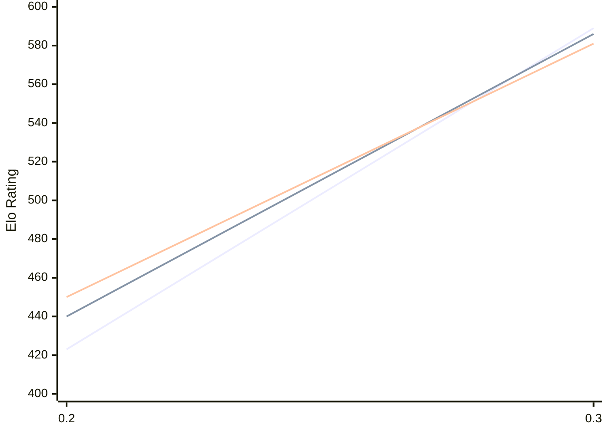

# Engine: Magpie

Author: George Bland

Home: https://github.com/mrgwbland/Magpie

## Elo Ratings E1 (Ultra 7 265T (1.50 GHz) - E-Core)

| Version | Published | STC 8.0+0.08s  | LTC 60.0+0.60s | VLTC 2m24s+1.12s | Comment |
| --- | --- | --- | --- | --- | --- |
| 0.3 | 2026-08-12 | 689 | 656 | 639 |  |
 | | | cElo (∆ prev) | cElo (∆ prev) | cElo (∆ prev) | 

## Elo Ratings P1 (Ultra 7 265T (1.50 GHz) - P-Core)

| Version | Published | STC 8.0+0.08s  | LTC 60.0+0.60s | VLTC 2m24s+1.12s | Comment |
| --- | --- | --- | --- | --- | --- |
| 0.3 | 2026-08-12 | 576 | 591 | 517 |  |
 | | | cElo (∆ prev) | cElo (∆ prev) | cElo (∆ prev) | 

## Elo Ratings T1 (i5-7500T 2.70GHz)

| Version | Published | STC 8.0+0.08s  | LTC 60.0+0.60s | VLTC 2m24s+1.12s | Comment |
| --- | --- | --- | --- | --- | --- |
| 0.3 | 2026-08-12 | 589(+166) | 586(+146) | 581(+131) |  |
| 0.2 | 2026-08-07 | 423 | 440 | 450 |  |
 | | | cElo (∆ prev) | cElo (∆ prev) | cElo (∆ prev) | 

<a href="https://github.com/computer-chess-index/cci/issues/new?template=submit-version.yml&title=[VERSION]+Magpie+<version>&body=###%20Engine%20name%0AMagpie%0A%0A###%20Version%0A0.3" target="_blank">Submit new version</a>

 Test Conditions:

GUI/CLI: <a href=https://github.com/cutechess/cutechess target="_blank">Cute-Chess</a> 
Elo Calculation: <a href=https://www.remi-coulom.fr/Bayesian-Elo/ target="_blank">Bayesian-Elo</a> 
CPU for P1: Intel(R) Core(TM) Ultra 7 265T (1.50 GHz) - P-Core 
CPU for E1: Intel(R) Core(TM) Ultra 7 265T (1.50 GHz) - E-Core 
CPU for T1: Intel(R) Core(TM) i5-7500T 2.70GHz 
Opening book: 8_moves_v3 
\* STC: 8.0+0.08s, LTC: 60.0+0.60s, VLTC: 2m24s+1.12s

 Lists:
Ratings: <a href=https://github.com/computer-chess-index/cci/blob/main/lists/CCIRatings.csv target="_blank">Complete list</a>

Generated: 2026-10-20 04:40:31

## Ratings Verlauf T1

```mermaid
%%{init: {"theme":"base","themeVariables":{"seriesColors:['#a3a3a3','#222221','#faa371']}}}%%
xychart-beta
  x-axis ["0.2", "0.3"]
  y-axis "Elo Rating" 400 --> 600
  line "T1: STC (8.0+0.08s)" [423, 589]
  line "T1: LTC (60.0+0.60s)" [440, 586]
  line "T1: VLTC (2m24s+1.12s)" [450, 581]
```

## Detailed Evaluation Results

| Version | Time Control | Variant | Elo  | Range +/- | Matches | Score | Average Opponent Elo | Draws |
| --- | --- |--- | --- | --- | --- | --- | --- | --- |
| 0.3 | VLTC (2m24s+1.12s) | T1 | 581 | 43 | 208 | 50% | 587 | 22% |
|  |  | P1 | 517 | 64 | 118 | 40% | 922 | 20% |
|  |  | E1 | 639 | 51 | 162 | 51% | 778 | 21% |
|  | LTC (60.0+0.60s) | T1 | 586 | 44 | 204 | 50% | 576 | 25% |
|  |  | P1 | 591 | 60 | 112 | 50% | 783 | 28% |
|  |  | E1 | 656 | 48 | 160 | 51% | 720 | 29% |
|  | STC (8.0+0.08s) | T1 | 589 | 44 | 220 | 47% | 648 | 16% |
|  |  | P1 | 576 | 63 | 104 | 47% | 813 | 21% |
|  |  | E1 | 689 | 48 | 172 | 52% | 703 | 17% |
| --- | --- |--- | --- | --- | --- | --- | --- | --- |
| 0.2 | VLTC (2m24s+1.12s) | T1 | 450 | 45 | 208 | 35% | 687 | 35% |
|  | LTC (60.0+0.60s) | T1 | 440 | 46 | 192 | 36% | 645 | 38% |
|  | STC (8.0+0.08s) | T1 | 423 | 46 | 188 | 37% | 598 | 35% |