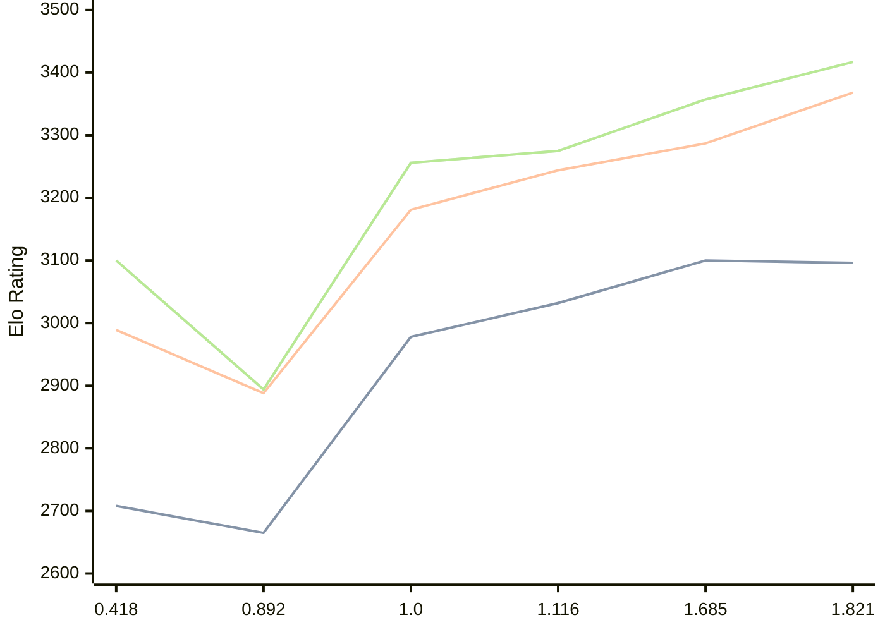

# Engine: Malika

Author: Fauzi Dabat Akram

Home: https://github.com/FauziAkram/Malika-releases

## Elo Ratings

| Version | Published | STC 8.0+0.08s  | LTC 60.0+0.60s | VLTC 2m24s+1.12s | Comment |
| --- | --- | --- | --- | --- | --- |
| 1.821 | 2026-08-12 | 3096(-4) | 3368(+81) | 3417(+60) |  |
| 1.685 | 2026-07-17 | 3100(+68) | 3287(+43) | 3357(+82) |  |
| 1.116 | 2026-05-07 | 3032(+54) | 3244(+63) | 3275(+19) |  |
| 1.0 | 2026-03-26 | 2978(+313) | 3181(+293) | 3256(+362) |  |
| 0.892 | 2026-02-23 | 2665(-43) | 2888(-101) | 2894(-206) |  |
| 0.418 | 2026-02-07 | 2708 | 2989 | 3100 |  |
 | | | cElo (∆ prev) | cElo (∆ prev) | cElo (∆ prev) | 

<a href="https://github.com/computer-chess-index/cci/issues/new?template=submit-version.yml&title=[VERSION]+Malika+<version>&body=###%20Engine%20name%0AMalika%0A%0A###%20Version%0A1.821" target="_blank">Submit new version</a>

 Test Conditions:

GUI/CLI: <a href=https://github.com/cutechess/cutechess target="_blank">Cute-Chess</a> 
Elo Calculation: <a href=https://www.remi-coulom.fr/Bayesian-Elo/ target="_blank">Bayesian-Elo</a> 
CPU: Intel(R) Core(TM) i5-7500T 2.70GHz 
Opening book: 8_moves_v3 
\* STC: 8.0+0.08s, LTC: 60.0+0.60s, VLTC: 2m24s+1.12s

 Lists:
Ratings: <a href=https://github.com/computer-chess-index/cci/blob/main/lists/CCIRatings.csv target="_blank">Complete list</a>

Generated: 2026-08-26 06:26:50

## Ratings Verlauf

⬛ STC (8.0+0.08s) &nbsp;&nbsp; 🟧 LTC (60.0+0.60s) &nbsp;&nbsp; 🟩 VLTC (2m24s+1.12s)

dark mode: 🟩STC (8.0+0.08s) 🟧LTC (60.0+0.60s) ⬜VLTC (2m24s+1.12s)

## Detailed Evaluation Results

| Version | Time Control | Elo  | Range +/- | Matches | Score | Average Opponent Elo | Draws |
| --- | --- | --- | --- | --- | --- | --- | --- |
| 1.821 | VLTC (2m24s+1.12s) | 3417 | 30 | 282 | 50% | 3421 | 72% |
| 1.821 | LTC (60.0+0.60s) | 3368 | 32 | 256 | 50% | 3370 | 66% |
| 1.821 | STC (8.0+0.08s) | 3096 | 32 | 264 | 51% | 3086 | 56% |
| --- | --- | --- | --- | --- | --- | --- | --- |
| 1.685 | VLTC (2m24s+1.12s) | 3357 | 28 | 348 | 49% | 3363 | 61% |
| 1.685 | LTC (60.0+0.60s) | 3287 | 29 | 324 | 50% | 3285 | 61% |
| 1.685 | STC (8.0+0.08s) | 3100 | 32 | 272 | 49% | 3108 | 50% |
| --- | --- | --- | --- | --- | --- | --- | --- |
| 1.116 | VLTC (2m24s+1.12s) | 3275 | 28 | 366 | 48% | 3293 | 49% |
| 1.116 | LTC (60.0+0.60s) | 3244 | 25 | 466 | 49% | 3254 | 46% |
| 1.116 | STC (8.0+0.08s) | 3032 | 27 | 422 | 51% | 3023 | 37% |
| --- | --- | --- | --- | --- | --- | --- | --- |
| 1.0 | VLTC (2m24s+1.12s) | 3256 | 28 | 366 | 50% | 3256 | 46% |
| 1.0 | LTC (60.0+0.60s) | 3181 | 29 | 364 | 50% | 3178 | 39% |
| 1.0 | STC (8.0+0.08s) | 2978 | 29 | 408 | 52% | 2957 | 30% |
| --- | --- | --- | --- | --- | --- | --- | --- |
| 0.892 | VLTC (2m24s+1.12s) | 2894 | 35 | 286 | 49% | 2907 | 23% |
| 0.892 | LTC (60.0+0.60s) | 2888 | 34 | 288 | 49% | 2896 | 25% |
| 0.892 | STC (8.0+0.08s) | 2665 | 35 | 292 | 52% | 2642 | 20% |
| --- | --- | --- | --- | --- | --- | --- | --- |
| 0.418 | VLTC (2m24s+1.12s) | 3100 | 33 | 276 | 50% | 3098 | 46% |
| 0.418 | LTC (60.0+0.60s) | 2989 | 35 | 244 | 52% | 2971 | 42% |
| 0.418 | STC (8.0+0.08s) | 2708 | 37 | 228 | 51% | 2697 | 33% |
| --- | --- | --- | --- | --- | --- | --- | --- |