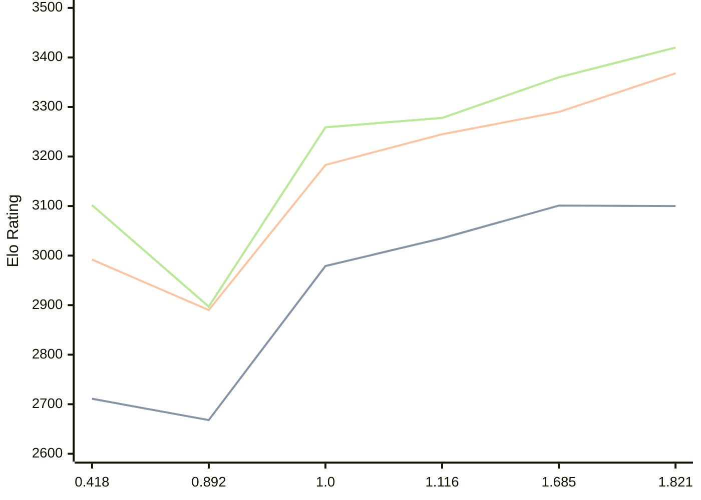

# Engine: Malika

Author: Fauzi Dabat Akram

Home: https://github.com/FauziAkram/Malika-releases

## Elo Ratings

| Version | Published | STC 8.0+0.08s  | LTC 60.0+0.60s | VLTC 2m24s+1.12s | Comment |
| --- | --- | --- | --- | --- | --- |
| 1.821 | 2026-08-12 | 3100(-1) | 3368(+78) | 3420(+60) |  |
| 1.685 | 2026-07-17 | 3101(+66) | 3290(+45) | 3360(+82) |  |
| 1.116 | 2026-05-07 | 3035(+56) | 3245(+62) | 3278(+19) |  |
| 1.0 | 2026-03-26 | 2979(+311) | 3183(+293) | 3259(+362) |  |
| 0.892 | 2026-02-23 | 2668(-43) | 2890(-102) | 2897(-205) |  |
| 0.418 | 2026-02-07 | 2711 | 2992 | 3102 |  |
 | | | cElo (∆ prev) | cElo (∆ prev) | cElo (∆ prev) | 

<a href="https://github.com/computer-chess-index/cci/issues/new?template=submit-version.yml&title=[VERSION]+Malika+<version>&body=###%20Engine%20name%0AMalika%0A%0A###%20Version%0A1.821" target="_blank">Submit new version</a>

 Test Conditions:

GUI/CLI: <a href=https://github.com/cutechess/cutechess target="_blank">Cute-Chess</a> 
Elo Calculation: <a href=https://www.remi-coulom.fr/Bayesian-Elo/ target="_blank">Bayesian-Elo</a> 
CPU: Intel(R) Core(TM) i5-7500T 2.70GHz 
Opening book: 8_moves_v3 
\* STC: 8.0+0.08s, LTC: 60.0+0.60s, VLTC: 2m24s+1.12s

 Lists:
Ratings: <a href=https://github.com/computer-chess-index/cci/blob/main/lists/CCIRatings.csv target="_blank">Complete list</a>

Generated: 2026-09-06 06:26:03

## Ratings Verlauf

## Detailed Evaluation Results

| Version | Time Control | Elo  | Range +/- | Matches | Score | Average Opponent Elo | Draws |
| --- | --- | --- | --- | --- | --- | --- | --- |
| 1.821 | VLTC (2m24s+1.12s) | 3420 | 28 | 316 | 50% | 3421 | 72% |
| 1.821 | LTC (60.0+0.60s) | 3368 | 30 | 296 | 49% | 3372 | 67% |
| 1.821 | STC (8.0+0.08s) | 3100 | 31 | 296 | 51% | 3092 | 55% |
| --- | --- | --- | --- | --- | --- | --- | --- |
| 1.685 | VLTC (2m24s+1.12s) | 3360 | 28 | 348 | 49% | 3364 | 61% |
| 1.685 | LTC (60.0+0.60s) | 3290 | 29 | 324 | 50% | 3287 | 61% |
| 1.685 | STC (8.0+0.08s) | 3101 | 32 | 272 | 49% | 3110 | 50% |
| --- | --- | --- | --- | --- | --- | --- | --- |
| 1.116 | VLTC (2m24s+1.12s) | 3278 | 28 | 366 | 48% | 3295 | 49% |
| 1.116 | LTC (60.0+0.60s) | 3245 | 25 | 466 | 49% | 3256 | 46% |
| 1.116 | STC (8.0+0.08s) | 3035 | 27 | 422 | 51% | 3025 | 37% |
| --- | --- | --- | --- | --- | --- | --- | --- |
| 1.0 | VLTC (2m24s+1.12s) | 3259 | 28 | 366 | 50% | 3259 | 46% |
| 1.0 | LTC (60.0+0.60s) | 3183 | 29 | 364 | 50% | 3181 | 39% |
| 1.0 | STC (8.0+0.08s) | 2979 | 29 | 408 | 52% | 2958 | 30% |
| --- | --- | --- | --- | --- | --- | --- | --- |
| 0.892 | VLTC (2m24s+1.12s) | 2897 | 35 | 286 | 49% | 2909 | 23% |
| 0.892 | LTC (60.0+0.60s) | 2890 | 34 | 288 | 49% | 2898 | 25% |
| 0.892 | STC (8.0+0.08s) | 2668 | 35 | 292 | 52% | 2645 | 20% |
| --- | --- | --- | --- | --- | --- | --- | --- |
| 0.418 | VLTC (2m24s+1.12s) | 3102 | 33 | 276 | 50% | 3100 | 46% |
| 0.418 | LTC (60.0+0.60s) | 2992 | 35 | 244 | 52% | 2974 | 42% |
| 0.418 | STC (8.0+0.08s) | 2711 | 37 | 228 | 51% | 2700 | 33% |
| --- | --- | --- | --- | --- | --- | --- | --- |