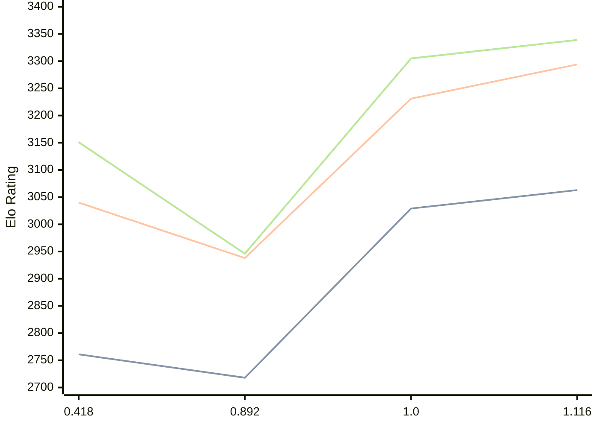

# Engine: Malika

Author: Fauzi Dabat Akram

Home: https://github.com/FauziAkram/Malika-releases

## Elo Ratings

| Version | Published | STC 8.0+0.08s  | LTC 60.0+0.60s | VLTC 2m24s+1.12s | Comment |
| --- | --- | --- | --- | --- | --- |
| 1.116 | 2026-05-07 | 3063(+34) | 3294(+63) | 3339(+34) |  |
| 1.0 | 2026-03-26 | 3029(+311) | 3231(+293) | 3305(+359) |  |
| 0.892 | 2026-02-23 | 2718(-43) | 2938(-102) | 2946(-205) |  |
| 0.418 | 2026-02-07 | 2761 | 3040 | 3151 |  |
 | | | cElo (∆ prev) | cElo (∆ prev) | cElo (∆ prev) | 

<a href="https://github.com/computer-chess-index/cci/issues/new?template=submit-version.yml&title=[VERSION]+Malika+<version>&body=###%20Engine%20name%0AMalika%0A%0A###%20Version%0A1.116" target="_blank">Submit new version</a>

 Test Conditions:

GUI/CLI: <a href=https://github.com/cutechess/cutechess target="_blank">Cute-Chess</a> 
Elo Calculation: <a href=https://www.remi-coulom.fr/Bayesian-Elo/ target="_blank">Bayesian-Elo</a> 
CPU: Intel(R) Core(TM) i5-7500T 2.70GHz 
Opening book: 8_moves_v3 
\* STC: 8.0+0.08s, LTC: 60.0+0.60s, VLTC: 2m24s+1.12s

 Lists:
Ratings: <a href=https://github.com/computer-chess-index/cci/blob/main/lists/CCIRatings.csv target="_blank">Complete list</a>

Generated: 2026-05-13 06:26:38

## Ratings Verlauf

⬛ STC (8.0+0.08s) &nbsp;&nbsp; 🟧 LTC (60.0+0.60s) &nbsp;&nbsp; 🟩 VLTC (2m24s+1.12s)

dark mode: 🟩STC (8.0+0.08s) 🟧LTC (60.0+0.60s) ⬜VLTC (2m24s+1.12s)

## Detailed Evaluation Results

| Version | Time Control | Elo  | Range +/- | Matches | Score | Average Opponent Elo | Draws |
| --- | --- | --- | --- | --- | --- | --- | --- |
| 1.116 | VLTC (2m24s+1.12s) | 3339 | 42 | 156 | 49% | 3344 | 53% |
| 1.116 | LTC (60.0+0.60s) | 3294 | 33 | 266 | 47% | 3320 | 45% |
| 1.116 | STC (8.0+0.08s) | 3063 | 41 | 188 | 52% | 3039 | 36% |
| --- | --- | --- | --- | --- | --- | --- | --- |
| 1.0 | VLTC (2m24s+1.12s) | 3305 | 28 | 366 | 50% | 3306 | 46% |
| 1.0 | LTC (60.0+0.60s) | 3231 | 29 | 364 | 50% | 3228 | 39% |
| 1.0 | STC (8.0+0.08s) | 3029 | 29 | 408 | 52% | 3008 | 30% |
| --- | --- | --- | --- | --- | --- | --- | --- |
| 0.892 | VLTC (2m24s+1.12s) | 2946 | 35 | 286 | 49% | 2958 | 23% |
| 0.892 | LTC (60.0+0.60s) | 2938 | 34 | 288 | 49% | 2946 | 25% |
| 0.892 | STC (8.0+0.08s) | 2718 | 35 | 292 | 52% | 2695 | 20% |
| --- | --- | --- | --- | --- | --- | --- | --- |
| 0.418 | VLTC (2m24s+1.12s) | 3151 | 33 | 276 | 50% | 3150 | 46% |
| 0.418 | LTC (60.0+0.60s) | 3040 | 35 | 244 | 52% | 3023 | 42% |
| 0.418 | STC (8.0+0.08s) | 2761 | 37 | 228 | 51% | 2750 | 33% |
| --- | --- | --- | --- | --- | --- | --- | --- |