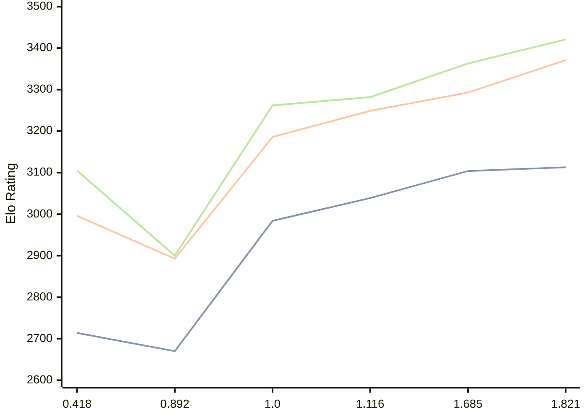

# Engine: Malika

Author: Fauzi Dabat Akram

Home: https://github.com/FauziAkram/Malika-releases

## Elo Ratings

| Version | Published | STC 8.0+0.08s  | LTC 60.0+0.60s | VLTC 2m24s+1.12s | Comment |
| --- | --- | --- | --- | --- | --- |
| 1.821 | 2026-08-12 | 3113(+9) | 3371(+78) | 3421(+58) |  |
| 1.685 | 2026-07-17 | 3104(+65) | 3293(+44) | 3363(+81) |  |
| 1.116 | 2026-05-07 | 3039(+55) | 3249(+63) | 3282(+20) |  |
| 1.0 | 2026-03-26 | 2984(+314) | 3186(+293) | 3262(+362) |  |
| 0.892 | 2026-02-23 | 2670(-44) | 2893(-103) | 2900(-205) |  |
| 0.418 | 2026-02-07 | 2714 | 2996 | 3105 |  |
 | | | cElo (∆ prev) | cElo (∆ prev) | cElo (∆ prev) | 

<a href="https://github.com/computer-chess-index/cci/issues/new?template=submit-version.yml&title=[VERSION]+Malika+<version>&body=###%20Engine%20name%0AMalika%0A%0A###%20Version%0A1.821" target="_blank">Submit new version</a>

 Test Conditions:

GUI/CLI: <a href=https://github.com/cutechess/cutechess target="_blank">Cute-Chess</a> 
Elo Calculation: <a href=https://www.remi-coulom.fr/Bayesian-Elo/ target="_blank">Bayesian-Elo</a> 
CPU: Intel(R) Core(TM) i5-7500T 2.70GHz 
Opening book: 8_moves_v3 
\* STC: 8.0+0.08s, LTC: 60.0+0.60s, VLTC: 2m24s+1.12s

 Lists:
Ratings: <a href=https://github.com/computer-chess-index/cci/blob/main/lists/CCIRatings.csv target="_blank">Complete list</a>

Generated: 2026-09-16 04:39:45

## Ratings Verlauf

## Detailed Evaluation Results

| Version | Time Control | Elo  | Range +/- | Matches | Score | Average Opponent Elo | Draws |
| --- | --- | --- | --- | --- | --- | --- | --- |
| 1.821 | VLTC (2m24s+1.12s) | 3421 | 27 | 332 | 50% | 3425 | 73% |
| 1.821 | LTC (60.0+0.60s) | 3371 | 29 | 316 | 50% | 3375 | 67% |
| 1.821 | STC (8.0+0.08s) | 3113 | 29 | 340 | 52% | 3098 | 55% |
| --- | --- | --- | --- | --- | --- | --- | --- |
| 1.685 | VLTC (2m24s+1.12s) | 3363 | 28 | 348 | 49% | 3368 | 61% |
| 1.685 | LTC (60.0+0.60s) | 3293 | 29 | 324 | 50% | 3290 | 61% |
| 1.685 | STC (8.0+0.08s) | 3104 | 32 | 272 | 49% | 3113 | 50% |
| --- | --- | --- | --- | --- | --- | --- | --- |
| 1.116 | VLTC (2m24s+1.12s) | 3282 | 28 | 366 | 48% | 3299 | 49% |
| 1.116 | LTC (60.0+0.60s) | 3249 | 25 | 466 | 49% | 3260 | 46% |
| 1.116 | STC (8.0+0.08s) | 3039 | 27 | 422 | 51% | 3028 | 37% |
| --- | --- | --- | --- | --- | --- | --- | --- |
| 1.0 | VLTC (2m24s+1.12s) | 3262 | 28 | 366 | 50% | 3263 | 46% |
| 1.0 | LTC (60.0+0.60s) | 3186 | 29 | 364 | 50% | 3183 | 39% |
| 1.0 | STC (8.0+0.08s) | 2984 | 29 | 408 | 52% | 2962 | 30% |
| --- | --- | --- | --- | --- | --- | --- | --- |
| 0.892 | VLTC (2m24s+1.12s) | 2900 | 35 | 286 | 49% | 2912 | 23% |
| 0.892 | LTC (60.0+0.60s) | 2893 | 34 | 288 | 49% | 2901 | 25% |
| 0.892 | STC (8.0+0.08s) | 2670 | 35 | 292 | 52% | 2647 | 20% |
| --- | --- | --- | --- | --- | --- | --- | --- |
| 0.418 | VLTC (2m24s+1.12s) | 3105 | 33 | 276 | 50% | 3104 | 46% |
| 0.418 | LTC (60.0+0.60s) | 2996 | 35 | 244 | 52% | 2977 | 42% |
| 0.418 | STC (8.0+0.08s) | 2714 | 37 | 228 | 51% | 2703 | 33% |
| --- | --- | --- | --- | --- | --- | --- | --- |