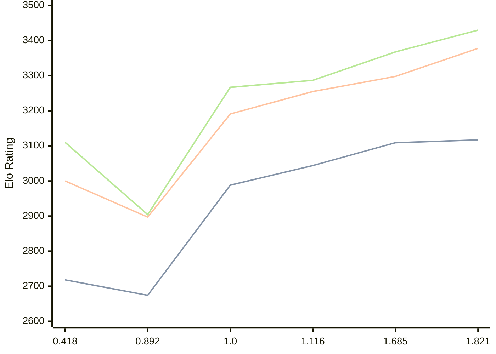

# Engine: Malika

Author: Fauzi Dabat Akram

Home: https://github.com/FauziAkram/Malika-releases

## Elo Ratings

| Version | Published | STC 8.0+0.08s  | LTC 60.0+0.60s | VLTC 2m24s+1.12s | Comment |
| --- | --- | --- | --- | --- | --- |
| 1.821 | 2026-08-12 | 3117(+8) | 3378(+80) | 3430(+62) |  |
| 1.685 | 2026-07-17 | 3109(+65) | 3298(+43) | 3368(+81) |  |
| 1.116 | 2026-05-07 | 3044(+56) | 3255(+64) | 3287(+20) |  |
| 1.0 | 2026-03-26 | 2988(+314) | 3191(+294) | 3267(+363) |  |
| 0.892 | 2026-02-23 | 2674(-44) | 2897(-103) | 2904(-206) |  |
| 0.418 | 2026-02-07 | 2718 | 3000 | 3110 |  |
 | | | cElo (∆ prev) | cElo (∆ prev) | cElo (∆ prev) | 

<a href="https://github.com/computer-chess-index/cci/issues/new?template=submit-version.yml&title=[VERSION]+Malika+<version>&body=###%20Engine%20name%0AMalika%0A%0A###%20Version%0A1.821" target="_blank">Submit new version</a>

 Test Conditions:

GUI/CLI: <a href=https://github.com/cutechess/cutechess target="_blank">Cute-Chess</a> 
Elo Calculation: <a href=https://www.remi-coulom.fr/Bayesian-Elo/ target="_blank">Bayesian-Elo</a> 
CPU: Intel(R) Core(TM) i5-7500T 2.70GHz 
Opening book: 8_moves_v3 
\* STC: 8.0+0.08s, LTC: 60.0+0.60s, VLTC: 2m24s+1.12s

 Lists:
Ratings: <a href=https://github.com/computer-chess-index/cci/blob/main/lists/CCIRatings.csv target="_blank">Complete list</a>

Generated: 2026-10-09 04:40:10

## Ratings Verlauf

```mermaid
%%{init: {"theme":"base","themeVariables":{"seriesColors:['#a3a3a3','#222221','#faa371']}}}%%
xychart-beta
  x-axis ["0.418", "0.892", "1.0", "1.116", "1.685", "1.821"]
  y-axis "Elo Rating" 2600 --> 3500
  line "" [2718, 2674, 2988, 3044, 3109, 3117]
  line "STC (8.0+0.08s)" [2718, 2674, 2988, 3044, 3109, 3117]
  line "LTC (60.0+0.60s)" [3000, 2897, 3191, 3255, 3298, 3378]
  line "" [3110, 2904, 3267, 3287, 3368, 3430]
  line "VLTC (2m24s+1.12s)" [3110, 2904, 3267, 3287, 3368, 3430]
```

## Detailed Evaluation Results

| Version | Time Control | Elo  | Range +/- | Matches | Score | Average Opponent Elo | Draws |
| --- | --- | --- | --- | --- | --- | --- | --- |
| 1.821 | VLTC (2m24s+1.12s) | 3430 | 27 | 340 | 50% | 3430 | 72% |
| 1.821 | LTC (60.0+0.60s) | 3378 | 28 | 320 | 50% | 3380 | 67% |
| 1.821 | STC (8.0+0.08s) | 3117 | 28 | 352 | 52% | 3104 | 55% |
| --- | --- | --- | --- | --- | --- | --- | --- |
| 1.685 | VLTC (2m24s+1.12s) | 3368 | 28 | 348 | 49% | 3374 | 61% |
| 1.685 | LTC (60.0+0.60s) | 3298 | 29 | 324 | 50% | 3295 | 61% |
| 1.685 | STC (8.0+0.08s) | 3109 | 32 | 272 | 49% | 3117 | 50% |
| --- | --- | --- | --- | --- | --- | --- | --- |
| 1.116 | VLTC (2m24s+1.12s) | 3287 | 28 | 366 | 48% | 3305 | 49% |
| 1.116 | LTC (60.0+0.60s) | 3255 | 25 | 466 | 49% | 3266 | 46% |
| 1.116 | STC (8.0+0.08s) | 3044 | 27 | 422 | 51% | 3033 | 37% |
| --- | --- | --- | --- | --- | --- | --- | --- |
| 1.0 | VLTC (2m24s+1.12s) | 3267 | 28 | 366 | 50% | 3268 | 46% |
| 1.0 | LTC (60.0+0.60s) | 3191 | 29 | 364 | 50% | 3189 | 39% |
| 1.0 | STC (8.0+0.08s) | 2988 | 29 | 408 | 52% | 2966 | 30% |
| --- | --- | --- | --- | --- | --- | --- | --- |
| 0.892 | VLTC (2m24s+1.12s) | 2904 | 35 | 286 | 49% | 2916 | 23% |
| 0.892 | LTC (60.0+0.60s) | 2897 | 34 | 288 | 49% | 2905 | 25% |
| 0.892 | STC (8.0+0.08s) | 2674 | 35 | 292 | 52% | 2651 | 20% |
| --- | --- | --- | --- | --- | --- | --- | --- |
| 0.418 | VLTC (2m24s+1.12s) | 3110 | 33 | 276 | 50% | 3108 | 46% |
| 0.418 | LTC (60.0+0.60s) | 3000 | 35 | 244 | 52% | 2982 | 42% |
| 0.418 | STC (8.0+0.08s) | 2718 | 37 | 228 | 51% | 2707 | 33% |
| --- | --- | --- | --- | --- | --- | --- | --- |