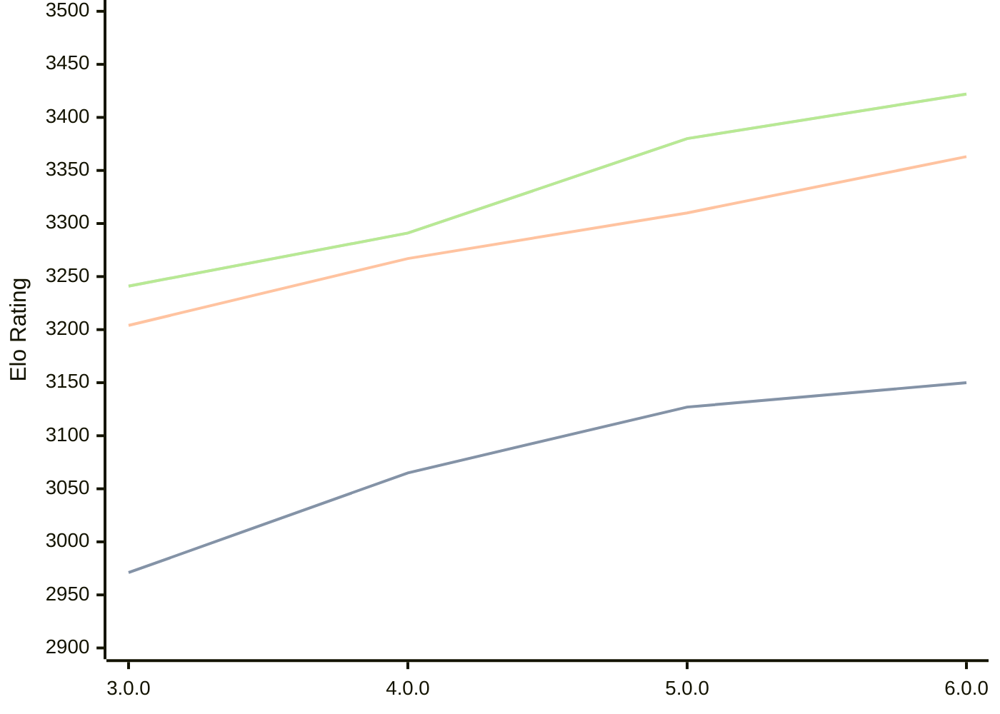

# Engine: Minke

Author: Eduardo Marinho

Home: https://github.com/enfmarinho/Minke

## Elo Ratings

| Version | Published | STC 8.0+0.08s  | LTC 60.0+0.60s | VLTC 2m24s+1.12s | Comment |
| --- | --- | --- | --- | --- | --- |
| 6.0.0 | 2026-04-25 | 3150(+23) | 3363(+53) | 3422(+42) |  |
| 5.0.0 | 2026-02-13 | 3127(+62) | 3310(+43) | 3380(+89) |  |
| 4.0.0 | 2025-12-29 | 3065(+94) | 3267(+63) | 3291(+50) |  |
| 3.0.0 | 2025-10-20 | 2971 | 3204 | 3241 |  |
 | | | cElo (∆ prev) | cElo (∆ prev) | cElo (∆ prev) | 

<a href="https://github.com/computer-chess-index/cci/issues/new?template=submit-version.yml&title=[VERSION]+Minke+<version>&body=###%20Engine%20name%0AMinke%0A%0A###%20Version%0A6.0.0" target="_blank">Submit new version</a>

 Test Conditions:

GUI/CLI: <a href=https://github.com/cutechess/cutechess target="_blank">Cute-Chess</a> 
Elo Calculation: <a href=https://www.remi-coulom.fr/Bayesian-Elo/ target="_blank">Bayesian-Elo</a> 
CPU: Intel(R) Core(TM) i5-7500T 2.70GHz 
Opening book: 8_moves_v3 
\* STC: 8.0+0.08s, LTC: 60.0+0.60s, VLTC: 2m24s+1.12s

 Lists:
Ratings: <a href=https://github.com/computer-chess-index/cci/blob/main/lists/CCIRatings.csv target="_blank">Complete list</a>

Generated: 2026-08-19 06:27:03

## Ratings Verlauf

⬛ STC (8.0+0.08s) &nbsp;&nbsp; 🟧 LTC (60.0+0.60s) &nbsp;&nbsp; 🟩 VLTC (2m24s+1.12s)

dark mode: 🟩STC (8.0+0.08s) 🟧LTC (60.0+0.60s) ⬜VLTC (2m24s+1.12s)

## Detailed Evaluation Results

| Version | Time Control | Elo  | Range +/- | Matches | Score | Average Opponent Elo | Draws |
| --- | --- | --- | --- | --- | --- | --- | --- |
| 6.0.0 | VLTC (2m24s+1.12s) | 3422 | 24 | 438 | 50% | 3424 | 77% |
| 6.0.0 | LTC (60.0+0.60s) | 3363 | 24 | 428 | 50% | 3363 | 71% |
| 6.0.0 | STC (8.0+0.08s) | 3150 | 27 | 382 | 49% | 3159 | 59% |
| --- | --- | --- | --- | --- | --- | --- | --- |
| 5.0.0 | VLTC (2m24s+1.12s) | 3380 | 24 | 414 | 50% | 3380 | 73% |
| 5.0.0 | LTC (60.0+0.60s) | 3310 | 26 | 382 | 51% | 3303 | 69% |
| 5.0.0 | STC (8.0+0.08s) | 3127 | 25 | 444 | 51% | 3123 | 57% |
| --- | --- | --- | --- | --- | --- | --- | --- |
| 4.0.0 | VLTC (2m24s+1.12s) | 3291 | 30 | 276 | 51% | 3282 | 68% |
| 4.0.0 | LTC (60.0+0.60s) | 3267 | 31 | 268 | 48% | 3282 | 68% |
| 4.0.0 | STC (8.0+0.08s) | 3065 | 33 | 252 | 51% | 3038 | 57% |
| --- | --- | --- | --- | --- | --- | --- | --- |
| 3.0.0 | VLTC (2m24s+1.12s) | 3241 | 37 | 184 | 50% | 3241 | 70% |
| 3.0.0 | LTC (60.0+0.60s) | 3204 | 32 | 252 | 48% | 3218 | 63% |
| 3.0.0 | STC (8.0+0.08s) | 2971 | 34 | 240 | 48% | 2984 | 56% |
| --- | --- | --- | --- | --- | --- | --- | --- |