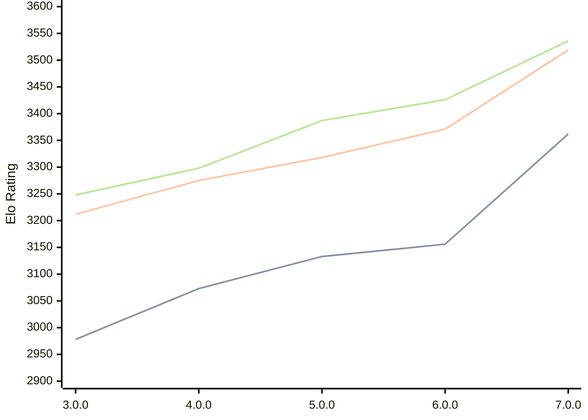

# Engine: Minke

Author: Eduardo Marinho

Home: https://github.com/enfmarinho/Minke

## Elo Ratings

| Version | Published | STC 8.0+0.08s  | LTC 60.0+0.60s | VLTC 2m24s+1.12s | Comment |
| --- | --- | --- | --- | --- | --- |
| 7.0.0 | 2026-08-27 | 3362(+206) | 3519(+148) | 3536(+110) |  |
| 6.0.0 | 2026-04-25 | 3156(+23) | 3371(+53) | 3426(+39) |  |
| 5.0.0 | 2026-02-13 | 3133(+60) | 3318(+43) | 3387(+89) |  |
| 4.0.0 | 2025-12-29 | 3073(+95) | 3275(+63) | 3298(+50) |  |
| 3.0.0 | 2025-10-20 | 2978 | 3212 | 3248 |  |
 | | | cElo (∆ prev) | cElo (∆ prev) | cElo (∆ prev) | 

<a href="https://github.com/computer-chess-index/cci/issues/new?template=submit-version.yml&title=[VERSION]+Minke+<version>&body=###%20Engine%20name%0AMinke%0A%0A###%20Version%0A7.0.0" target="_blank">Submit new version</a>

 Test Conditions:

GUI/CLI: <a href=https://github.com/cutechess/cutechess target="_blank">Cute-Chess</a> 
Elo Calculation: <a href=https://www.remi-coulom.fr/Bayesian-Elo/ target="_blank">Bayesian-Elo</a> 
CPU: Intel(R) Core(TM) i5-7500T 2.70GHz 
Opening book: 8_moves_v3 
\* STC: 8.0+0.08s, LTC: 60.0+0.60s, VLTC: 2m24s+1.12s

 Lists:
Ratings: <a href=https://github.com/computer-chess-index/cci/blob/main/lists/CCIRatings.csv target="_blank">Complete list</a>

Generated: 2026-09-06 04:36:45

## Ratings Verlauf

## Detailed Evaluation Results

| Version | Time Control | Elo  | Range +/- | Matches | Score | Average Opponent Elo | Draws |
| --- | --- | --- | --- | --- | --- | --- | --- |
| 7.0.0 | VLTC (2m24s+1.12s) | 3536 | 32 | 222 | 50% | 3533 | 87% |
| 7.0.0 | LTC (60.0+0.60s) | 3519 | 33 | 214 | 51% | 3513 | 81% |
| 7.0.0 | STC (8.0+0.08s) | 3362 | 28 | 330 | 47% | 3379 | 63% |
| --- | --- | --- | --- | --- | --- | --- | --- |
| 6.0.0 | VLTC (2m24s+1.12s) | 3426 | 23 | 450 | 49% | 3432 | 76% |
| 6.0.0 | LTC (60.0+0.60s) | 3371 | 24 | 432 | 50% | 3371 | 71% |
| 6.0.0 | STC (8.0+0.08s) | 3156 | 27 | 382 | 49% | 3166 | 59% |
| --- | --- | --- | --- | --- | --- | --- | --- |
| 5.0.0 | VLTC (2m24s+1.12s) | 3387 | 24 | 414 | 50% | 3389 | 73% |
| 5.0.0 | LTC (60.0+0.60s) | 3318 | 26 | 382 | 51% | 3310 | 69% |
| 5.0.0 | STC (8.0+0.08s) | 3133 | 25 | 444 | 51% | 3129 | 57% |
| --- | --- | --- | --- | --- | --- | --- | --- |
| 4.0.0 | VLTC (2m24s+1.12s) | 3298 | 30 | 276 | 51% | 3290 | 68% |
| 4.0.0 | LTC (60.0+0.60s) | 3275 | 31 | 268 | 48% | 3290 | 68% |
| 4.0.0 | STC (8.0+0.08s) | 3073 | 33 | 252 | 51% | 3044 | 57% |
| --- | --- | --- | --- | --- | --- | --- | --- |
| 3.0.0 | VLTC (2m24s+1.12s) | 3248 | 37 | 184 | 50% | 3249 | 70% |
| 3.0.0 | LTC (60.0+0.60s) | 3212 | 32 | 252 | 48% | 3227 | 63% |
| 3.0.0 | STC (8.0+0.08s) | 2978 | 34 | 240 | 48% | 2990 | 56% |
| --- | --- | --- | --- | --- | --- | --- | --- |