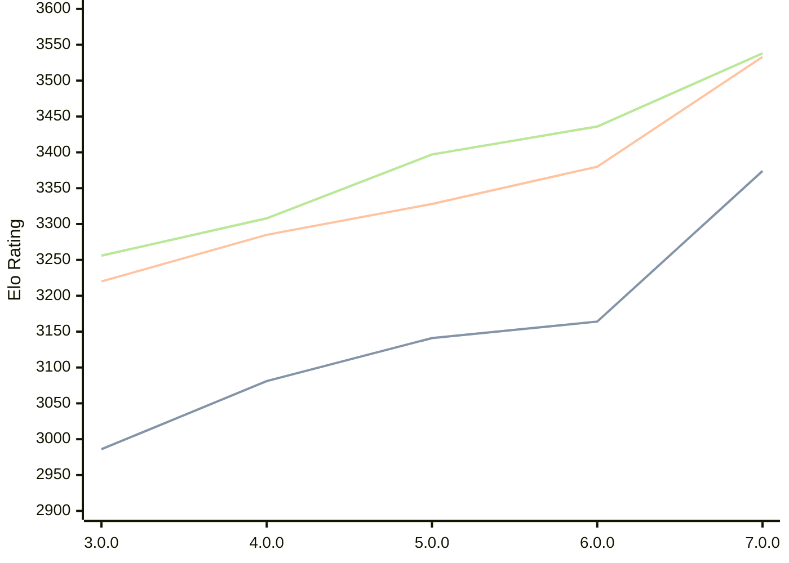

# Engine: Minke

Author: Eduardo Marinho

Home: https://github.com/enfmarinho/Minke

## Elo Ratings

| Version | Published | STC 8.0+0.08s  | LTC 60.0+0.60s | VLTC 2m24s+1.12s | Comment |
| --- | --- | --- | --- | --- | --- |
| 7.0.0 | 2026-08-27 | 3374(+210) | 3533(+153) | 3538(+102) |  |
| 6.0.0 | 2026-04-25 | 3164(+23) | 3380(+52) | 3436(+39) |  |
| 5.0.0 | 2026-02-13 | 3141(+60) | 3328(+43) | 3397(+89) |  |
| 4.0.0 | 2025-12-29 | 3081(+95) | 3285(+65) | 3308(+52) |  |
| 3.0.0 | 2025-10-20 | 2986 | 3220 | 3256 |  |
 | | | cElo (∆ prev) | cElo (∆ prev) | cElo (∆ prev) | 

<a href="https://github.com/computer-chess-index/cci/issues/new?template=submit-version.yml&title=[VERSION]+Minke+<version>&body=###%20Engine%20name%0AMinke%0A%0A###%20Version%0A7.0.0" target="_blank">Submit new version</a>

 Test Conditions:

GUI/CLI: <a href=https://github.com/cutechess/cutechess target="_blank">Cute-Chess</a> 
Elo Calculation: <a href=https://www.remi-coulom.fr/Bayesian-Elo/ target="_blank">Bayesian-Elo</a> 
CPU: Intel(R) Core(TM) i5-7500T 2.70GHz 
Opening book: 8_moves_v3 
\* STC: 8.0+0.08s, LTC: 60.0+0.60s, VLTC: 2m24s+1.12s

 Lists:
Ratings: <a href=https://github.com/computer-chess-index/cci/blob/main/lists/CCIRatings.csv target="_blank">Complete list</a>

Generated: 2026-10-09 04:40:23

## Ratings Verlauf

```mermaid
%%{init: {"theme":"base","themeVariables":{"seriesColors:['#a3a3a3','#222221','#faa371']}}}%%
xychart-beta
  x-axis ["3.0.0", "4.0.0", "5.0.0", "6.0.0", "7.0.0"]
  y-axis "Elo Rating" 2900 --> 3600
  line "" [2986, 3081, 3141, 3164, 3374]
  line "STC (8.0+0.08s)" [2986, 3081, 3141, 3164, 3374]
  line "LTC (60.0+0.60s)" [3220, 3285, 3328, 3380, 3533]
  line "" [3256, 3308, 3397, 3436, 3538]
  line "VLTC (2m24s+1.12s)" [3256, 3308, 3397, 3436, 3538]
```

## Detailed Evaluation Results

| Version | Time Control | Elo  | Range +/- | Matches | Score | Average Opponent Elo | Draws |
| --- | --- | --- | --- | --- | --- | --- | --- |
| 7.0.0 | VLTC (2m24s+1.12s) | 3538 | 29 | 280 | 50% | 3541 | 87% |
| 7.0.0 | LTC (60.0+0.60s) | 3533 | 30 | 260 | 51% | 3526 | 80% |
| 7.0.0 | STC (8.0+0.08s) | 3374 | 27 | 350 | 48% | 3387 | 63% |
| --- | --- | --- | --- | --- | --- | --- | --- |
| 6.0.0 | VLTC (2m24s+1.12s) | 3436 | 23 | 450 | 49% | 3441 | 76% |
| 6.0.0 | LTC (60.0+0.60s) | 3380 | 24 | 432 | 50% | 3380 | 71% |
| 6.0.0 | STC (8.0+0.08s) | 3164 | 27 | 382 | 49% | 3174 | 59% |
| --- | --- | --- | --- | --- | --- | --- | --- |
| 5.0.0 | VLTC (2m24s+1.12s) | 3397 | 24 | 414 | 50% | 3398 | 73% |
| 5.0.0 | LTC (60.0+0.60s) | 3328 | 26 | 382 | 51% | 3320 | 69% |
| 5.0.0 | STC (8.0+0.08s) | 3141 | 25 | 444 | 51% | 3137 | 57% |
| --- | --- | --- | --- | --- | --- | --- | --- |
| 4.0.0 | VLTC (2m24s+1.12s) | 3308 | 30 | 276 | 51% | 3298 | 68% |
| 4.0.0 | LTC (60.0+0.60s) | 3285 | 31 | 268 | 48% | 3298 | 68% |
| 4.0.0 | STC (8.0+0.08s) | 3081 | 33 | 252 | 51% | 3052 | 57% |
| --- | --- | --- | --- | --- | --- | --- | --- |
| 3.0.0 | VLTC (2m24s+1.12s) | 3256 | 37 | 184 | 50% | 3258 | 70% |
| 3.0.0 | LTC (60.0+0.60s) | 3220 | 32 | 252 | 48% | 3235 | 63% |
| 3.0.0 | STC (8.0+0.08s) | 2986 | 34 | 240 | 48% | 2998 | 56% |
| --- | --- | --- | --- | --- | --- | --- | --- |