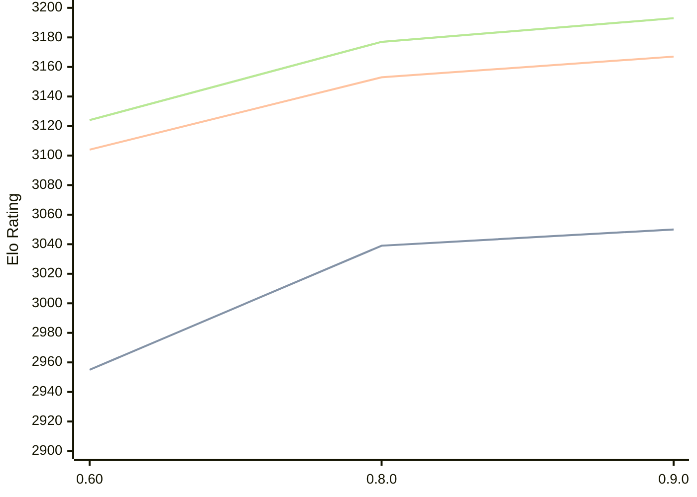

# Engine: Motor

Author: Martin Novák

Home: https://github.com/martinnovaak/motor

## Ratings nach Version

| Version | Published | STC 8.0+0.08s  | LTC 60.0+0.60s | VLTC 2m24s+1.12s | Comment |
| --- | --- | --- | --- | --- | --- |
| 0.9.0 | 2025-06-02 | 3050(+11) | 3167(+14) | 3193(+16) |  |
| 0.8.0 | 2024-10-28 | 3039(+new) | 3153(+new) | 3177(+new) |  |
| 0.7.0 | 2024-08-11 |  |  |  |  |
| 0.60 | 2024-06-30 | 2955(+new) | 3104(+new) | 3124(+new) |  |
| 0.5.0 | 2024-05-23 |  |  |  |  |
| 0.4.0 | 2024-04-18 |  |  |  |  |
| 0.3.0 | 2024-03-30 |  |  |  |  |
| 0.2.0 | 2024-03-09 |  |  |  |  |
 | | | cElo (∆ prev) | cElo (∆ prev) | cElo (∆ prev) | 

 Test Conditions:

GUI/CLI: <a href=https://github.com/cutechess/cutechess target="_blank">Cute-Chess</a> 
Elo Calculation: <a href=https://www.remi-coulom.fr/Bayesian-Elo/ target="_blank">Bayesian-Elo</a> 
CPU: Intel(R) Core(TM) i5-7500T 2.70GHz 
Opening book: 8_moves_v3 
\* STC: 8.0+0.08s, LTC: 60.0+0.60s, VLTC: 2m24s+1.12s

 Lists:
Ratings: <a href=https://github.com/computer-chess-index/cci/blob/main/lists/CCIRatings.csv target="_blank">Complete list</a>

Generated: 2026-02-24 07:36:31

## Ratings Verlauf

⬛ STC (8.0+0.08s) &nbsp;&nbsp; 🟧 LTC (60.0+0.60s) &nbsp;&nbsp; 🟩 VLTC (2m24s+1.12s)

