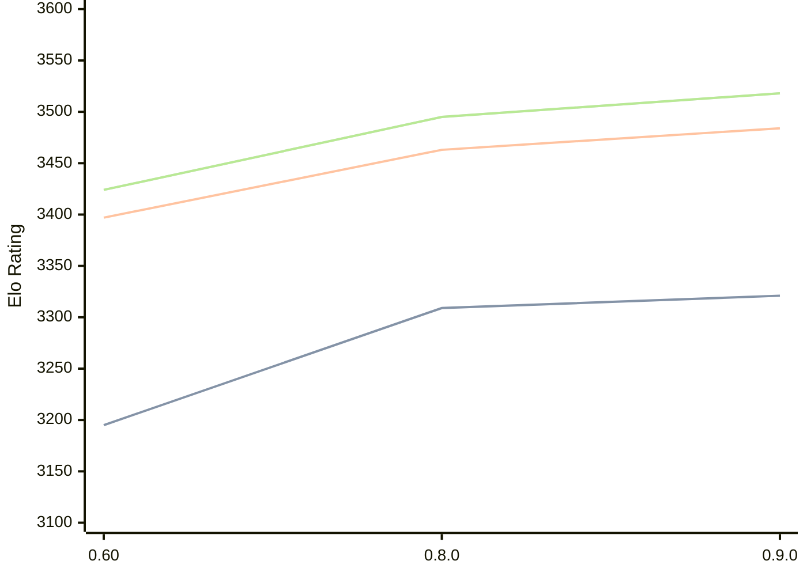

# Engine: Motor

Author: Martin Novák

Home: https://github.com/martinnovaak/motor

## Elo Ratings

| Version | Published | STC 8.0+0.08s  | LTC 60.0+0.60s | VLTC 2m24s+1.12s | Comment |
| --- | --- | --- | --- | --- | --- |
| 0.9.0 | 2025-06-02 | 3321(+12) | 3484(+21) | 3518(+23) |  |
| 0.8.0 | 2024-10-28 | 3309(+new) | 3463(+new) | 3495(+new) |  |
| 0.7.0 | 2024-08-11 |  |  |  |  |
| 0.60 | 2024-06-30 | 3195(+new) | 3397(+new) | 3424(+new) |  |
| 0.5.0 | 2024-05-23 |  |  |  |  |
| 0.4.0 | 2024-04-18 |  |  |  |  |
| 0.3.0 | 2024-03-30 |  |  |  |  |
| 0.2.0 | 2024-03-09 |  |  |  |  |
| 0.1.0 | 2024-02-18 |  |  |  |  |
 | | | cElo (∆ prev) | cElo (∆ prev) | cElo (∆ prev) | 

<a href="https://github.com/computer-chess-index/cci/issues/new?template=submit-version.yml&title=[VERSION]+Motor+<version>&body=###%20Engine%20name%0AMotor%0A%0A###%20Version%0A0.9.0" target="_blank">Submit new version</a>

 Test Conditions:

GUI/CLI: <a href=https://github.com/cutechess/cutechess target="_blank">Cute-Chess</a> 
Elo Calculation: <a href=https://www.remi-coulom.fr/Bayesian-Elo/ target="_blank">Bayesian-Elo</a> 
CPU: Intel(R) Core(TM) i5-7500T 2.70GHz 
Opening book: 8_moves_v3 
\* STC: 8.0+0.08s, LTC: 60.0+0.60s, VLTC: 2m24s+1.12s

 Lists:
Ratings: <a href=https://github.com/computer-chess-index/cci/blob/main/lists/CCIRatings.csv target="_blank">Complete list</a>

Generated: 2026-07-17 06:26:46

## Ratings Verlauf

## Ratings Verlauf

⬛ STC (8.0+0.08s) &nbsp;&nbsp; 🟧 LTC (60.0+0.60s) &nbsp;&nbsp; 🟩 VLTC (2m24s+1.12s)

dark mode: 🟩STC (8.0+0.08s) 🟧LTC (60.0+0.60s) ⬜VLTC (2m24s+1.12s)

## Detailed Evaluation Results

| Version | Time Control | Elo  | Range +/- | Matches | Score | Average Opponent Elo | Draws |
| --- | --- | --- | --- | --- | --- | --- | --- |
| 0.9.0 | VLTC (2m24s+1.12s) | 3518 | 22 | 474 | 49% | 3524 | 88% |
| 0.9.0 | LTC (60.0+0.60s) | 3484 | 23 | 428 | 50% | 3480 | 83% |
| 0.9.0 | STC (8.0+0.08s) | 3321 | 21 | 556 | 50% | 3320 | 72% |
| --- | --- | --- | --- | --- | --- | --- | --- |
| 0.8.0 | VLTC (2m24s+1.12s) | 3495 | 13 | 1468 | 51% | 3491 | 86% |
| 0.8.0 | LTC (60.0+0.60s) | 3463 | 13 | 1484 | 50% | 3461 | 83% |
| 0.8.0 | STC (8.0+0.08s) | 3309 | 13 | 1460 | 49% | 3314 | 71% |
| --- | --- | --- | --- | --- | --- | --- | --- |
| 0.60 | VLTC (2m24s+1.12s) | 3424 | 28 | 304 | 50% | 3425 | 80% |
| 0.60 | LTC (60.0+0.60s) | 3397 | 28 | 316 | 52% | 3380 | 74% |
| 0.60 | STC (8.0+0.08s) | 3195 | 29 | 352 | 56% | 3059 | 59% |
| --- | --- | --- | --- | --- | --- | --- | --- |