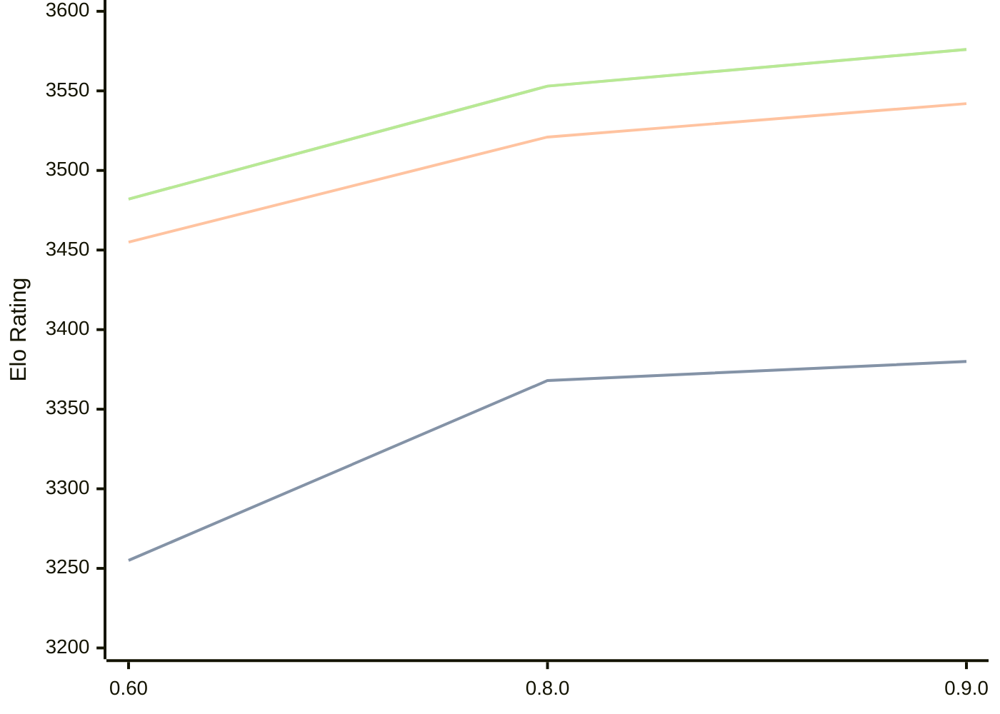

# Engine: Motor

Author: Martin Novák

Home: https://github.com/martinnovaak/motor

## Elo Ratings

| Version | Published | STC 8.0+0.08s  | LTC 60.0+0.60s | VLTC 2m24s+1.12s | Comment |
| --- | --- | --- | --- | --- | --- |
| 0.9.0 | 2025-06-02 | 3380(+12) | 3542(+21) | 3576(+23) |  |
| 0.8.0 | 2024-10-28 | 3368(+new) | 3521(+new) | 3553(+new) |  |
| 0.7.0 | 2024-08-11 |  |  |  |  |
| 0.60 | 2024-06-30 | 3255(+new) | 3455(+new) | 3482(+new) |  |
| 0.5.0 | 2024-05-23 |  |  |  |  |
| 0.4.0 | 2024-04-18 |  |  |  |  |
| 0.3.0 | 2024-03-30 |  |  |  |  |
| 0.2.0 | 2024-03-09 |  |  |  |  |
| 0.1.0 | 2024-02-18 |  |  |  |  |
 | | | cElo (∆ prev) | cElo (∆ prev) | cElo (∆ prev) | 

<a href="https://github.com/computer-chess-index/cci/issues/new?template=submit-version.yml&title=[VERSION]+Motor+<version>&body=###%20Engine%20name%0AMotor%0A%0A###%20Version%0A0.9.0" target="_blank">Submit new version</a>

 Test Conditions:

GUI/CLI: <a href=https://github.com/cutechess/cutechess target="_blank">Cute-Chess</a> 
Elo Calculation: <a href=https://www.remi-coulom.fr/Bayesian-Elo/ target="_blank">Bayesian-Elo</a> 
CPU: Intel(R) Core(TM) i5-7500T 2.70GHz 
Opening book: 8_moves_v3 
\* STC: 8.0+0.08s, LTC: 60.0+0.60s, VLTC: 2m24s+1.12s

 Lists:
Ratings: <a href=https://github.com/computer-chess-index/cci/blob/main/lists/CCIRatings.csv target="_blank">Complete list</a>

Generated: 2026-05-03 07:41:16

## Ratings Verlauf

⬛ STC (8.0+0.08s) &nbsp;&nbsp; 🟧 LTC (60.0+0.60s) &nbsp;&nbsp; 🟩 VLTC (2m24s+1.12s)

dark mode: 🟩STC (8.0+0.08s) 🟧LTC (60.0+0.60s) ⬜VLTC (2m24s+1.12s)

## Detailed Evaluation Results

| Version | Time Control | Elo  | Range +/- | Matches | Score | Average Opponent Elo | Draws |
| --- | --- | --- | --- | --- | --- | --- | --- |
| 0.9.0 | VLTC (2m24s+1.12s) | 3576 | 24 | 410 | 49% | 3582 | 89% |
| 0.9.0 | D1 | 1046 | 29 | 368 | 49% | 1054 | 43% |
| 0.9.0 | D10 | 2952 | 26 | 454 | 49% | 2955 | 42% |
| 0.9.0 | D11 | 3094 | 24 | 476 | 51% | 3085 | 54% |
| 0.9.0 | D12 | 3216 | 23 | 482 | 50% | 3216 | 64% |
| 0.9.0 | D13 | 3299 | 22 | 552 | 52% | 3285 | 64% |
| 0.9.0 | D14 | 3343 | 23 | 484 | 51% | 3321 | 71% |
| 0.9.0 | D15 | 3394 | 22 | 520 | 51% | 3389 | 72% |
| 0.9.0 | D16 | 3422 | 21 | 530 | 50% | 3418 | 78% |
| 0.9.0 | D2 | 1183 | 33 | 318 | 50% | 1195 | 26% |
| 0.9.0 | D3 | 1143 | 32 | 356 | 49% | 1157 | 19% |
| 0.9.0 | D4 | 1249 | 36 | 276 | 52% | 1231 | 21% |
| 0.9.0 | D5 | 1521 | 32 | 348 | 50% | 1524 | 18% |
| 0.9.0 | D6 | 1735 | 29 | 430 | 50% | 1742 | 23% |
| 0.9.0 | D7 | 2295 | 27 | 496 | 51% | 2288 | 22% |
| 0.9.0 | D8 | 2616 | 27 | 458 | 49% | 2620 | 32% |
| 0.9.0 | D9 | 2795 | 27 | 416 | 52% | 2776 | 42% |
| 0.9.0 | S10 | 3418 | 24 | 440 | 50% | 3416 | 75% |
| 0.9.0 | S40 | 3522 | 25 | 380 | 50% | 3524 | 83% |
| 0.9.0 | LTC (60.0+0.60s) | 3542 | 25 | 388 | 50% | 3538 | 82% |
| 0.9.0 | STC (8.0+0.08s) | 3380 | 23 | 484 | 50% | 3379 | 74% |
| --- | --- | --- | --- | --- | --- | --- | --- |
| 0.8.0 | VLTC (2m24s+1.12s) | 3553 | 13 | 1468 | 51% | 3549 | 86% |
| 0.8.0 | D1 | 963 | 19 | 1120 | 55% | 894 | 25% |
| 0.8.0 | D10 | 2905 | 16 | 1184 | 52% | 2888 | 47% |
| 0.8.0 | D11 | 3051 | 15 | 1156 | 49% | 3056 | 57% |
| 0.8.0 | D12 | 3154 | 15 | 1244 | 50% | 3150 | 60% |
| 0.8.0 | D13 | 3231 | 14 | 1244 | 51% | 3224 | 67% |
| 0.8.0 | D14 | 3295 | 14 | 1296 | 50% | 3291 | 67% |
| 0.8.0 | D15 | 3340 | 22 | 536 | 49% | 3344 | 70% |
| 0.8.0 | D16 | 3384 | 22 | 512 | 50% | 3387 | 75% |
| 0.8.0 | D2 | 1119 | 17 | 1272 | 47% | 1150 | 14% |
| 0.8.0 | D3 | 1057 | 17 | 1252 | 48% | 1083 | 18% |
| 0.8.0 | D4 | 1241 | 18 | 1240 | 50% | 1247 | 13% |
| 0.8.0 | D5 | 1496 | 18 | 1184 | 50% | 1496 | 16% |
| 0.8.0 | D6 | 1781 | 18 | 1212 | 51% | 1773 | 18% |
| 0.8.0 | D7 | 2269 | 18 | 1100 | 49% | 2282 | 26% |
| 0.8.0 | D8 | 2554 | 17 | 1152 | 50% | 2557 | 36% |
| 0.8.0 | D9 | 2727 | 16 | 1160 | 51% | 2719 | 41% |
| 0.8.0 | S10 | 3394 | 13 | 1492 | 49% | 3399 | 75% |
| 0.8.0 | S40 | 3498 | 13 | 1428 | 50% | 3498 | 82% |
| 0.8.0 | LTC (60.0+0.60s) | 3521 | 13 | 1484 | 50% | 3521 | 83% |
| 0.8.0 | STC (8.0+0.08s) | 3368 | 13 | 1460 | 49% | 3372 | 71% |
| --- | --- | --- | --- | --- | --- | --- | --- |
| 0.7.0 |  |  |  |  |  |  |  |
| 0.60 | VLTC (2m24s+1.12s) | 3482 | 28 | 304 | 50% | 3484 | 80% |
| 0.60 | D1 | 1085 | 19 | 1080 | 50% | 1087 | 17% |
| 0.60 | D10 | 2792 | 18 | 956 | 48% | 2807 | 46% |
| 0.60 | D11 | 2952 | 18 | 920 | 48% | 2966 | 52% |
| 0.60 | D12 | 3060 | 15 | 1160 | 49% | 3067 | 56% |
| 0.60 | D13 | 3163 | 16 | 1052 | 50% | 3162 | 61% |
| 0.60 | D14 | 3217 | 16 | 981 | 50% | 3218 | 65% |
| 0.60 | D15 | 3283 | 34 | 220 | 49% | 3291 | 70% |
| 0.60 | D16 | 3340 | 39 | 160 | 47% | 3363 | 76% |
| 0.60 | D17 | 3409 | 78 | 40 | 51% | 3402 | 73% |
| 0.60 | D18 | 3372 | 77 | 40 | 46% | 3398 | 73% |
| 0.60 | D19 | 3402 | 77 | 40 | 46% | 3428 | 78% |
| 0.60 | D2 | 1184 | 18 | 1160 | 53% | 1146 | 13% |
| 0.60 | D3 | 1133 | 19 | 1080 | 50% | 1137 | 14% |
| 0.60 | D4 | 1268 | 19 | 1030 | 48% | 1292 | 14% |
| 0.60 | D5 | 1424 | 20 | 940 | 49% | 1439 | 12% |
| 0.60 | D6 | 1724 | 19 | 980 | 49% | 1732 | 20% |
| 0.60 | D7 | 1990 | 19 | 1024 | 49% | 2003 | 22% |
| 0.60 | D8 | 2367 | 18 | 1079 | 54% | 2331 | 31% |
| 0.60 | D9 | 2619 | 19 | 880 | 51% | 2607 | 39% |
| 0.60 | S10 | 3302 | 32 | 244 | 50% | 3305 | 70% |
| 0.60 | S40 | 3418 | 34 | 216 | 50% | 3420 | 73% |
| 0.60 | LTC (60.0+0.60s) | 3455 | 28 | 316 | 52% | 3438 | 74% |
| 0.60 | STC (8.0+0.08s) | 3255 | 29 | 352 | 56% | 3116 | 59% |
| --- | --- | --- | --- | --- | --- | --- | --- |
| 0.5.0 |  |  |  |  |  |  |  |
| 0.4.0 |  |  |  |  |  |  |  |
| 0.3.0 |  |  |  |  |  |  |  |
| 0.2.0 |  |  |  |  |  |  |  |
| 0.1.0 |  |  |  |  |  |  |  |