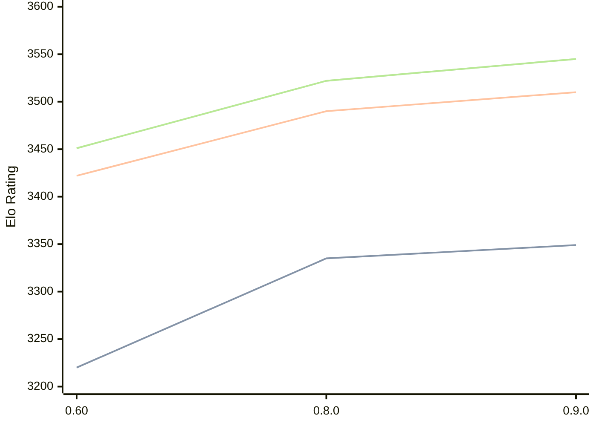

# Engine: Motor

Author: Martin Novák

Home: https://github.com/martinnovaak/motor

## Elo Ratings E1

| Version | Published | STC 8.0+0.08s  | LTC 60.0+0.60s | VLTC 2m24s+1.12s | Comment |
| --- | --- | --- | --- | --- | --- |
| 0.9.0 | 2025-06-02 | 3209 | 3486 | 3545 |  |
 | | | cElo (∆ prev) | cElo (∆ prev) | cElo (∆ prev) | 

## Elo Ratings P1

| Version | Published | STC 8.0+0.08s  | LTC 60.0+0.60s | VLTC 2m24s+1.12s | Comment |
| --- | --- | --- | --- | --- | --- |
| 0.9.0 | 2025-06-02 | 3560 | 3717 | 3730 |  |
 | | | cElo (∆ prev) | cElo (∆ prev) | cElo (∆ prev) | 

## Elo Ratings T1

| Version | Published | STC 8.0+0.08s  | LTC 60.0+0.60s | VLTC 2m24s+1.12s | Comment |
| --- | --- | --- | --- | --- | --- |
| 0.9.0 | 2025-06-02 | 3349(+14) | 3510(+20) | 3545(+23) |  |
| 0.8.0 | 2024-10-28 | 3335(+115) | 3490(+68) | 3522(+71) |  |
| 0.60 | 2024-06-30 | 3220 | 3422 | 3451 |  |
 | | | cElo (∆ prev) | cElo (∆ prev) | cElo (∆ prev) | 

<a href="https://github.com/computer-chess-index/cci/issues/new?template=submit-version.yml&title=[VERSION]+Motor+<version>&body=###%20Engine%20name%0AMotor%0A%0A###%20Version%0A0.9.0" target="_blank">Submit new version</a>

 Test Conditions:

GUI/CLI: <a href=https://github.com/cutechess/cutechess target="_blank">Cute-Chess</a> 
Elo Calculation: <a href=https://www.remi-coulom.fr/Bayesian-Elo/ target="_blank">Bayesian-Elo</a> 
CPU for P1: Intel(R) Core(TM) Ultra 7 265T (1.50 GHz) - P-Core 
CPU for E1: Intel(R) Core(TM) Ultra 7 265T (1.50 GHz) - E-Core 
CPU for T1: Intel(R) Core(TM) i5-7500T 2.70GHz 
Opening book: 8_moves_v3 
\* STC: 8.0+0.08s, LTC: 60.0+0.60s, VLTC: 2m24s+1.12s

 Lists:
Ratings: <a href=https://github.com/computer-chess-index/cci/blob/main/lists/CCIRatings.csv target="_blank">Complete list</a>

Generated: 2026-10-10 04:40:22

## Ratings Verlauf

```mermaid
%%{init: {"theme":"base","themeVariables":{"seriesColors:['#a3a3a3','#222221','#faa371']}}}%%
xychart-beta
  x-axis ["0.60", "0.8.0", "0.9.0"]
  y-axis "Elo Rating" 3200 --> 3600
  line "" [3220, 3335, 3349]
  line "STC (8.0+0.08s)" [3220, 3335, 3349]
  line "LTC (60.0+0.60s)" [3422, 3490, 3510]
  line "" [3451, 3522, 3545]
  line "VLTC (2m24s+1.12s)" [3451, 3522, 3545]
```

## Detailed Evaluation Results

| Version | Time Control | Elo  | Range +/- | Matches | Score | Average Opponent Elo | Draws |
| --- | --- | --- | --- | --- | --- | --- | --- |
| 0.9.0 | VLTC (2m24s+1.12s) | 3730 | 45 | 116 | 50% | 3730 | 79% |
| 0.9.0 | VLTC (2m24s+1.12s) | 3545 | 42 | 134 | 50% | 3542 | 83% |
| 0.9.0 | VLTC (2m24s+1.12s) | 3545 | 21 | 530 | 49% | 3549 | 89% |
| 0.9.0 | LTC (60.0+0.60s) | 3717 | 43 | 128 | 50% | 3722 | 79% |
| 0.9.0 | LTC (60.0+0.60s) | 3486 | 37 | 176 | 46% | 3514 | 78% |
| 0.9.0 | LTC (60.0+0.60s) | 3510 | 22 | 500 | 50% | 3509 | 83% |
| 0.9.0 | STC (8.0+0.08s) | 3560 | 37 | 176 | 51% | 3549 | 78% |
| --- | --- | --- | --- | --- | --- | --- | --- |
| 0.9.0 | STC (8.0+0.08s) | 3209 | 30 | 284 | 45% | 3251 | 66% |
| --- | --- | --- | --- | --- | --- | --- | --- |
| 0.9.0 | STC (8.0+0.08s) | 3349 | 20 | 644 | 50% | 3347 | 72% |
| --- | --- | --- | --- | --- | --- | --- | --- |
| 0.8.0 | VLTC (2m24s+1.12s) | 3522 | 13 | 1468 | 51% | 3518 | 86% |
| 0.8.0 | LTC (60.0+0.60s) | 3490 | 13 | 1484 | 50% | 3488 | 83% |
| 0.8.0 | STC (8.0+0.08s) | 3335 | 13 | 1460 | 49% | 3340 | 71% |
| --- | --- | --- | --- | --- | --- | --- | --- |
| 0.60 | VLTC (2m24s+1.12s) | 3451 | 28 | 304 | 50% | 3452 | 80% |
| 0.60 | LTC (60.0+0.60s) | 3422 | 28 | 316 | 52% | 3406 | 74% |
| 0.60 | STC (8.0+0.08s) | 3220 | 29 | 352 | 56% | 3086 | 59% |
| --- | --- | --- | --- | --- | --- | --- | --- |