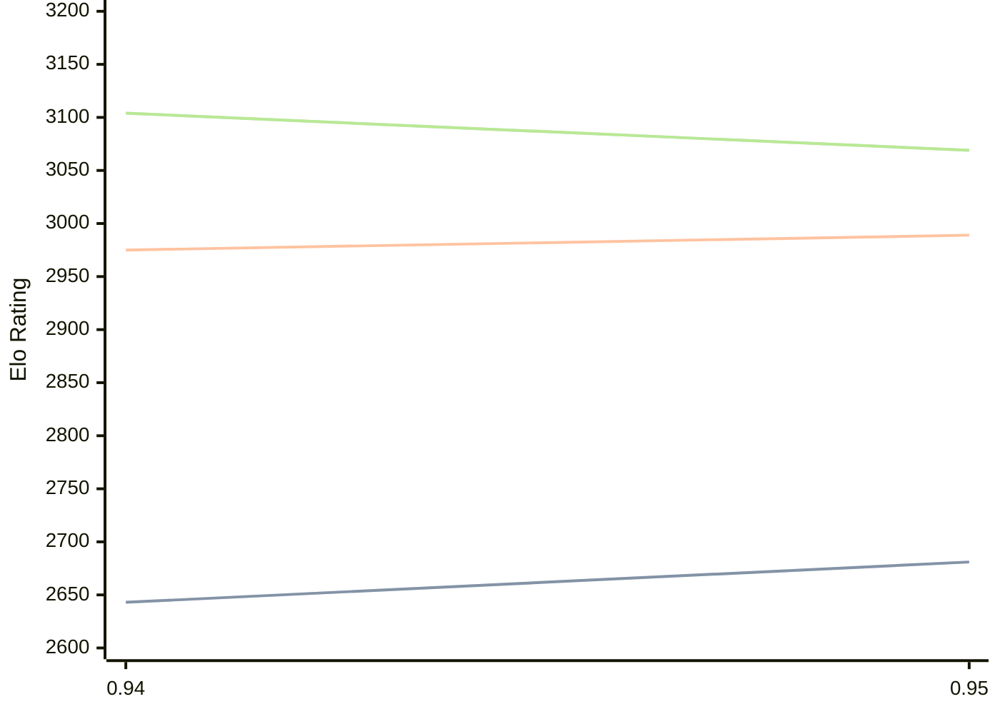

# Engine: Myrddin

Author: John Merlino

Home: https://github.com/JVMerlino/Myrddin

## Elo Ratings

| Version | Published | STC 8.0+0.08s  | LTC 60.0+0.60s | VLTC 2m24s+1.12s | Comment |
| --- | --- | --- | --- | --- | --- |
| 0.95 | 2026-04-23 | 2681(+38) | 2989(+14) | 3069(-35) |  |
| 0.94 | 2025-12-11 | 2643(+new) | 2975(+new) | 3104(+new) |  |
| 0.93 | 2025-04-23 |  |  |  |  |
| 0.92 | 2024-12-08 |  |  |  |  |
| 0.91 | 2024-10-19 |  |  |  |  |
| 0.90 | 2023-06-12 |  |  |  |  |
| 0.89 | 2023-03-10 |  |  |  |  |
 | | | cElo (∆ prev) | cElo (∆ prev) | cElo (∆ prev) | 

<a href="https://github.com/computer-chess-index/cci/issues/new?template=submit-version.yml&title=[VERSION]+Myrddin+<version>&body=###%20Engine%20name%0AMyrddin%0A%0A###%20Version%0A0.95" target="_blank">Submit new version</a>

 Test Conditions:

GUI/CLI: <a href=https://github.com/cutechess/cutechess target="_blank">Cute-Chess</a> 
Elo Calculation: <a href=https://www.remi-coulom.fr/Bayesian-Elo/ target="_blank">Bayesian-Elo</a> 
CPU: Intel(R) Core(TM) i5-7500T 2.70GHz 
Opening book: 8_moves_v3 
\* STC: 8.0+0.08s, LTC: 60.0+0.60s, VLTC: 2m24s+1.12s

 Lists:
Ratings: <a href=https://github.com/computer-chess-index/cci/blob/main/lists/CCIRatings.csv target="_blank">Complete list</a>

Generated: 2026-05-03 08:18:56

## Ratings Verlauf

⬛ STC (8.0+0.08s) &nbsp;&nbsp; 🟧 LTC (60.0+0.60s) &nbsp;&nbsp; 🟩 VLTC (2m24s+1.12s)

dark mode: 🟩STC (8.0+0.08s) 🟧LTC (60.0+0.60s) ⬜VLTC (2m24s+1.12s)

## Detailed Evaluation Results

| Version | Time Control | Elo  | Range +/- | Matches | Score | Average Opponent Elo | Draws |
| --- | --- | --- | --- | --- | --- | --- | --- |
| 0.95 | VLTC (2m24s+1.12s) | 3069 | 32 | 294 | 52% | 3048 | 43% |
| 0.95 | LTC (60.0+0.60s) | 2989 | 33 | 286 | 49% | 2997 | 41% |
| 0.95 | STC (8.0+0.08s) | 2681 | 31 | 348 | 53% | 2649 | 33% |
| --- | --- | --- | --- | --- | --- | --- | --- |
| 0.94 | VLTC (2m24s+1.12s) | 3104 | 27 | 380 | 50% | 3102 | 52% |
| 0.94 | LTC (60.0+0.60s) | 2975 | 28 | 382 | 53% | 2944 | 41% |
| 0.94 | STC (8.0+0.08s) | 2643 | 27 | 476 | 50% | 2626 | 31% |
| --- | --- | --- | --- | --- | --- | --- | --- |